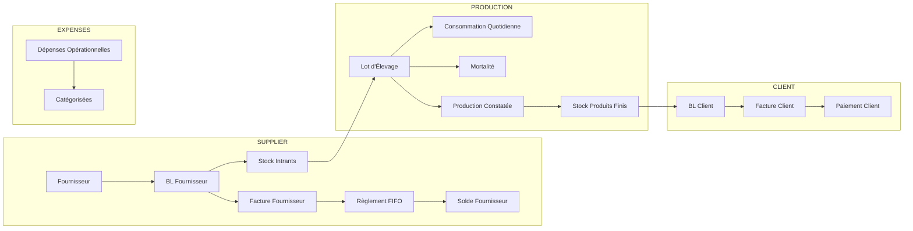
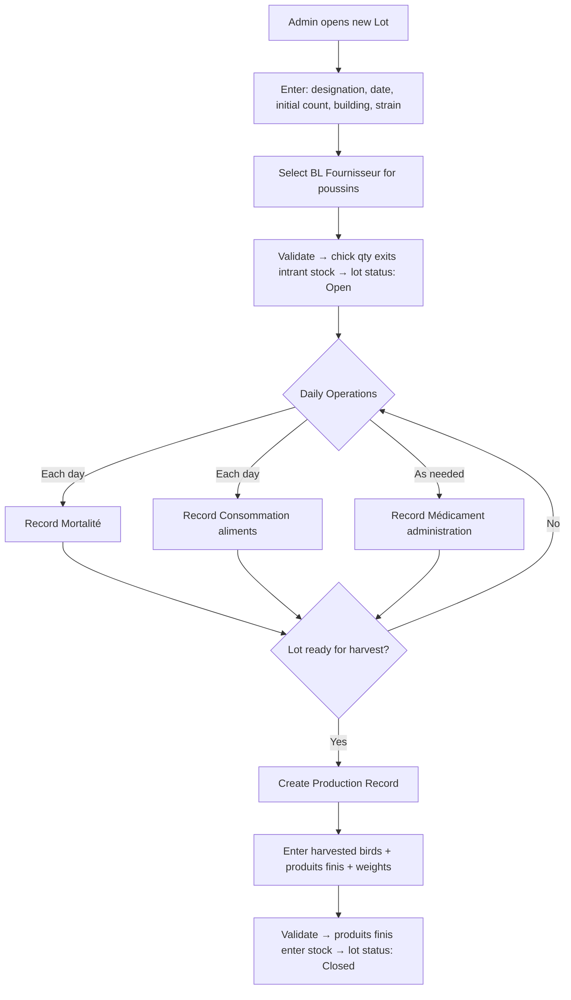
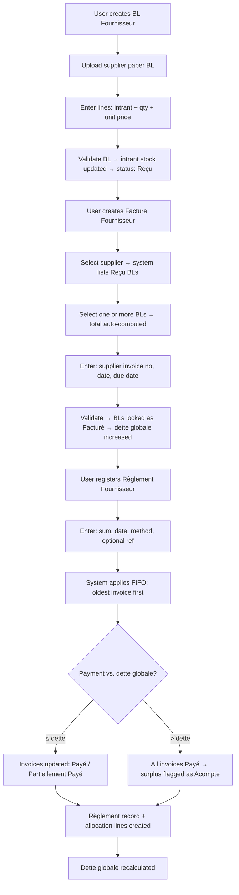
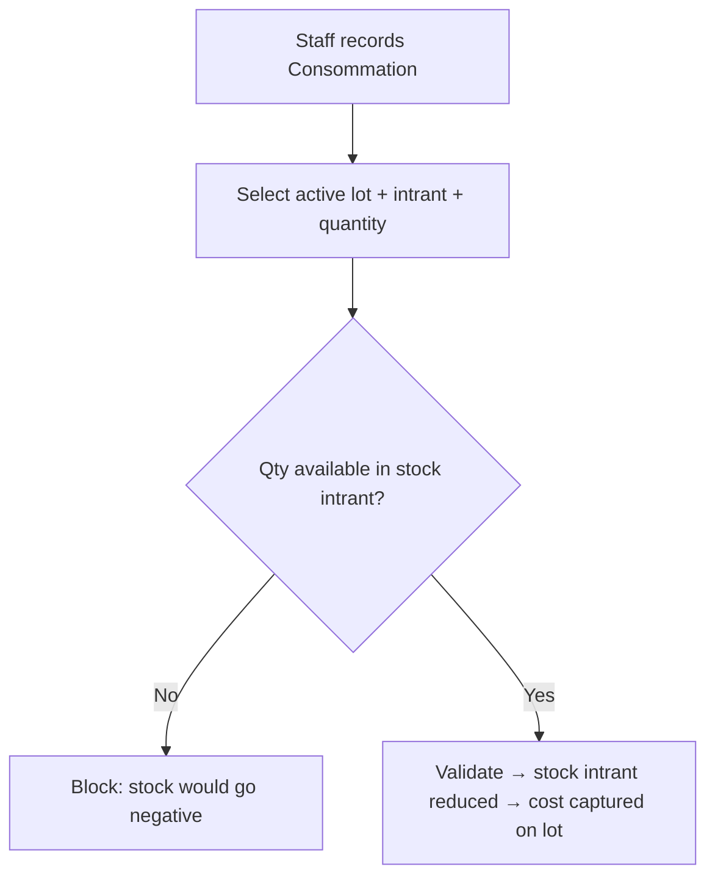

# App Requirements Documentation

## Internal Management System — *Élevage Avicole*

**Version:** 1.0
**Date:** April 2026
**Organization:** Small Algerian Poultry Farming Operation
**Document Type:** Business Requirements & System Design

---

## 1. Executive Summary

Web-based internal management system for a small *élevage avicole*. Replaces paper notebooks, spreadsheets, and verbal debt tracking with a single traceable platform covering the full operational and financial cycle.

**Key Features:**

- *Intrant* catalog with stock tracking (aliments, poussins, médicaments)
- *Lot d'élevage* lifecycle: open → daily operations → close
- Daily mortality and feed/medicine consumption per lot
- Production recording: harvested birds → *stock produits finis*
- Two-segment stock: *intrants* (entry via BL fournisseur) and *produits finis* (entry via production)
- Full supplier chain: BL Fournisseur → Facture Fournisseur → Règlement FIFO
- Full client chain: BL Client → Facture Client → Paiement Client
- Operational expense (*dépense*) tracking, strictly separated from AP
- Printable documents: BL, factures, reçus, pièces justificatives
- Alerts: overdue invoices, debt ceiling, stock minimums, uninvoiced BLs
- Reports: lot profitability, supplier aging, cash flow, stock status

---

## 2. Business Context

### 2.1 Full Operational Lifecycle



### 2.2 Operational Context

- **Primary Use Case:** End-to-end management of a small poultry farm — procurement, production, sales, AP/AR
- **Organization Size:** 1–10 staff
- **Currency:** DZD (Algerian Dinar)
- **Language:** French / English (single-language deployment)
- **Volume:** Dozens of movements/month, up to 20 simultaneous lots, up to 50 suppliers and 100 clients

---

## 3. Scope

### In Scope

| # | Domain | French Label |
|---|--------|--------------|
| 01 | Input catalog & stock | Gestion des Intrants |
| 02 | Poultry batches | Lots d'Élevage |
| 03 | Consumption tracking | Consommation |
| 04 | Production output | Production |
| 05 | Inventory (2 segments) | Stock |
| 06 | Supplier delivery notes | BL Fournisseur |
| 07 | Supplier invoices (AP) | Factures Fournisseurs |
| 08 | Client delivery notes | BL Clients |
| 09 | Client invoicing (AR) | Facturation Clients |
| 10 | Client payments | Paiements Clients |
| 11 | Operational expenses | Dépenses |
| 12 | Supplier settlement (FIFO) | Règlement Fournisseurs |
| 13 | Printable documents | Documents Imprimables |

### Out of Scope

- Payroll management and tax filing
- Accounting journal exports (FIFO/LIFO/weighted average formal accounting)
- Multi-farm or multi-branch consolidation
- Barcode scanning (future)
- Mobile native app (web-responsive only)

---

## 4. Assumptions

1. *Intrants* enter stock **only** through validated *BL fournisseur* — no direct stock entries
2. *Produits finis* enter stock **only** through validated production records
3. A *facture fournisseur* total is **always** auto-computed from its selected BLs — no manual amount entry
4. Supplier payments use **FIFO only** — oldest invoice settled first; user enters a sum, system allocates
5. If payment exceeds *dette globale*, surplus is flagged as *acompte fournisseur*
6. A *facture fournisseur* for goods **never** auto-generates a *dépense* — strict AP / expense separation
7. BLs marked **Facturé** are locked and cannot be re-included in another invoice
8. Stock cannot go negative; the system blocks exit/consumption that would breach zero
9. Lots, intrants, fournisseurs, and clients are deactivated — never deleted
10. All movements capture a `balance_after` snapshot at confirmation (immutable)
11. Closed lots are fully locked — no further entries
12. A *BL client* deducts from *stock produits finis* upon validation

---

## 5. Core Django Apps

| App | Purpose |
|-----|---------|
| `accounts` | User management, roles, authentication |
| `catalog` | Intrant definitions, categories, units of measure |
| `lots` | Lots d'élevage lifecycle, mortality records |
| `consumption` | Daily feed and medicine consumption per lot |
| `production` | Harvest records, produits finis definitions |
| `stock` | Stock balances for intrants and produits finis |
| `suppliers` | Fournisseur directory |
| `bl_fournisseur` | Supplier delivery notes, file attachments |
| `factures_fournisseurs` | Supplier invoices (AP) |
| `reglements` | Supplier FIFO settlement mechanism |
| `clients` | Client directory |
| `bl_clients` | Client delivery notes |
| `facturation` | Client invoices (AR) |
| `paiements_clients` | Client payment recording |
| `depenses` | Operational expense records |
| `alerts` | Alert generation and resolution |
| `reporting` | All reports, KPIs, printable document views |

---

## 6. Key Models

| Model | App | Key Fields |
|-------|-----|------------|
| `UserProfile` | `accounts` | `user` (OneToOne), `role` (admin/staff/viewer), `is_active` |
| `Intrant` | `catalog` | `code` (unique), `designation`, `category` (aliment/poussin/medicament/other), `unit` (kg/sac/unit/bottle/dose/liter), `current_stock` (denorm), `alert_threshold`, `is_active` |
| `ProduitFini` | `catalog` | `code` (unique), `designation`, `unit`, `current_stock` (denorm), `is_active` |
| `Fournisseur` | `suppliers` | `code` (unique), `name`, `contact`, `phone`, `email`, `address`, `notes`, `is_active` |
| `Client` | `clients` | `code` (unique), `name`, `contact`, `phone`, `address`, `is_active` |
| `Lot` | `lots` | `reference`, `designation`, `opening_date`, `initial_count`, `building`, `strain`, `fournisseur_poussin` (FK), `status` (open/closed), `closing_date` (nullable) |
| `MortaliteRecord` | `lots` | `lot` (FK), `date`, `count`, `cause`, `notes` |
| `Consommation` | `consumption` | `lot` (FK), `date`, `intrant` (FK), `quantity`, `unit_cost_at_time`, `notes` |
| `ProductionRecord` | `production` | `lot` (FK), `date`, `birds_harvested`, `notes` |
| `ProductionLine` | `production` | `production` (FK), `produit_fini` (FK), `quantity`, `unit`, `weight_kg` |
| `StockIntrant` | `stock` | `intrant` (FK unique), `quantity` |
| `StockProduitFini` | `stock` | `produit_fini` (FK unique), `quantity` |
| `StockMovement` | `stock` | `movement_type`, `intrant`/`produit_fini` (FK), `quantity`, `direction` (+/-), `source_ref_type`, `source_ref_id`, `balance_after`, `date`, `recorded_by` (FK) |
| `BLFournisseur` | `bl_fournisseur` | `reference` (unique, auto), `fournisseur` (FK), `date`, `supplier_ref`, `status` (brouillon/recu/facture/litige), `reception_notes`, `attachment` (file), `recorded_by` (FK) |
| `BLFournisseurLine` | `bl_fournisseur` | `bl` (FK), `intrant` (FK), `quantity`, `unit_price`, `line_total` |
| `FactureFournisseur` | `factures_fournisseurs` | `reference` (auto), `fournisseur` (FK), `supplier_invoice_no`, `date`, `due_date`, `invoice_type` (goods/service), `total_amount` (auto from BLs), `montant_regle`, `reste_a_payer`, `status` (non_paye/partiellement_paye/paye/litige) |
| `FactureFournisseurBL` | `factures_fournisseurs` | `facture` (FK), `bl` (FK) — M2M link |
| `ReglementFournisseur` | `reglements` | `fournisseur` (FK), `date`, `montant`, `method` (especes/cheque/virement), `reference`, `notes`, `recorded_by` (FK) |
| `ReglementAllocation` | `reglements` | `reglement` (FK), `facture` (FK), `amount_applied` |
| `AcompteFournisseur` | `reglements` | `fournisseur` (FK), `reglement` (FK), `amount`, `date`, `applied_to_facture` (FK nullable) |
| `BLClient` | `bl_clients` | `reference` (unique, auto), `client` (FK), `date`, `delivery_address`, `status` (livre/facture/litige), `signed_by`, `recorded_by` (FK) |
| `BLClientLine` | `bl_clients` | `bl` (FK), `produit_fini` (FK), `quantity`, `unit_price`, `line_total` |
| `FactureClient` | `facturation` | `reference` (auto), `client` (FK), `date`, `due_date`, `montant_ht`, `tva`, `montant_ttc`, `montant_regle`, `reste_a_payer`, `status` (non_payee/partiellement_payee/payee) |
| `FactureClientBL` | `facturation` | `facture` (FK), `bl` (FK) — M2M link |
| `PaiementClient` | `paiements_clients` | `client` (FK), `date`, `amount`, `method`, `reference`, `notes`, `recorded_by` (FK) |
| `PaiementClientAllocation` | `paiements_clients` | `paiement` (FK), `facture` (FK), `amount_applied` |
| `Depense` | `depenses` | `date`, `category` (salaire/energie/maintenance/transport/frais_vet/fournitures/taxes/divers), `description`, `amount`, `method`, `document_ref`, `lot` (FK nullable), `linked_facture` (FK nullable — service exception only), `recorded_by` (FK) |
| `Alert` | `alerts` | `alert_type`, `related_object_type`, `related_object_id`, `triggered_at`, `resolved_at`, `is_active`, `notes` |

---

## 7. Computed / Derived Values

| Value | Formula |
|-------|---------|
| **Effectif vivant (lot)** | `lot.initial_count − Σ MortaliteRecord.count` |
| **Taux de mortalité** | `Σ deaths / initial_count × 100` |
| **Consommation totale aliments (lot)** | `Σ Consommation.quantity` where `intrant.category = aliment` |
| **IC (Indice de Consommation)** | `total_feed_kg / total_weight_gain_kg` |
| **Coût intrants total (lot)** | `Σ (Consommation.quantity × unit_cost_at_time)` |
| **Stock intrant courant** | `StockIntrant.quantity` (maintained by signals) |
| **Stock produit fini courant** | `StockProduitFini.quantity` (maintained by signals) |
| **Dette fournisseur globale** | `Σ FactureFournisseur.reste_a_payer` (non_paye + partiellement_paye) |
| **Reste à payer (facture)** | `total_amount − montant_regle` |
| **Créance client totale** | `Σ FactureClient.reste_a_payer` (non_payee + partiellement_payee) |
| **BL fournisseur total** | `Σ BLFournisseurLine.line_total` |
| **Facture fournisseur total** | `Σ BLFournisseurLine.line_total` across all linked BLs |
| **Facture client total HT** | `Σ BLClientLine.line_total` across all linked BLs |
| **Revenus lot (ventes)** | `Σ BLClientLine.line_total` traceable to production from that lot |
| **Marge brute lot** | `Revenus lot − Coût intrants total − Dépenses attribuées` |

---

## 8. Business Workflows

### 8.1 Lot Lifecycle



### 8.2 Supplier Chain (BL → Invoice → FIFO Settlement)



### 8.3 FIFO Allocation Logic

```
P = payment amount
For each invoice I ordered by date ASC (oldest first):
  if P = 0 → STOP
  if I.reste_a_payer ≤ P:
    → Mark I as Payé; P = P − I.reste_a_payer
  if I.reste_a_payer > P:
    → Mark I as Partiellement Payé; I.reste_a_payer -= P; P = 0 → STOP
```

### 8.4 Client Chain (BL → Invoice → Payment)

```mermaid
flowchart TD
    A[User creates BL Client] --> B[Select client + produits finis lines + qty + unit price]
    B --> C{Qty available in stock produits finis?}
    C -->|No| D[Block with warning]
    C -->|Yes| E[Validate BL → stock produits finis reduced → status: Livré]
    E --> F[User creates Facture Client]
    F --> G[Select client → system lists Livré BLs]
    G --> H[Select BLs → total auto-computed]
    H --> I[Validate → BLs locked as Facturé → créance increased]
    I --> J[Client sends payment]
    J --> K[User records Paiement Client: amount, method, ref]
    K --> L[User selects invoice(s) to apply payment to]
    L --> M[Invoices updated: Payée / Partiellement Payée]
    M --> N[Créance client recalculated]
```

### 8.5 Consumption Recording



---

## 9. Key Pages / Screens

### 9.1 Dashboard

- KPI summary: open lots count, total *dette fournisseur*, total *créances clients*, stock alerts count
- Active lot cards: lot name, effectif vivant, days open, last consommation date
- Pending alerts: overdue invoices, low stock, uninvoiced BLs
- Quick links: New BL Fournisseur / New BL Client / New Consommation

### 9.2 Lot Detail Page

**Sections:** Lot header (strain, building, dates) | Live indicators (effectif, mortalité %, IC) | Consommation history | Mortalité log | Production records (if closed) | Dépenses attribuées | Cost summary

### 9.3 Intrant Stock View

**Columns:** Code | Désignation | Category | Qty | Unit | Alert Threshold | Status | Last Movement
**Status badges:** 🔴 Rupture / 🟡 Seuil / 🟢 Normal

### 9.4 Produit Fini Stock View

**Columns:** Code | Désignation | Qty | Unit | Last Production Date | Last BL Client Date

### 9.5 BL Fournisseur Form

Fields: Supplier, supplier's own BL ref, date, line items (intrant + qty + unit price), reception notes, file upload (PDF/JPG/PNG). Attachment status indicator shown on all list views.

### 9.6 Supplier Account View (*Compte Fournisseur*)

Single screen per supplier showing: dette globale, open invoices list (ordered oldest→newest), BL history, settlement history with allocation details, acompte balance if any.

### 9.7 Facture Fournisseur Creation

Step 1: select supplier → Step 2: system displays *Reçu* BLs → Step 3: user checks BLs to include → Step 4: total auto-displayed → Step 5: enter supplier invoice no + dates → Step 6: validate.

### 9.8 Règlement Fournisseur Form

Fields: supplier (with current *dette globale* displayed inline), amount, date, method, optional ref. On save: FIFO preview shown before confirmation. Post-confirmation: allocation detail and updated *dette globale* displayed.

### 9.9 Client Account View (*Compte Client*)

Per client: total créance, open invoices, BL history (invoiced / not invoiced), payment history.

### 9.10 Dépenses List

**Columns:** Date | Category | Description | Amount | Method | Lot (if attributed)
**Filters:** Category, date range, lot, method

### 9.11 Printable Document Views

Dedicated print-optimized URL per document type (HTML + print CSS — no PDF library):

| Document | URL Pattern | Triggered By |
|----------|------------|--------------|
| Accusé Réception BL Fournisseur | `/bl-fournisseur/<id>/print/` | After validation |
| Reçu de Règlement Fournisseur | `/reglement/<id>/print/` | After settlement |
| Impression Facture Fournisseur | `/facture-fournisseur/<id>/print/` | On demand |
| Bon de Livraison Client | `/bl-client/<id>/print/` | After validation |
| Facture Client | `/facture-client/<id>/print/` | On demand |
| Reçu de Paiement Client | `/paiement-client/<id>/print/` | After recording |
| Pièce Justificative Dépense | `/depense/<id>/print/` | On demand |
| Bon de Mouvement de Stock | `/stock-movement/<id>/print/` | On demand |

### 9.12 Reports

| Report | Access | Key Filters |
|--------|--------|-------------|
| Balance fournisseur par ancienneté | Admin | Supplier, date |
| Historique des règlements | Admin | Supplier, date range |
| Répartition des règlements | Admin | Supplier, date range |
| Dettes en cours par fournisseur | Admin | — |
| Rentabilité par lot | Admin | Lot, date range |
| Résumé de trésorerie | Admin | Date range |
| État des stocks | All | Category, status |
| Consommation par lot | Admin + Staff | Lot, intrant, date range |
| Créances clients | Admin | Client, date range |
| Historique BL clients | All | Client, date range |

---

## 10. Business Rules

### 10.1 Intrant & Stock Rules

| Rule | Description |
|------|-------------|
| **BR-INT-01** | Intrant stock increases **only** via validated *BL fournisseur* |
| **BR-INT-02** | Intrant stock decreases **only** via validated *consommation* or lot opening (poussins) |
| **BR-INT-03** | Stock cannot go below zero; system blocks the triggering record |
| **BR-INT-04** | Manual adjustments require a reason and are flagged in stock history for audit |
| **BR-INT-05** | Unit of measure is immutable once any movement references the intrant |
| **BR-INT-06** | Produit fini stock increases **only** via validated production records |
| **BR-INT-07** | Produit fini stock decreases **only** via validated *BL client* |

### 10.2 Lot Rules

| Rule | Description |
|------|-------------|
| **BR-LOT-01** | A lot requires an initial poussin count linked to a *BL fournisseur* |
| **BR-LOT-02** | Effectif vivant = initial count − cumulative mortalité; cannot be manually edited |
| **BR-LOT-03** | Consommation and mortalité entries are only permitted on **open** lots |
| **BR-LOT-04** | Closing a lot requires at least one production record |
| **BR-LOT-05** | A closed lot is fully locked — no further entries of any type |

### 10.3 BL Fournisseur Rules

| Rule | Description |
|------|-------------|
| **BR-BLF-01** | Stock impact occurs **only** on BL validation (not on draft save) |
| **BR-BLF-02** | A BL in **Facturé** status is locked — cannot be edited or re-invoiced |
| **BR-BLF-03** | A BL in **En Litige** is excluded from invoice creation until dispute is resolved |
| **BR-BLF-04** | Each BL carries an attachment indicator; **Sans pièce jointe** BLs are visually flagged |

### 10.4 Facture Fournisseur Rules

| Rule | Description |
|------|-------------|
| **BR-FAF-01** | Invoice total = auto-sum of selected BL line totals — no manual override |
| **BR-FAF-02** | Only **Reçu** (non-invoiced) BLs from the selected supplier may be included |
| **BR-FAF-03** | Upon invoice validation, all included BLs are marked **Facturé** (locked) |
| **BR-FAF-04** | Invoice status cannot be manually set to **Payé** — only settlement records drive status |
| **BR-FAF-05** | **En Litige** invoices are excluded from *dette globale* calculation by default (configurable) |
| **BR-FAF-06** | Invoice type = **Service** is the only permitted basis for an optional *dépense* link |

### 10.5 Règlement Fournisseur Rules

| Rule | Description |
|------|-------------|
| **BR-REG-01** | FIFO allocation is automatic and deterministic — user cannot choose which invoice to pay |
| **BR-REG-02** | Invoices are ordered oldest date first; ties broken by invoice creation timestamp |
| **BR-REG-03** | Partial coverage of the last reached invoice is the expected correct outcome |
| **BR-REG-04** | Overpayment (sum > *dette globale*) flags surplus as *acompte fournisseur* |
| **BR-REG-05** | An *acompte* is applied to the next invoice(s) in FIFO order by explicit user action or automatically on next règlement |
| **BR-REG-06** | A settlement record and its allocation lines are immutable after creation |
| **BR-REG-07** | *Dette globale* is recalculated immediately after each settlement |

### 10.6 BL Client Rules

| Rule | Description |
|------|-------------|
| **BR-BLC-01** | Stock produits finis decreases only on BL Client validation |
| **BR-BLC-02** | BL Client cannot be validated if requested qty exceeds available stock |
| **BR-BLC-03** | A BL in **Facturé** status is locked — cannot be edited or re-invoiced |

### 10.7 Facture Client Rules

| Rule | Description |
|------|-------------|
| **BR-FAC-01** | Client invoice total = auto-sum of selected *BL client* line totals |
| **BR-FAC-02** | Only **Livré** (non-invoiced) BLs from the selected client may be included |
| **BR-FAC-03** | Client can manually select which invoice(s) a payment applies to (unlike supplier FIFO) |

### 10.8 Dépense Rules

| Rule | Description |
|------|-------------|
| **BR-DEP-01** | A *facture fournisseur* for goods **never** auto-generates a *dépense* |
| **BR-DEP-02** | Double-counting prevention: AP and *dépenses* draw from mutually exclusive data sources |
| **BR-DEP-03** | A *dépense* may optionally be linked to a **Service**-type supplier invoice — only by explicit user action |
| **BR-DEP-04** | *Dépenses* may be optionally attributed to a specific lot for profitability calculations |

### 10.9 Alert Rules

| Alert Type | Trigger Condition | Resolution |
|-----------|------------------|------------|
| **Stock minimum** | `StockIntrant.quantity < intrant.alert_threshold` | Qty rises above threshold |
| **Rupture stock** | `StockIntrant.quantity = 0` | Any validated inbound entry |
| **Stock produit fini bas** | `StockProduitFini.quantity < threshold` | New production or threshold updated |
| **Facture en retard** | `today > facture.due_date AND status ≠ Payé` | Invoice fully settled |
| **Dette globale plafond** | `dette_globale > configured_ceiling` per supplier | Debt drops below ceiling |
| **BL sans facture (X jours)** | BL in **Reçu** status for > configured days | BL included in an invoice |
| **Règlement inactif (X jours)** | No settlement for a supplier in > configured days | New settlement recorded |
| **Acompte fournisseur en attente** | Surplus payment not yet applied to next invoice | Acompte applied |
| **Mortalité anormale** | Lot daily mortality % exceeds configured threshold | Manual acknowledgement |

---

## 11. Data Validation Rules

| Field | Rule |
|-------|------|
| Intrant code | Required, unique, alphanumeric + hyphens, max 50 chars |
| Intrant unit | From predefined list; immutable after first movement |
| Lot initial count | Integer > 0 |
| Mortalité count | Integer ≥ 0; cumulative cannot exceed initial count |
| Consommation quantity | Decimal > 0; cannot exceed available stock |
| BL Fournisseur date | Cannot be in the future |
| BL line unit price | Decimal ≥ 0 |
| BL line quantity | Decimal > 0 |
| Facture Fournisseur due date | Must be ≥ invoice date |
| Règlement amount | Decimal > 0 |
| BL Client quantity | Decimal > 0; cannot exceed available *stock produits finis* |
| Paiement client amount | Decimal > 0 |
| Dépense amount | Decimal > 0 |
| Production birds harvested | Integer > 0; cannot exceed current *effectif vivant* |
| Facture fournisseur — BL selection | All selected BLs must belong to the chosen supplier and be in **Reçu** status |
| Facture client — BL selection | All selected BLs must belong to the chosen client and be in **Livré** status |
| Transfer between FIFO and dépense | Only permitted when invoice type = Service and user explicitly creates the link |

---

## 12. Django Technical Notes

- **Architecture:** Function-based views only; no class-based views
- **HTTP Methods:** GET / POST with Post-Redirect-Get throughout
- **AJAX:** Minimal — `JsonResponse` for inline stock balance display and intrant/produit lookup in forms only
- **Authentication:** Django built-in `User` + `OneToOne UserProfile` (role field)
- **File uploads:** BL fournisseur attachment stored in `MEDIA_ROOT`; supported formats: PDF, JPG, PNG
- **Signals:** `post_save` on `BLFournisseurLine` (validated), `Consommation`, `ProductionLine`, `BLClientLine` → update `StockIntrant` / `StockProduitFini` and log `StockMovement`
- **FIFO engine:** Pure Python utility function, called synchronously on `ReglementFournisseur` save; wrapped in a database transaction
- **Printable documents:** Dedicated URL + HTML template + print CSS per document type; no ReportLab or PDF library
- **Exports:** CSV only via Django responses; no third-party export library required
- **Admin:** `django-import-export` for batch import of intrants, fournisseurs, clients
- **Soft deletes:** All master records (intrant, produit, fournisseur, client, lot) use `is_active` flag; never `DELETE`

---

## 13. Consistency & Correctness Review

### ✅ Stock Integrity

- [x] Intrant stock = Σ BL validated entries − Σ consommation validated exits ± adjustments ✓
- [x] Produit fini stock = Σ production validated entries − Σ BL client validated exits ± adjustments ✓
- [x] Stock cannot go negative — enforced at validation for all exit paths ✓

### ✅ Supplier Financial Chain

- [x] *Dette globale* = Σ *reste à payer* across all non_paye and partiellement_paye invoices ✓
- [x] FIFO algorithm is deterministic; same input always produces same allocation ✓
- [x] Every settlement has an immutable allocation record down to invoice level ✓
- [x] Overpayment surplus captured as *acompte* — never silently discarded ✓
- [x] AP and *dépenses* are mutually exclusive — no automatic conversion from one to the other ✓

### ✅ Lot Traceability

- [x] Chicks: BL Fournisseur → lot opening → effectif vivant tracked daily ✓
- [x] Feed: BL Fournisseur → stock intrant → consommation → lot cost → IC ✓
- [x] Production: lot → production record → stock produits finis → BL client → facture → paiement ✓

### ✅ Calculation Verification

| Formula | Status |
|---------|--------|
| `effectif_vivant = initial_count − Σ mortalite.count` | ✓ |
| `IC = total_feed_kg / total_weight_gain_kg` | ✓ |
| `facture_total = Σ BL_line_totals (selected BLs)` | ✓ |
| `reste_a_payer = total_amount − montant_regle` | ✓ |
| `dette_globale = Σ reste_a_payer (open invoices)` | ✓ |
| `marge_brute = revenus − coût_intrants − dépenses_attribuées` | ✓ |
| `FIFO: oldest invoice date first, partial on last reached` | ✓ |

---

## 14. Document Status

**Version:** 1.0 — FINAL
**Status:** APPROVED FOR DEVELOPMENT
**Next Steps:** Technical architecture design & Django project scaffolding

---

*Based on Functional Specification v1.1 — Élevage Avicole Internal Management System*
