<div dir="rtl">

# نظام ElevageERP — السيناريو الكامل: دفعة دجاج روس 308

## الدورة الكاملة: شراء المدخلات ← فتح الدفعة ← التربية ← الذبح ← البيع ← المصاريف

> **الوثيقة**: المواصفات الوظيفية التنفيذية
> **الدفعة المستهدفة**: `دفعة مايو 2026 — الحظيرة A` — 2 000 كتكوت روس 308
> **مدة الدورة**: 40 يوم (10 مايو ← 19 يونيو 2026)
> **نقطة البداية**: `python manage.py seed_db_minimal` — لا بيانات تشغيلية

---

## جدول المحتويات

1. [نظرة عامة على الدورة](#1-نظرة-عامة-على-الدورة)
2. [ما يوفره الـ seed الأدنى](#2-ما-يوفره-الـ-seed-الأدنى)
3. [المرحلة 0 — الإعداد الأولي (إدخال يدوي)](#المرحلة-0--الإعداد-الأولي-إدخال-يدوي)
4. [المرحلة 1 — شراء المدخلات (وصل + فاتورة + تسوية)](#المرحلة-1--شراء-المدخلات)
5. [المرحلة 2 — فتح دفعة التربية](#المرحلة-2--فتح-دفعة-التربية)
6. [المرحلة 3 — المتابعة اليومية (نفوق + استهلاك)](#المرحلة-3--المتابعة-اليومية)
7. [المرحلة 4 — الذبح والإنتاج](#المرحلة-4--الذبح-والإنتاج)
8. [المرحلة 5 — تسوية المخزون](#المرحلة-5--تسوية-المخزون)
9. [المرحلة 6 — البيع والتسليم للعملاء](#المرحلة-6--البيع-والتسليم-للعملاء)
10. [المرحلة 7 — المصاريف التشغيلية](#المرحلة-7--المصاريف-التشغيلية)
11. [حساب نتائج الدفعة](#11-حساب-نتائج-الدفعة)
12. [قواعد العمل المُفعَّلة](#12-قواعد-العمل-المُفعَّلة)

---

## 1. نظرة عامة على الدورة

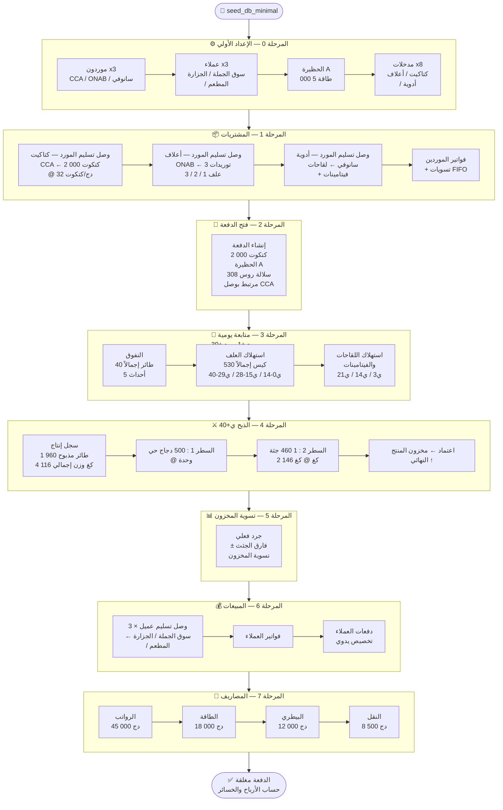

---

## 2. ما يوفره الـ seed الأدنى

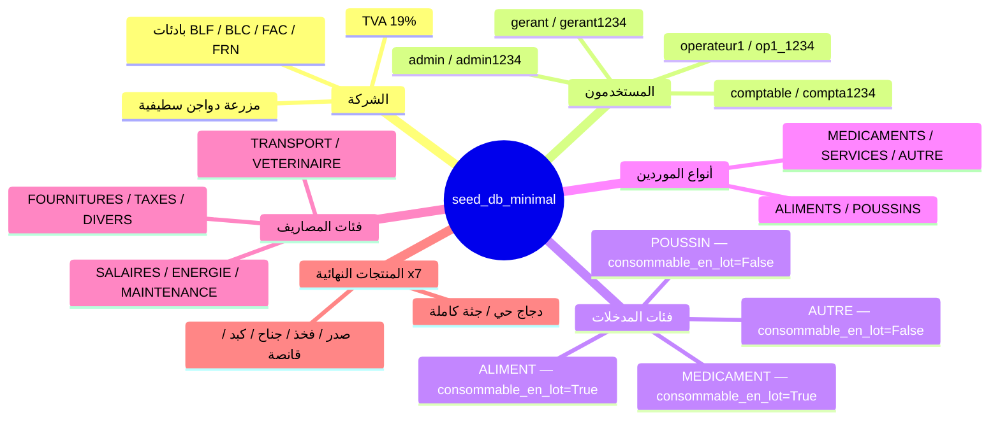

> ⚠️ **المخزون = صفر في كل مكان.** لا موردون، لا عملاء، لا حظائر، لا مدخلات،
> لا وصولات، لا دفعات، لا فواتير، لا حركات مخزون.
> **المرحلة 0** تغطي الإدخال اليدوي لجميع الكيانات الفعلية اللازمة للدورة الكاملة.

---

## المرحلة 0 — الإعداد الأولي (إدخال يدوي)

> **الشرط المسبق**: تنفيذ `python manage.py seed_db_minimal`.
> الدخول بحساب `admin / admin1234`.

### 0.1 إنشاء الموردين

```
الموديول: المشتريات › الموردون › [مورد جديد]
النموذج: FournisseurForm

━━━━━━━━━━━━━━━━━━━━━━━━━━━━━━━━━━━━━━━━━━━━━━━━━━━
FOURN-1 — Couvoirs du Centre (CCA)  ← مطلوب للدفعة
  الاسم            : Couvoirs du Centre — CCA
  النوع الرئيسي    : POUSSINS
  العنوان          : Zone Agro-industrielle, Blida
  الولاية          : Blida
  الهاتف           : 025 55 66 77
  NIF              : 009000000002
  RC               : 09/00-0000002 B 02

FOURN-2 — ONAB سطيف  ← مطلوب للأعلاف
  الاسم            : ONAB Setifien
  النوع الرئيسي    : ALIMENTS
  العنوان          : Route de Boghni, Setifien
  الولاية          : Setifien
  الهاتف           : 026 12 34 56
  NIF              : 099000000001
  RC               : 16/00-0000001 B 01

FOURN-3 — سانوفي الجزائر  ← مطلوب للأدوية
  الاسم            : Sanofi Algérie (Vétérinaire)
  النوع الرئيسي    : MEDICAMENTS
  العنوان          : Rue Hassiba Ben Bouali, Alger
  الولاية          : Alger
  الهاتف           : 021 99 00 11
  NIF              : 016000000003
  RC               : 16/00-0000003 B 03

FOURN-4 — Proxi-Aliments  (اختياري)
  الاسم            : Proxi-Aliments Boumerdès
  النوع الرئيسي    : ALIMENTS
  الولاية          : Boumerdès
  الهاتف           : 024 81 22 33

FOURN-5 — Techno-Avicole  (اختياري — خدمات)
  الاسم            : Techno-Avicole Services
  النوع الرئيسي    : SERVICES
  الولاية          : Alger
  الهاتف           : 021 30 40 50
```

### 0.2 إنشاء العملاء

```
الموديول: المبيعات › العملاء › [عميل جديد]
النموذج: ClientForm

━━━━━━━━━━━━━━━━━━━━━━━━━━━━━━━━━━━━━━━━━━━━━━━━━━━
CLI-1 — سوق الجملة السطيفي  ← مطلوب (BLC-0001)
  الاسم           : Marché de Gros Setifien
  نوع العميل      : تاجر جملة
  الولاية         : Setifien
  الهاتف          : 0555 11 22 33
  سقف الائتمان    : 500 000,00 دج

CLI-2 — جزارة عمران وأبناؤه  ← مطلوب (BLC-0002)
  الاسم           : Boucherie Amrane & Fils
  نوع العميل      : تاجر تجزئة
  الولاية         : Setifien
  الهاتف          : 0660 33 44 55
  سقف الائتمان    : 200 000,00 دج

CLI-3 — مطعم النخلة  ← مطلوب (BLC-0003)
  الاسم           : Restaurant Le Palmier
  نوع العميل      : مطعم
  الولاية         : Setifien
  الهاتف          : 0770 22 33 44
  سقف الائتمان    : 150 000,00 دج

CLI-4 — بقالة وسط عزازقة  (اختياري)
  الاسم           : Épicerie Centrale Azazga
  نوع العميل      : تاجر تجزئة
  الولاية         : Setifien
  سقف الائتمان    : 80 000,00 دج

CLI-5 — تاجر جملة الجزائر الجنوب  (اختياري)
  الاسم           : Grossiste Alger Sud
  نوع العميل      : تاجر جملة
  الولاية         : Alger
  سقف الائتمان    : 1 000 000,00 دج
```

### 0.3 إنشاء الحظائر

```
الموديول: المخزون › الحظائر › [حظيرة جديدة]
النموذج: BatimentForm

━━━━━━━━━━━━━━━━━━━━━━━━━━━━━━━━━━━━━━━━━━━━━━━━━━━
BAT-1 — الحظيرة A  ← مطلوبة للدفعة
  الاسم    : Bâtiment A
  الطاقة   : 5 000
  الوصف    : الحظيرة الرئيسية — تهوية ميكانيكية

BAT-2 — الحظيرة B  (اختيارية — دفعات مستقبلية)
  الاسم    : Bâtiment B
  الطاقة   : 4 000
  الوصف    : الحظيرة الثانوية — تهوية طبيعية

BAT-3 — الحظيرة C  (اختيارية)
  الاسم    : Bâtiment C
  الطاقة   : 6 000
  الوصف    : حظيرة جديدة — عزل مُحسَّن

BAT-4 — مستودع الأعلاف  (اختياري)
  الاسم    : Dépôt Aliments
  الطاقة   : (اتركه فارغاً)
  الوصف    : مستودع تخزين الأعلاف والمدخلات
```

### 0.4 إنشاء المدخلات

```
الموديول: المخزون › المدخلات › [مدخل جديد]
النموذج: IntrantForm

━━━━━━━━━━━━━━━━━━━━━━━━━━━━━━━━━━━━━━━━━━━━━━━━━━━
INT-1 — كتكوت روس 308  ← مطلوب (BLF-0001، فتح الدفعة)
  التسمية        : كتكوت روس 308 (يوم واحد)
  الفئة          : POUSSIN
  وحدة القياس    : unite
  حد التنبيه     : 100
  الموردون        : Couvoirs du Centre — CCA

INT-2 — علف البداية  ← مطلوب (BLF-0002، استهلاك ي0-ي14)
  التسمية        : علف البداية — الطور الأول (0–14 يوم)
  الفئة          : ALIMENT
  وحدة القياس    : sac
  حد التنبيه     : 10
  الموردون        : ONAB Setifien

INT-3 — علف النمو  ← مطلوب (BLF-0002، استهلاك ي15-ي28)
  التسمية        : علف النمو — الطور الثاني (15–28 يوم)
  الفئة          : ALIMENT
  وحدة القياس    : sac
  حد التنبيه     : 15
  الموردون        : ONAB Setifien

INT-4 — علف التسمين  ← مطلوب (BLF-0003، استهلاك ي29-ي40)
  التسمية        : علف التسمين — الطور الثالث (29 يوم فأكثر)
  الفئة          : ALIMENT
  وحدة القياس    : sac
  حد التنبيه     : 20
  الموردون        : ONAB Setifien

INT-5 — لقاح نيوكاسل  ← مطلوب (BLF-0004، تلقيح ي14)
  التسمية        : لقاح نيوكاسل (هيتشنر B1)
  الفئة          : MEDICAMENT
  وحدة القياس    : dose
  حد التنبيه     : 500
  الموردون        : Sanofi Algérie (Vétérinaire)

INT-6 — لقاح غامبورو  ← مطلوب (BLF-0004، تلقيح ي22)
  التسمية        : لقاح غامبورو (IBD متوسط)
  الفئة          : MEDICAMENT
  وحدة القياس    : dose
  حد التنبيه     : 500
  الموردون        : Sanofi Algérie (Vétérinaire)

INT-7 — أموكسيسيلين 50%  ← مطلوب (BLF-0004، علاج ي8+ي22)
  التسمية        : أموكسيسيلين 50% مسحوق
  الفئة          : MEDICAMENT
  وحدة القياس    : g
  حد التنبيه     : 200
  الموردون        : Sanofi Algérie (Vétérinaire)

INT-8 — فيتامينات + إلكتروليتات  ← مطلوب (BLF-0004، دعم ي3/ي8/ي22)
  التسمية        : فيتامينات + إلكتروليتات (مركّب)
  الفئة          : MEDICAMENT
  وحدة القياس    : litre
  حد التنبيه     : 5
  الموردون        : Sanofi Algérie (Vétérinaire)

INT-9 — كتكوت كوب 500  (اختياري — دفعات مستقبلية)
  التسمية        : كتكوت كوب 500 (يوم واحد)
  الفئة          : POUSSIN
  وحدة القياس    : unite
  الموردون        : Couvoirs du Centre — CCA

INT-10 — الفراش  (اختياري)
  التسمية        : فراش (نشارة خشب)
  الفئة          : AUTRE
  وحدة القياس    : sac
  الموردون        : (اتركه فارغاً)
```

> ✅ **المرحلة 0 مكتملة.** جميع الكيانات الفعلية اللازمة للدورة موجودة.
> المخزون = 0 في كل مكان. انتقل إلى المرحلة 1 — شراء المدخلات.

---

## المرحلة 1 — شراء المدخلات

### 1.1 نظرة عامة على المشتريات اللازمة

| المدخل                               | الكمية / دفعة 40 يوم / 2 000 طائر | الوحدة | المورد         |
| ------------------------------------ | --------------------------------- | ------ | -------------- |
| كتكوت روس 308                        | 2 000                             | وحدة   | CCA بليدة      |
| علف البداية الطور الأول (0–14 يوم)   | 200                               | كيس    | ONAB سطيف      |
| علف النمو الطور الثاني (15–28 يوم)   | 180                               | كيس    | ONAB سطيف      |
| علف التسمين الطور الثالث (29–40 يوم) | 150                               | كيس    | ONAB سطيف      |
| لقاح نيوكاسل (هيتشنر B1)             | 4 000                             | جرعة   | سانوفي الجزائر |
| لقاح غامبورو (IBD)                   | 4 000                             | جرعة   | سانوفي الجزائر |
| أموكسيسيلين 50% مسحوق                | 500                               | غ      | سانوفي الجزائر |
| فيتامينات + إلكتروليتات              | 10                                | لتر    | سانوفي الجزائر |

### 1.2 تدفق وصولات تسليم الموردين الأربعة

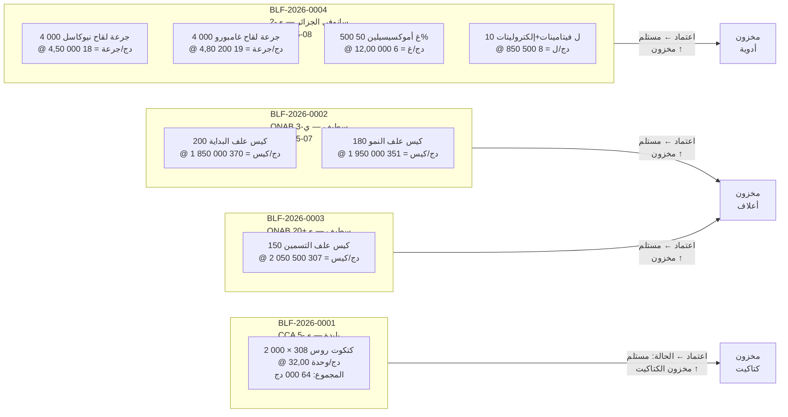

### 1.3 نماذج وصل تسليم المورد (`BLFournisseurForm`)

```
الموديول: المشتريات › وصولات تسليم المورد › [جديد]
القاعدة: الحالة لا تقبل إلا مسودة / مستلم / في نزاع (BR-BLF-02)
         تاريخ الوصل ≤ اليوم
         المرفق: PDF/JPG/PNG ≤ 5 ميغابايت

━━━━━━━━━━━━━━━━━━━━━━━━━━━━━━━━━━━━━━━━━━━━━━━━━━━
BLF-2026-0001 — كتاكيت CCA
  المرجع               : BLF-2026-0001
  المورد               : Couvoirs du Centre — CCA
  تاريخ الوصل          : 2026-05-05
  مرجع المورد          : "BC-CCA-0512-2026"
  الحالة               : مستلم
  ملاحظات الاستلام     : "وصول 07:30 — شاحنة مبردة — حالة جيدة"

  الأسطر (BLFournisseurLigneFormSet):
  ┌─────────────────────────────────────────────────────────────────┐
  │ المدخل              │ الكمية │ سعر الوحدة  │ الملاحظات           │
  ├─────────────────────┼────────┼─────────────┼─────────────────────┤
  │ كتكوت روس 308       │  2 000 │   32,0000   │ خلط الجنسين         │
  └─────────────────────┴────────┴─────────────┴─────────────────────┘
  ← مجموع السطر: 64 000,00 دج
  الإجراء: [حفظ] ← الحالة = مستلم ← مخزون(كتكوت روس 308) ↑ 2 000

━━━━━━━━━━━━━━━━━━━━━━━━━━━━━━━━━━━━━━━━━━━━━━━━━━━
BLF-2026-0002 — أعلاف ONAB (1/2)
  المرجع               : BLF-2026-0002
  المورد               : ONAB Setifien
  تاريخ الوصل          : 2026-05-07
  مرجع المورد          : "ONAB-BL-20260507-088"
  الحالة               : مستلم

  الأسطر:
  ┌──────────────────────────────────────────────────────────────────┐
  │ المدخل              │ الكمية   │ سعر الوحدة  │ المجموع            │
  ├─────────────────────┼──────────┼─────────────┼────────────────────┤
  │ علف البداية         │  200,000 │  1 850,0000 │ 370 000            │
  │ علف النمو           │  180,000 │  1 950,0000 │ 351 000            │
  └─────────────────────┴──────────┴─────────────┴────────────────────┘
  ← مجموع الوصل: 721 000,00 دج
  ← مخزون علف البداية ↑ 200 كيس / مخزون علف النمو ↑ 180 كيس

━━━━━━━━━━━━━━━━━━━━━━━━━━━━━━━━━━━━━━━━━━━━━━━━━━━
BLF-2026-0003 — أعلاف ONAB (تسمين — ي+20)
  المرجع               : BLF-2026-0003
  المورد               : ONAB Setifien
  تاريخ الوصل          : 2026-05-30
  الحالة               : مستلم

  الأسطر:
  ┌──────────────────────────────────────────────────────────────────┐
  │ المدخل              │ الكمية   │ سعر الوحدة  │ المجموع            │
  ├─────────────────────┼──────────┼─────────────┼────────────────────┤
  │ علف التسمين         │  150,000 │  2 050,0000 │ 307 500            │
  └─────────────────────┴──────────┴─────────────┴────────────────────┘
  ← مجموع الوصل: 307 500,00 دج

━━━━━━━━━━━━━━━━━━━━━━━━━━━━━━━━━━━━━━━━━━━━━━━━━━━
BLF-2026-0004 — أدوية سانوفي
  المرجع               : BLF-2026-0004
  المورد               : Sanofi Algérie (Vétérinaire)
  تاريخ الوصل          : 2026-05-08
  الحالة               : مستلم

  الأسطر:
  ┌────────────────────────────────────────────────────────────────────┐
  │ المدخل                       │ الكمية │ سعر الوحدة │ المجموع       │
  ├──────────────────────────────┼────────┼────────────┼───────────────┤
  │ لقاح نيوكاسل (هيتشنر B1)    │  4 000 │    4,5000  │  18 000       │
  │ لقاح غامبورو (IBD)           │  4 000 │    4,8000  │  19 200       │
  │ أموكسيسيلين 50% مسحوق        │    500 │   12,0000  │   6 000       │
  │ فيتامينات + إلكتروليتات      │     10 │  850,0000  │   8 500       │
  └──────────────────────────────┴────────┴────────────┴───────────────┘
  ← مجموع الوصل: 51 700,00 دج
```

### 1.4 فواتير الموردين (`FactureFournisseurForm`)

```
القاعدة: BR-FAF-01 المبلغ الإجمالي محسوب تلقائياً من أسطر الوصل (لا إدخال يدوي)
         BR-FAF-02 فقط الوصولات بحالة "مستلم" للمورد ذاته قابلة للاختيار
         BR-FAF-04 حالة "مدفوعة" غير قابلة للاختيار (تُعيَّن بالتسويات)

━━━━━━━━━━━━━━━━━━━━━━━━━━━━━━━━━━━━━━━━━━━━━━━━━━━
FRN-2026-0001 — فاتورة كتاكيت CCA
  المرجع          : FRN-2026-0001
  المورد          : Couvoirs du Centre — CCA
  وصولات التسليم  : [BLF-2026-0001] ← اختيار بمربع تحديد
  تاريخ الفاتورة  : 2026-05-06
  تاريخ الاستحقاق : 2026-06-05  ← +30 يوم
  نوع الفاتورة    : بضائع
  الحالة          : غير مدفوعة
  المبلغ الإجمالي : 64 000,00 دج ← تلقائي

FRN-2026-0002 — فاتورة أعلاف ONAB (1/2)
  المورد          : ONAB Setifien
  وصولات التسليم  : [BLF-2026-0002]
  تاريخ الفاتورة  : 2026-05-08
  تاريخ الاستحقاق : 2026-06-07
  المبلغ الإجمالي : 721 000,00 دج ← تلقائي

FRN-2026-0003 — فاتورة أعلاف ONAB (تسمين)
  المورد          : ONAB Setifien
  وصولات التسليم  : [BLF-2026-0003]
  تاريخ الفاتورة  : 2026-05-31
  تاريخ الاستحقاق : 2026-06-30
  المبلغ الإجمالي : 307 500,00 دج ← تلقائي

FRN-2026-0004 — فاتورة أدوية سانوفي
  المورد          : Sanofi Algérie (Vétérinaire)
  وصولات التسليم  : [BLF-2026-0004]
  تاريخ الفاتورة  : 2026-05-09
  تاريخ الاستحقاق : 2026-06-08
  المبلغ الإجمالي : 51 700,00 دج ← تلقائي
```

> ⚠️ **BR-BLF-02**: تنتقل الوصولات إلى حالة `مفوتر` وتُقفل فور إدراجها في فاتورة.

### 1.5 تسويات الموردين (`ReglementFournisseurForm`)

```
القاعدة: BR-REG-03 التخصيص FIFO التلقائي على الفواتير غير المسددة
         BR-REG-06 التسويات غير قابلة للتعديل بعد الإنشاء

REG-2026-0001 — تسوية CCA
  المورد           : Couvoirs du Centre — CCA
  تاريخ التسوية    : 2026-05-10
  المبلغ           : 64 000,00 دج
  طريقة الدفع      : تحويل بنكي
  مرجع الدفع       : "VIR-BNA-10052026-001"
  ← تخصيص على FRN-2026-0001 : 64 000,00 دج ← الحالة = مدفوعة ✅

REG-2026-0002 — تسوية ONAB (دفعة أولى)
  المورد           : ONAB Setifien
  تاريخ التسوية    : 2026-05-10
  المبلغ           : 400 000,00 دج
  طريقة الدفع      : شيك
  مرجع الدفع       : "CHQ-0455"
  ← تخصيص FIFO على FRN-2026-0002 : 400 000,00 دج
  ← FRN-2026-0002 المتبقي: 321 000,00 دج ← مدفوعة جزئياً

REG-2026-0003 — تسوية ONAB (تسوية الرصيد أعلاف 1/2)
  المورد           : ONAB Setifien
  تاريخ التسوية    : 2026-05-25
  المبلغ           : 321 000,00 دج
  طريقة الدفع      : تحويل بنكي
  ← FRN-2026-0002 مسددة ✅

REG-2026-0004 — تسوية سانوفي
  المورد           : Sanofi Algérie (Vétérinaire)
  تاريخ التسوية    : 2026-05-15
  المبلغ           : 51 700,00 دج
  طريقة الدفع      : تحويل بنكي
  ← FRN-2026-0004 مسددة ✅
```

---

## المرحلة 2 — فتح دفعة التربية

### 2.1 التدفق

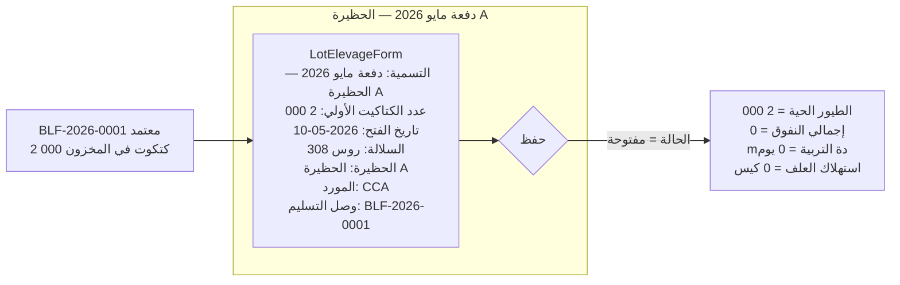

### 2.2 نموذج دفعة التربية (`LotElevageForm`)

```
الموديول: التربية › الدفعات › [فتح دفعة جديدة]
النموذج: LotElevageForm

  التسمية                    : "دفعة مايو 2026 — الحظيرة A"
  تاريخ الفتح                : 2026-05-10  ← ≤ اليوم (BR-LOT clean_date_ouverture)
  عدد الكتاكيت الأولي        : 2 000       ← ≥ 1 (BR-LOT clean)
  مورد الكتاكيت              : Couvoirs du Centre — CCA
  وصل تسليم الكتاكيت         : BLF-2026-0001  ← وصل بحالة مستلم أو مفوتر
  الحظيرة                    : الحظيرة A
  السلالة                    : روس 308
  الملاحظات                  : "الكثافة: 13,3 طائر/م² — المساحة الصافية 150 م²"

  ← الحالة = مفتوحة
  ← الطيور الحية = 2 000
```

---

## المرحلة 3 — المتابعة اليومية

### 3.1 تقويم الدفعة (ي0 = 10 مايو 2026)

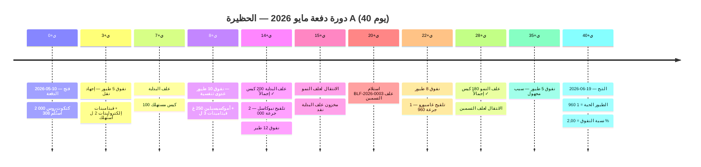

### 3.2 أحداث النفوق (`MortaliteForm`)

```
الموديول: التربية › الدفعة › [تسجيل نفوق]
القاعدة: BR-LOT-03 الدفعة يجب أن تكون مفتوحة
         التراكم ≤ عدد الكتاكيت الأولي

┌──────────────────────────────────────────────────────────────────────────────┐
│ التاريخ    │ العدد │ السبب                          │ التراكم │ الأحياء    │
├────────────┼───────┼────────────────────────────────┼─────────┼────────────┤
│ 2026-05-13 │     5 │ إجهاد النقل / جفاف            │       5 │    1 995   │
│ 2026-05-18 │    10 │ عدوى تنفسية مبكرة              │      15 │    1 985   │
│ 2026-05-24 │    12 │ داء الرشاشيات المشتبه به        │      27 │    1 973   │
│ 2026-06-01 │     8 │ كوكسيديا — بدء العلاج           │      35 │    1 965   │
│ 2026-06-14 │     5 │ سبب غير محدد                   │      40 │    1 960   │
└────────────┴───────┴────────────────────────────────┴─────────┴────────────┘
  نسبة النفوق النهائية: 40 / 2 000 = 2,00 %
```

> 💡 **أمر الإدخال السريع** — لتجنب إدخال الأحداث الخمسة يدوياً:
>
> ```bash
> python manage.py seed_elevage_lot --lot "دفعة مايو 2026 — الحظيرة A" --what mortalites
> ```

### 3.3 استهلاك العلف (`ConsommationForm`)

```
الموديول: التربية › الدفعة › [تسجيل استهلاك]
القاعدة: BR-LOT-03 الدفعة مفتوحة / BR-INT-03 المخزون المتاح ≥ الكمية المطلوبة
         فقط المدخلات ذات consommable_en_lot=True تظهر (علف + دواء)

طور البداية — ي0 إلى ي14 (200 كيس إجمالاً)
  ┌──────────────────────────────────────────────────────────────┐
  │ التاريخ    │ المدخل       │ الكمية  │ المخزون بعد            │
  ├────────────┼──────────────┼─────────┼────────────────────────┤
  │ 2026-05-12 │ علف البداية  │  25,000 │ 175 كيس                │
  │ 2026-05-14 │ علف البداية  │  25,000 │ 150 كيس                │
  │ 2026-05-17 │ علف البداية  │  50,000 │ 100 كيس                │
  │ 2026-05-21 │ علف البداية  │  50,000 │  50 كيس                │
  │ 2026-05-24 │ علف البداية  │  50,000 │   0 كيس ✓ نفد          │
  └────────────┴──────────────┴─────────┴────────────────────────┘

طور النمو — ي15 إلى ي28 (180 كيس إجمالاً)
  ┌──────────────────────────────────────────────────────────────┐
  │ التاريخ    │ المدخل       │ الكمية  │ المخزون بعد            │
  ├────────────┼──────────────┼─────────┼────────────────────────┤
  │ 2026-05-25 │ علف النمو    │  60,000 │ 120 كيس                │
  │ 2026-06-01 │ علف النمو    │  60,000 │  60 كيس                │
  │ 2026-06-08 │ علف النمو    │  60,000 │   0 كيس ✓ نفد          │
  └────────────┴──────────────┴─────────┴────────────────────────┘

طور التسمين — ي29 إلى ي40 (150 كيس — توريد BLF-0003 وصل ي+20)
  ┌──────────────────────────────────────────────────────────────┐
  │ التاريخ    │ المدخل        │ الكمية  │ المخزون بعد           │
  ├────────────┼───────────────┼─────────┼───────────────────────┤
  │ 2026-06-08 │ علف التسمين   │  50,000 │ 100 كيس               │
  │ 2026-06-13 │ علف التسمين   │  50,000 │  50 كيس               │
  │ 2026-06-18 │ علف التسمين   │  50,000 │   0 كيس ✓ نفد         │
  └────────────┴───────────────┴─────────┴───────────────────────┘
```

> 💡 **أمر الإدخال السريع** للأعلاف:
>
> ```bash
> python manage.py seed_elevage_lot --lot "دفعة مايو 2026 — الحظيرة A" --what aliments
> ```

### 3.4 استهلاك الأدوية

```
الطور الوقائي والعلاجي:
  ┌──────────────────────────────────────────────────────────────────────────────┐
  │ التاريخ    │ المدخل                    │ الكمية   │ الغرض                    │
  ├────────────┼───────────────────────────┼──────────┼──────────────────────────┤
  │ 2026-05-13 │ فيتامينات + إلكتروليتات  │  2,000 ل │ دعم إجهاد الوصول        │
  │ 2026-05-18 │ أموكسيسيلين 50%          │  250 غ   │ عدوى تنفسية (علاج)       │
  │ 2026-05-18 │ فيتامينات + إلكتروليتات  │  3,000 ل │ دعم المناعة               │
  │ 2026-05-24 │ لقاح نيوكاسل HB1         │ 2 000 ج  │ التلقيح الأولي            │
  │ 2026-06-01 │ لقاح غامبورو IBD         │ 1 965 ج  │ تلقيح غامبورو (1 965 حي) │
  │ 2026-06-01 │ أموكسيسيلين 50%          │  250 غ   │ علاج الكوكسيديا           │
  │ 2026-06-01 │ فيتامينات + إلكتروليتات  │  5,000 ل │ تعافٍ ما بعد العلاج      │
  └────────────┴───────────────────────────┴──────────┴──────────────────────────┘

  المخزون المتبقي بعد الدورة:
  لقاح نيوكاسل  : 4 000 - 2 000 = 2 000 جرعة
  لقاح غامبورو  : 4 000 - 1 965 = 2 035 جرعة
  أموكسيسيلين   :   500 -   500 =     0 غ ← نفد
  فيتامينات     :    10 -    10 =     0 ل ← نفد
```

> 💡 **أمر الإدخال السريع** للأدوية:
>
> ```bash
> python manage.py seed_elevage_lot --lot "دفعة مايو 2026 — الحظيرة A" --what medics
> ```
>
> **لتعبئة كل شيء دفعة واحدة** (نفوق + أعلاف + أدوية):
>
> ```bash
> python manage.py seed_elevage_lot --lot "دفعة مايو 2026 — الحظيرة A"
> ```

---

## المرحلة 4 — الذبح والإنتاج

### 4.1 التدفق

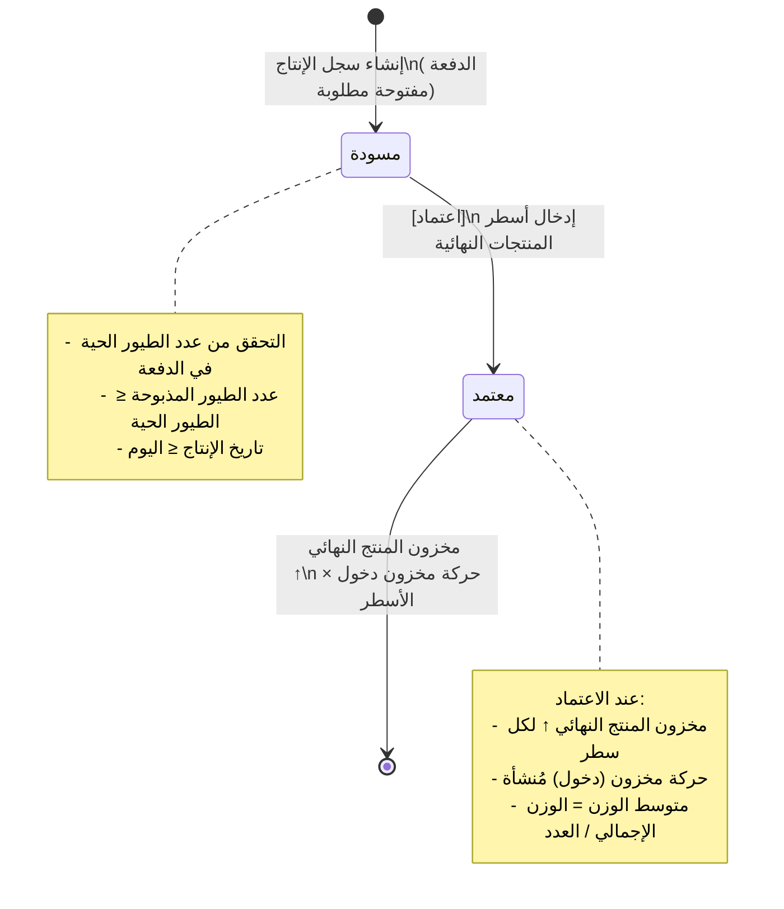

### 4.2 نموذج سجل الإنتاج (`ProductionRecordForm`)

```
الموديول: الإنتاج › [سجل إنتاج جديد]
النموذج: ProductionRecordForm

  الدفعة                    : دفعة مايو 2026 — الحظيرة A  ← حالة مفتوحة مطلوبة
  تاريخ الإنتاج             : 2026-06-19
  عدد الطيور المذبوحة       : 1 960  ← ≤ الطيور الحية (1 960) ✅
  الوزن الإجمالي (كغ)       : 4 116,000  ← 1 960 × 2,100 كغ متوسط
  الملاحظات                 : "ذبح كامل — متوسط الوزن 2,1 كغ — الدفعة مغلقة"

  ← متوسط الوزن محسوب تلقائياً: 4 116,000 / 1 960 = 2,100 كغ
  ← الحالة = مسودة
```

### 4.3 أسطر الإنتاج (`ProductionLigneFormSet`)

```
الأسطر (سجل واحد ← N أسطر منتجات نهائية):

  ┌─────────────────────────────────────────────────────────────────────────────┐
  │ المنتج النهائي       │ الكمية   │ وزن الوحدة │ تكلفة الوحدة │ القيمة الإجمالية │
  ├──────────────────────┼──────────┼────────────┼──────────────┼──────────────────┤
  │ دجاج حي              │  500,000 │  2,100 كغ  │  320,0000 دج │  160 000,00       │
  │ جثة كاملة منزوعة     │ 1 460,000│  1,470 كغ  │  280,0000 دج │  408 800,00       │
  └──────────────────────┴──────────┴────────────┴──────────────┴──────────────────┘

  إجمالي القيمة التقديرية: 568 800,00 دج

  الإجراء: [اعتماد] ← الحالة = معتمد
    ← مخزون(دجاج حي)             ↑ +500,000 وحدة
    ← مخزون(جثة كاملة منزوعة)   ↑ +1 460,000 وحدة
    ← 2 × حركة مخزون (مصدر=إنتاج، نوع=دخول)
```

### 4.4 إغلاق الدفعة (`LotFermetureForm`)

```
الموديول: التربية › الدفعة › [إغلاق الدفعة]
النموذج: LotFermetureForm

  تاريخ الإغلاق  : 2026-06-19
  ملاحظات الإغلاق: "الدفعة مغلقة بعد الذبح الكامل. نسبة النفوق=2%. IC=1,62. متوسط الزيادة اليومية=53 غ/يوم."

  ← الدفعة.الحالة = مغلقة
  ← لا نفوق ولا استهلاك إضافي ممكن (BR-LOT-03)
```

### 4.5 المؤشرات الحيوانية النهائية

| المؤشر                | الحساب                         | القيمة         |
| --------------------- | ------------------------------ | -------------- |
| الطيور الأولية        | —                              | 2 000 طائر     |
| إجمالي النفوق         | —                              | 40 طائر        |
| نسبة النفوق           | 40 / 2 000 × 100               | **2,00 %**     |
| الطيور المذبوحة       | 2 000 − 40                     | **1 960**      |
| متوسط الوزن عند الذبح | 4 116 / 1 960                  | **2,100 كغ**   |
| مدة التربية           | ي0 ← ي40                       | **40 يوم**     |
| إجمالي استهلاك العلف  | 200 + 180 + 150                | **530 كيس**    |
| متوسط الزيادة اليومية | 2 100غ / 40 يوم                | **52,5 غ/يوم** |
| معامل التحويل         | 530 × 25 كغ / (1 960 × 2,1 كغ) | **≈ 3,24**     |

---

## المرحلة 5 — تسوية المخزون

> **السياق**: الجرد الفعلي في 2026-06-20 يكشف عن نقص 3 جثث (تلف في غرفة التبريد).

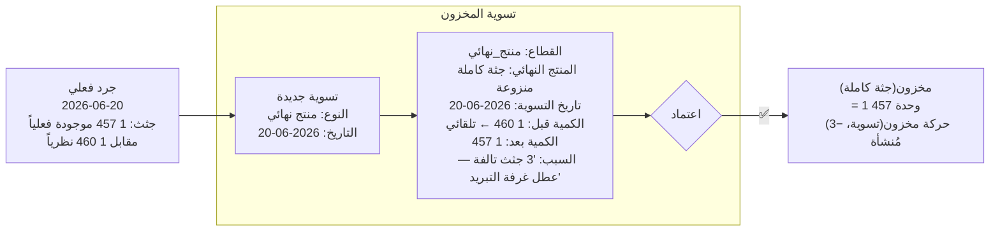

```
الموديول: المخزون › تسويات › [جديد]
النموذج: StockAjustementForm

  القطاع           : PRODUIT_FINI
  المنتج النهائي   : جثة كاملة منزوعة الأحشاء
  تاريخ التسوية    : 2026-06-20  ← ≤ اليوم
  الكمية قبل       : 1 460,000   ← للقراءة فقط، يملأه النظام تلقائياً
  الكمية بعد       : 1 457,000
  السبب            : "3 جثث تالفة بسبب عطل غرفة التبريد — دفعة 20/06"

  القواعد: الكمية بعد ≥ 0 / القطاع = منتج_نهائي ← المنتج النهائي مطلوب / المدخل = فارغ
```

---

## المرحلة 6 — البيع والتسليم للعملاء

### 6.1 نظرة عامة على المبيعات

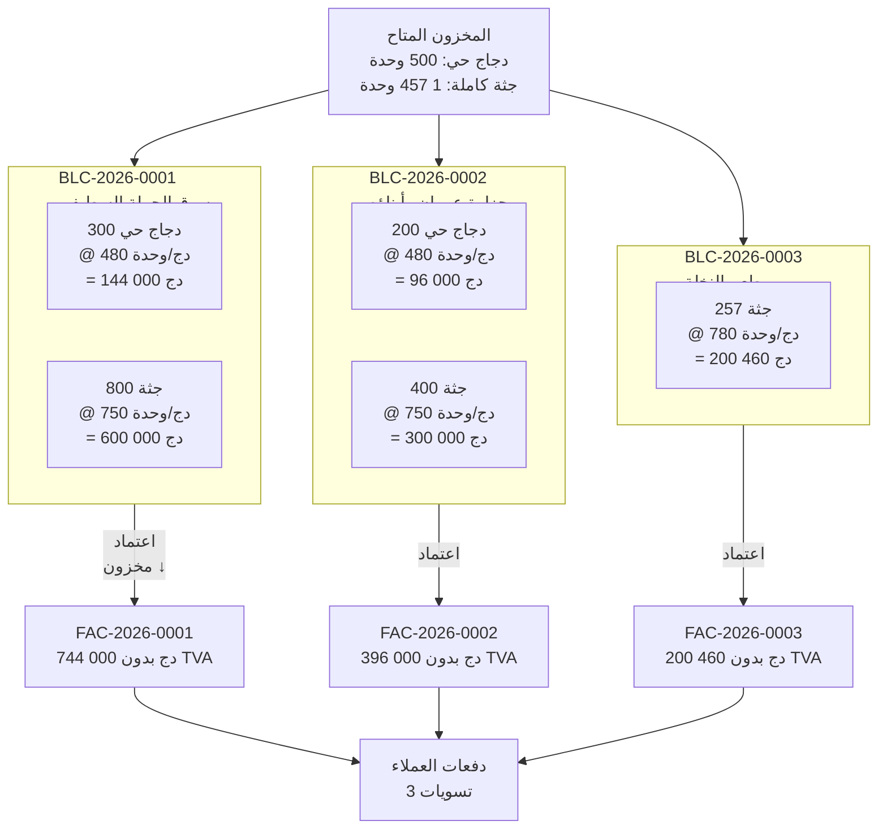

### 6.2 نماذج وصل تسليم العميل (`BLClientForm`)

```
الموديول: المبيعات › وصولات تسليم العميل › [جديد]
القاعدة: BR-BLC-02 التحقق من المخزون قبل الاعتماد (الكمية ≤ المخزون المتاح)
         BR-BLC-03 وصل مفوتر = مقفل
         الحالات المتاحة للمستخدم: مسودة / تم التسليم / في نزاع (لا "مفوتر")

━━━━━━━━━━━━━━━━━━━━━━━━━━━━━━━━━━━━━━━━━━━━━━━━━━━
BLC-2026-0001 — سوق الجملة السطيفي
  المرجع              : BLC-2026-0001
  العميل              : Marché de Gros Setifien
  تاريخ الوصل         : 2026-06-20
  عنوان التسليم       : "منطقة السوق، الطريق الوطني 5، سطيف"
  موقع من قبل         : "بوعلام خالد — مسؤول الاستلام"
  الحالة              : تم التسليم

  الأسطر:
  ┌────────────────────────────────────────────────────────────────────────────┐
  │ المنتج النهائي       │ الكمية   │ سعر الوحدة  │ المجموع                    │
  ├──────────────────────┼──────────┼─────────────┼────────────────────────────┤
  │ دجاج حي              │  300,000 │   480,0000  │  144 000,00                │
  │ جثة كاملة منزوعة    │  800,000 │   750,0000  │  600 000,00                │
  └──────────────────────┴──────────┴─────────────┴────────────────────────────┘
  مجموع الوصل: 744 000,00 دج
  الإجراء: [اعتماد] ← الحالة = تم التسليم
    ← مخزون(دجاج حي)           ↓ −300 (تبقى 200)
    ← مخزون(جثة كاملة منزوعة)  ↓ −800 (تبقى 657)

━━━━━━━━━━━━━━━━━━━━━━━━━━━━━━━━━━━━━━━━━━━━━━━━━━━
BLC-2026-0002 — جزارة عمران وأبناؤه
  المرجع  : BLC-2026-0002
  العميل  : Boucherie Amrane & Fils
  تاريخ الوصل : 2026-06-21
  الحالة  : تم التسليم

  الأسطر:
  ┌────────────────────────────────────────────────────────────────────────────┐
  │ المنتج النهائي       │ الكمية   │ سعر الوحدة  │ المجموع                    │
  ├──────────────────────┼──────────┼─────────────┼────────────────────────────┤
  │ دجاج حي              │  200,000 │   480,0000  │   96 000,00                │
  │ جثة كاملة منزوعة    │  400,000 │   750,0000  │  300 000,00                │
  └──────────────────────┴──────────┴─────────────┴────────────────────────────┘
  مجموع الوصل: 396 000,00 دج
  ← مخزون دجاج حي ↓ −200 (تبقى 0) / جثة ↓ −400 (تبقى 257)

━━━━━━━━━━━━━━━━━━━━━━━━━━━━━━━━━━━━━━━━━━━━━━━━━━━
BLC-2026-0003 — مطعم النخلة
  المرجع  : BLC-2026-0003
  العميل  : Restaurant Le Palmier
  تاريخ الوصل : 2026-06-22
  الحالة  : تم التسليم

  الأسطر:
  ┌────────────────────────────────────────────────────────────────────────────┐
  │ المنتج النهائي       │ الكمية   │ سعر الوحدة  │ المجموع                    │
  ├──────────────────────┼──────────┼─────────────┼────────────────────────────┤
  │ جثة كاملة منزوعة    │  257,000 │   780,0000  │  200 460,00                │
  └──────────────────────┴──────────┴─────────────┴────────────────────────────┘
  مجموع الوصل: 200 460,00 دج
  ← جثة ↓ −257 (تبقى 0) ✅ كل المخزون بيع
```

### 6.3 فواتير العملاء والدفعات

```
القاعدة: BR-FAC-01 المبلغ بدون TVA = مجموع أسطر الوصولات تلقائياً
         BR-FAC-02 فقط الوصولات بحالة "تم التسليم" للعميل ذاته
         BR-FAC-03 الدفع يدوي — المستخدم يختار الفاتورة(ات) للتغطية
         حالة "مدفوعة" غير قابلة للاختيار (تُعيَّن بالتخصيصات)

FAC-2026-0001 — سوق الجملة السطيفي
  العميل          : Marché de Gros Setifien
  وصولات التسليم  : [BLC-2026-0001]
  تاريخ الفاتورة  : 2026-06-20
  تاريخ الاستحقاق : 2026-07-20  ← +30 يوم
  المبلغ بدون TVA : 744 000,00 ← تلقائي
  نسبة TVA        : 0,00 %  ← الدواجن معفاة من TVA
  المبلغ شامل TVA : 744 000,00

  الدفعة 1:
    العميل        : Marché de Gros Setifien
    تاريخ الدفع   : 2026-06-20
    المبلغ        : 744 000,00
    طريقة الدفع   : نقداً
    التخصيص       : ← FAC-2026-0001 : 744 000 دج ← الحالة = مدفوعة ✅

FAC-2026-0002 — جزارة عمران وأبناؤه
  وصولات التسليم  : [BLC-2026-0002]
  المبلغ بدون TVA : 396 000,00
  المبلغ شامل TVA : 396 000,00 (معفى)

  الدفعة 2:
    المبلغ        : 200 000,00
    طريقة الدفع   : شيك
    مرجع الدفع    : "CHQ-AMRANE-1044"
    التخصيص       : ← FAC-2026-0002 : 200 000 دج ← مدفوعة جزئياً
    المتبقي       : 196 000,00 دج ← في الانتظار

FAC-2026-0003 — مطعم النخلة
  وصولات التسليم  : [BLC-2026-0003]
  المبلغ شامل TVA : 200 460,00

  الدفعة 3:
    المبلغ        : 200 460,00
    طريقة الدفع   : تحويل بنكي
    مرجع الدفع    : "VIR-PALMIER-22062026"
    التخصيص       : ← FAC-2026-0003 : 200 460 دج ← مدفوعة ✅
```

---

## المرحلة 7 — المصاريف التشغيلية

### 7.1 التدفق

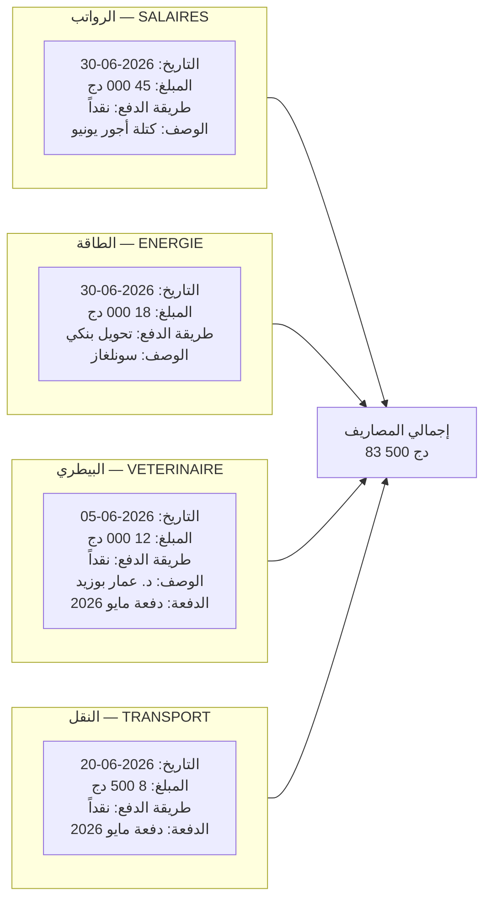

### 7.2 نماذج المصاريف (`DepenseForm`)

```
الموديول: المصاريف › [مصروف جديد]
القاعدة: BR-DEP-01/03 الفاتورة المرتبطة للفواتير من نوع "خدمة" فقط
         BR-DEP-04 تخصيص الدفعة اختياري (تحليل الربحية)
         التاريخ ≤ اليوم / المبلغ > 0

DEP-001 — رواتب يونيو
  التاريخ            : 2026-06-30
  الفئة              : الرواتب والأجور
  الوصف              : "رواتب عمال التربية — دفعة مايو 2026 — 3 أشخاص"
  المبلغ             : 45 000,00
  طريقة الدفع        : نقداً
  مرجع الوثيقة       : "FP-JUIN-2026"
  الدفعة             : دفعة مايو 2026 — الحظيرة A  ← تخصيص تحليلي (BR-DEP-04)
  الفاتورة المرتبطة  : (فارغ)

DEP-002 — كهرباء سونلغاز
  التاريخ            : 2026-06-30
  الفئة              : الطاقة (كهرباء / غاز)
  الوصف              : "فاتورة كهرباء يونيو 2026 — تهوية + إضاءة الحظيرة A"
  المبلغ             : 18 000,00
  طريقة الدفع        : تحويل بنكي
  مرجع الوثيقة       : "SONELGAZ-2026-06-8854"
  الدفعة             : دفعة مايو 2026 — الحظيرة A

DEP-003 — أتعاب البيطري
  التاريخ            : 2026-06-05
  الفئة              : المصاريف البيطرية
  الوصف              : "زيارة صحية + تشخيص كوكسيديا — د. عمار بوزيد"
  المبلغ             : 12 000,00
  طريقة الدفع        : نقداً
  الدفعة             : دفعة مايو 2026 — الحظيرة A
  الفاتورة المرتبطة  : (فارغ — أتعاب مباشرة، لا فاتورة خدمة مورد)
  الملاحظات          : "وصفة طبية + بروتوكول علاج أموكسيسيلين 250 غ"

DEP-004 — نقل التسليم
  التاريخ            : 2026-06-20
  الفئة              : النقل والوقود
  الوصف              : "نقل للذبح + توصيل العملاء — 20 و 21 يونيو"
  المبلغ             : 8 500,00
  طريقة الدفع        : نقداً
  الدفعة             : دفعة مايو 2026 — الحظيرة A
```

---

## 11. حساب نتائج الدفعة

### 11.1 ملخص التدفقات المالية

```mermaid
sankey-beta
  الإيرادات,بيع سوق الجملة,744000
  الإيرادات,بيع جزارة عمران,396000
  الإيرادات,بيع مطعم النخلة,200460
  التكاليف,شراء كتاكيت,64000
  التكاليف,شراء أعلاف,1028500
  التكاليف,شراء أدوية,51700
  التكاليف,رواتب,45000
  التكاليف,طاقة,18000
  التكاليف,بيطري,12000
  التكاليف,نقل,8500
```

### 11.2 حساب الأرباح والخسائر التحليلي — دفعة مايو 2026

| البند                                          | المبلغ (دج)       |
| ---------------------------------------------- | ----------------- |
| **الإيرادات**                                  |                   |
| بيع دجاج حي (500 وحدة × متوسط 480 دج)          | 240 000,00        |
| بيع جثة كاملة (1 457 وحدة × متوسط 757 دج)      | 1 103 949,00      |
| تسوية المخزون (−3 جثث تالفة)                   | −2 271,00         |
| **إجمالي الإيرادات**                           | **1 341 678,00**  |
|                                                |                   |
| **التكاليف المباشرة**                          |                   |
| شراء كتاكيت (2 000 × 32 دج)                    | −64 000,00        |
| شراء أعلاف (200×1 850 + 180×1 950 + 150×2 050) | −1 028 500,00     |
| شراء أدوية ولقاحات                             | −51 700,00        |
| **إجمالي التكاليف المباشرة**                   | **−1 144 200,00** |
|                                                |                   |
| **التكاليف التشغيلية**                         |                   |
| رواتب العمال                                   | −45 000,00        |
| الطاقة الكهربائية                              | −18 000,00        |
| أتعاب البيطري                                  | −12 000,00        |
| نقل التسليم                                    | −8 500,00         |
| **إجمالي التكاليف التشغيلية**                  | **−83 500,00**    |
|                                                |                   |
| **صافي نتيجة الدفعة**                          | **113 978,00 دج** |
| **هامش الربح الصافي**                          | **~8,5 %**        |
| **الهامش لكل طائر مباع**                       | **58,15 دج**      |

### 11.3 جدول حركات مخزون المنتجات النهائية

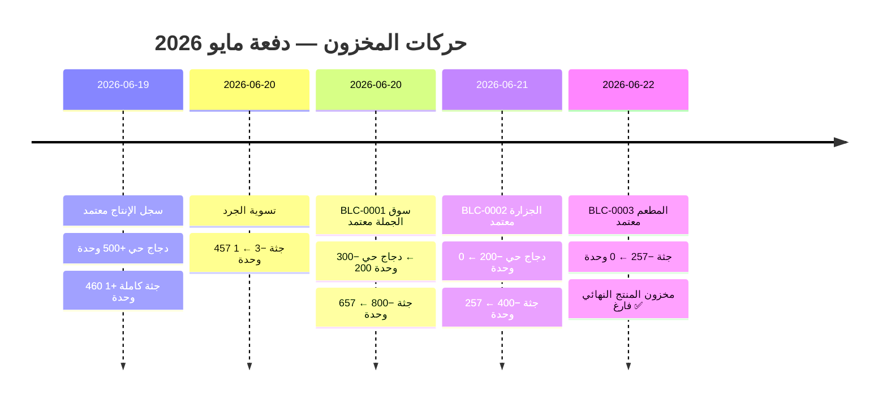

### 11.4 لوحة متابعة الذمم المدينة

| العميل       | الفاتورة      | المبلغ شامل TVA | المُسدَّد     | المتبقي     | الحالة    |
| ------------ | ------------- | --------------- | ------------- | ----------- | --------- |
| سوق الجملة   | FAC-2026-0001 | 744 000         | 744 000       | 0           | ✅ مدفوعة |
| جزارة عمران  | FAC-2026-0002 | 396 000         | 200 000       | **196 000** | ⚠️ جزئية  |
| مطعم النخلة  | FAC-2026-0003 | 200 460         | 200 460       | 0           | ✅ مدفوعة |
| **الإجمالي** |               | **1 340 460**   | **1 144 460** | **196 000** |           |

---

## 12. قواعد العمل المُفعَّلة

### 12.1 جدول قواعد العمل حسب المرحلة

| القاعدة          | الموديول  | الوصف                                      | نقطة التطبيق                                         |
| ---------------- | --------- | ------------------------------------------ | ---------------------------------------------------- |
| **BR-BLF-01**    | المشتريات | تأثير المخزون عند اعتماد الوصل فقط         | إشارة `post_save` لـ BLFournisseurLigne              |
| **BR-BLF-02**    | المشتريات | وصل مفوتر مقفل — لا يمكن تعديله            | `BLFournisseurForm.clean()` + `est_verrouille`       |
| **BR-BLF-03**    | المشتريات | وصل "في نزاع" مستثنى من اختيار الفاتورة    | QuerySet `FactureFournisseurForm`                    |
| **BR-FAF-01**    | المشتريات | مبلغ الفاتورة = مجموع أسطر الوصل تلقائياً  | إشارة حساب post-save                                 |
| **BR-FAF-02**    | المشتريات | فقط الوصولات "مستلم" للمورد ذاته           | `FactureFournisseurForm.clean()`                     |
| **BR-FAF-04**    | المشتريات | حالة "مدفوعة" غير قابلة للاختيار           | `STATUT_USER_CHOICES` بدون مدفوعة                    |
| **BR-REG-03**    | المشتريات | تخصيص FIFO تلقائي                          | إشارة `post_save` لـ ReglementFournisseur            |
| **BR-REG-06**    | المشتريات | التسويات غير قابلة للتعديل                 | لا نموذج تعديل                                       |
| **BR-LOT-01**    | التربية   | الدفعة تستلزم عدد كتاكيت + وصل تسليم       | `LotElevageForm.clean()`                             |
| **BR-LOT-03**    | التربية   | نفوق/استهلاك على دفعة مفتوحة فقط           | `MortaliteForm.clean()` + `ConsommationForm.clean()` |
| **BR-LOT-04**    | التربية   | إغلاق الدفعة يستلزم ≥ سجل إنتاج واحد معتمد | تحقق في الواجهة قبل `LotFermetureForm`               |
| **BR-INT-03**    | المخزون   | الاستهلاك ≤ المخزون المتاح                 | `ConsommationForm.clean()`                           |
| **BR-INT-05**    | المدخلات  | وحدة القياس ثابتة إذا وُجدت حركات          | `IntrantForm.clean_unite_mesure()`                   |
| **BR-DEP-01/03** | المصاريف  | الفاتورة المرتبطة = نوع خدمة فقط           | `DepenseForm.clean()`                                |
| **BR-DEP-04**    | المصاريف  | تخصيص الدفعة اختياري                       | الحقل `lot` اختياري                                  |
| **BR-BLC-01**    | المبيعات  | مخزون المنتج النهائي ينقص عند اعتماد الوصل | إشارة `post_save` لـ BLClientLigne                   |
| **BR-BLC-02**    | المبيعات  | الكمية ≤ المخزون المتاح                    | تحقق في الواجهة قبل الاعتماد                         |
| **BR-BLC-03**    | المبيعات  | وصل مفوتر مقفل                             | `BLClientForm.est_verrouille`                        |
| **BR-FAC-01**    | المبيعات  | مبلغ فاتورة العميل = مجموع أسطر الوصولات   | إشارة حساب                                           |
| **BR-FAC-02**    | المبيعات  | فقط الوصولات "تم التسليم" للعميل ذاته      | QuerySet `FactureClientForm`                         |
| **BR-FAC-03**    | المبيعات  | تخصيص دفعات العميل يدوي                    | واجهة `PaiementClientAllocation`                     |

### 12.2 انتقالات الحالات

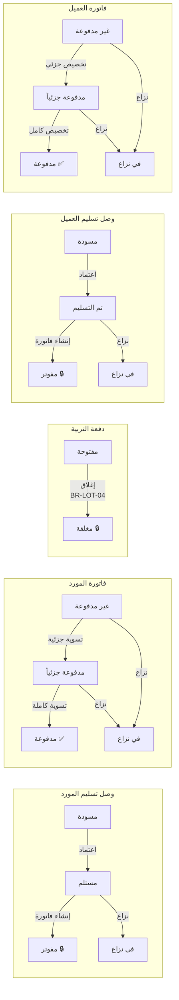

### 12.3 أدوار المستخدمين حسب المرحلة

| المرحلة       | الإجراء الرئيسي                       | الدور المطلوب     |
| ------------- | ------------------------------------- | ----------------- |
| 0 — الإعداد   | إنشاء موردين / عملاء / حظائر / مدخلات | `مسؤول` أو `مدير` |
| 1 — المشتريات | إنشاء الوصل + اعتماد                  | `مشغل` أو `مدير`  |
| 1 — المشتريات | إنشاء الفاتورة + التسوية              | `محاسب` أو `مدير` |
| 2 — الدفعة    | فتح دفعة                              | `مشغل` أو `مدير`  |
| 3 — المتابعة  | نفوق + استهلاك                        | `مشغل` أو `مدير`  |
| 4 — الإنتاج   | إدخال + اعتماد الذبح                  | `مشغل` أو `مدير`  |
| 4 — الإنتاج   | إغلاق الدفعة                          | `مدير`            |
| 5 — التسوية   | إنشاء تسوية مخزون                     | `مدير`            |
| 6 — المبيعات  | وصل العميل + اعتماد                   | `مدير` أو `مسؤول` |
| 6 — المبيعات  | فاتورة + تخصيص الدفع                  | `محاسب` أو `مدير` |
| 7 — المصاريف  | إنشاء مصاريف                          | `مدير` أو `محاسب` |

---

## ملحق أ — ملخص الكيانات المُنشأة

> **نقطة البداية**: `seed_db_minimal` ← فئات جاهزة، صفر بيانات تشغيلية، صفر كيانات فعلية.
> **المرحلة 0**: موردون / عملاء / حظيرة / مدخلات مُدخَلة يدوياً.

| المرحلة | الكيان           | المرجع / المعرف                  | الحالة النهائية         |
| ------- | ---------------- | -------------------------------- | ----------------------- |
| 1       | وصل تسليم المورد | BLF-2026-0001 (كتاكيت CCA)       | مفوتر 🔒                |
| 1       | وصل تسليم المورد | BLF-2026-0002 (أعلاف ONAB 1/2)   | مفوتر 🔒                |
| 1       | وصل تسليم المورد | BLF-2026-0003 (أعلاف ONAB تسمين) | مفوتر 🔒                |
| 1       | وصل تسليم المورد | BLF-2026-0004 (أدوية سانوفي)     | مفوتر 🔒                |
| 1       | فاتورة المورد    | FRN-2026-0001 (CCA 64 000 دج)    | مدفوعة ✅               |
| 1       | فاتورة المورد    | FRN-2026-0002 (ONAB 721 000 دج)  | مدفوعة ✅               |
| 1       | فاتورة المورد    | FRN-2026-0003 (ONAB 307 500 دج)  | غير مدفوعة ⏳           |
| 1       | فاتورة المورد    | FRN-2026-0004 (سانوفي 51 700 دج) | مدفوعة ✅               |
| 1       | تسوية المورد     | REG-2026-0001/0002/0003/0004     | غير قابلة للتعديل       |
| 2       | دفعة التربية     | دفعة مايو 2026 — الحظيرة A       | مغلقة 🔒                |
| 3       | أحداث النفوق     | 5 أحداث، 40 طائر                 | —                       |
| 3       | الاستهلاكات      | 11 إدخال علف + 7 دواء            | —                       |
| 4       | سجل الإنتاج      | إنتاج 2026-06-19                 | معتمد ✅                |
| 5       | تسوية المخزون    | ADJ-2026-0001 (−3 جثث)           | —                       |
| 6       | وصل تسليم العميل | BLC-2026-0001/0002/0003          | مفوترة 🔒               |
| 6       | فاتورة العميل    | FAC-2026-0001/0002/0003          | مدفوعة / جزئية / مدفوعة |
| 6       | دفعة العميل      | PAY-0001/0002/0003               | غير قابلة للتعديل       |
| 7       | المصاريف         | DEP-001/002/003/004              | —                       |

---

_نهاية الوثيقة — ElevageERP السيناريو الكامل لدفعة مايو 2026 — روس 308 — 2 000 طائر_

</div>
