# ÉlevageERP — Scénario Complet : Lot Poulet Ross 308

## Cycle Intégral : Achat Intrants → Ouverture Lot → Élevage → Abattage → Vente → Dépenses

> **Document** : Spécification fonctionnelle d'exécution  
> **Lot cible** : `Lot Mai 2026 — Bâtiment A` — 2 000 poussins Ross 308  
> **Durée cycle** : 40 jours (10 mai → 19 juin 2026)  
> **Point de départ** : `python manage.py seed_db --mode minimal` — zéro donnée opérationnelle

---

## Table des matières

1. [Vue d'ensemble du cycle](#1-vue-densemble-du-cycle)
2. [Ce que le seed minimal fournit](#2-ce-que-le-seed-minimal-fournit)
3. [Phase 0 — Configuration Initiale (fournisseurs, clients, bâtiments, intrants)](#phase-0--configuration-initiale-saisie-manuelle)
4. [Phase 1 — Achats Intrants (BL + Facture + Règlement)](#3-phase-1--achats-intrants)
5. [Phase 2 — Ouverture du Lot d'Élevage](#4-phase-2--ouverture-du-lot-délevage)
6. [Phase 3 — Suivi Quotidien (Mortalités + Consommations)](#5-phase-3--suivi-quotidien)
7. [Phase 4 — Abattage & Production](#6-phase-4--abattage--production)
8. [Phase 5 — Ajustement de Stock](#7-phase-5--ajustement-de-stock)
9. [Phase 6 — Vente & Livraison Client](#8-phase-6--vente--livraison-client)
10. [Phase 7 — Dépenses Opérationnelles](#9-phase-7--dépenses-opérationnelles)
11. [Compte de résultat du lot](#10-compte-de-résultat-du-lot)
12. [Règles métier activées](#11-règles-métier-activées)

---

## 1. Vue d'ensemble du cycle

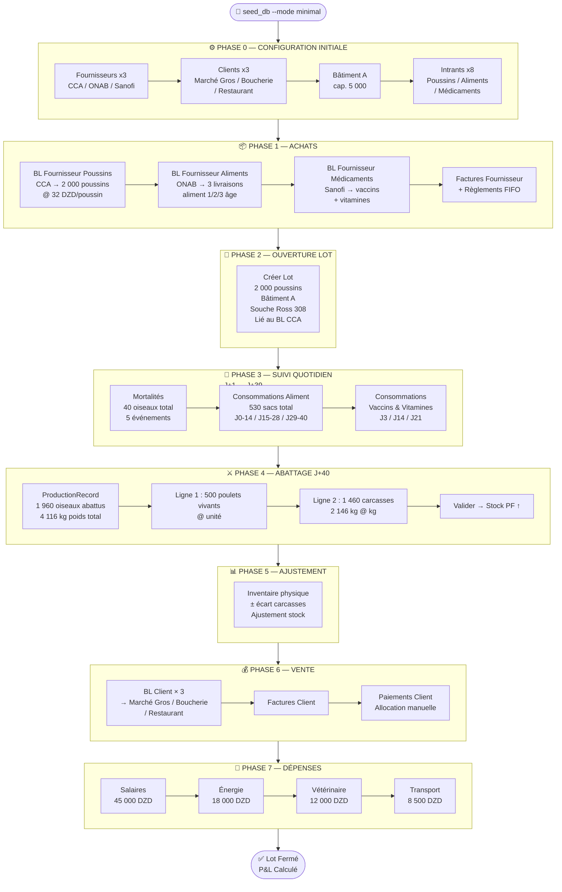

---

## 2. Ce que le seed minimal fournit

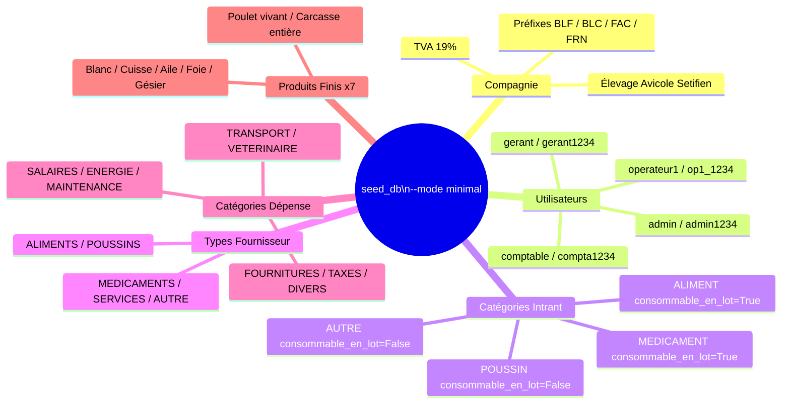

> ⚠️ **Tout le reste est à zéro.** Aucun fournisseur, aucun client, aucun bâtiment,
> aucun intrant, aucun BL, aucun lot, aucune facture, aucun mouvement de stock.
> La **Phase 0** ci-dessous couvre la saisie manuelle de toutes les instances physiques
> requises pour le cycle complet.

---

## Phase 0 — Configuration Initiale (saisie manuelle)

> **Prérequis** : `python manage.py seed_db --mode minimal` exécuté.
> Connexion avec `admin / admin1234`.

### 0.1 Créer les Fournisseurs

```
Module : ACHATS → Fournisseurs → [Nouveau fournisseur]
Modèle : Fournisseur

━━━━━━━━━━━━━━━━━━━━━━━━━━━━━━━━━━━━━━━━━━━━━━━━━━━
FOURN-1 — Couvoirs du Centre (CCA)  ← requis pour le lot
  nom             : Couvoirs du Centre — CCA
  type_principal  : POUSSINS
  adresse         : Zone Agro-industrielle, Blida
  wilaya          : Blida
  telephone       : 025 55 66 77
  nif             : 009000000002
  rc              : 09/00-0000002 B 02

FOURN-2 — ONAB Setifien  ← requis pour les aliments
  nom             : ONAB Setifien
  type_principal  : ALIMENTS
  adresse         : Route de Boghni, Setifien
  wilaya          : Setifien
  telephone       : 026 12 34 56
  nif             : 099000000001
  rc              : 16/00-0000001 B 01

FOURN-3 — Sanofi Algérie  ← requis pour les médicaments
  nom             : Sanofi Algérie (Vétérinaire)
  type_principal  : MEDICAMENTS
  adresse         : Rue Hassiba Ben Bouali, Alger
  wilaya          : Alger
  telephone       : 021 99 00 11
  nif             : 016000000003
  rc              : 16/00-0000003 B 03

FOURN-4 — Proxi-Aliments (optionnel — aliments secondaires)
  nom             : Proxi-Aliments Boumerdès
  type_principal  : ALIMENTS
  adresse         : Zone Industrielle, Boumerdès
  wilaya          : Boumerdès
  telephone       : 024 81 22 33

FOURN-5 — Techno-Avicole (optionnel — services)
  nom             : Techno-Avicole Services
  type_principal  : SERVICES
  adresse         : Rue des Frères Bouadou, Birtouta, Alger
  wilaya          : Alger
  telephone       : 021 30 40 50
```

### 0.2 Créer les Clients

```
Module : VENTES → Clients → [Nouveau client]
Modèle : Client

━━━━━━━━━━━━━━━━━━━━━━━━━━━━━━━━━━━━━━━━━━━━━━━━━━━
CLI-1 — Marché de Gros Setifien  ← requis (BLC-0001)
  nom            : Marché de Gros Setifien
  type_client    : grossiste
  wilaya         : Setifien
  telephone      : 0555 11 22 33
  plafond_credit : 500 000,00

CLI-2 — Boucherie Amrane & Fils  ← requis (BLC-0002)
  nom            : Boucherie Amrane & Fils
  type_client    : detaillant
  wilaya         : Setifien
  telephone      : 0660 33 44 55
  plafond_credit : 200 000,00

CLI-3 — Restaurant Le Palmier  ← requis (BLC-0003)
  nom            : Restaurant Le Palmier
  type_client    : restauration
  wilaya         : Setifien
  telephone      : 0770 22 33 44
  plafond_credit : 150 000,00

CLI-4 — Épicerie Centrale Azazga  (optionnel)
  nom            : Épicerie Centrale Azazga
  type_client    : detaillant
  wilaya         : Setifien
  telephone      : 0555 44 55 66
  plafond_credit : 80 000,00

CLI-5 — Grossiste Alger Sud  (optionnel)
  nom            : Grossiste Alger Sud
  type_client    : grossiste
  wilaya         : Alger
  telephone      : 021 88 77 66
  plafond_credit : 1 000 000,00
```

### 0.3 Créer les Bâtiments

```
Module : STOCK → Bâtiments → [Nouveau bâtiment]
Modèle : Batiment

━━━━━━━━━━━━━━━━━━━━━━━━━━━━━━━━━━━━━━━━━━━━━━━━━━━
BAT-1 — Bâtiment A  ← requis pour le lot
  nom         : Bâtiment A
  capacite    : 5 000
  description : الحظيرة الرئيسية — تهوية ميكانيكية

BAT-2 — Bâtiment B  (optionnel — lots futurs)
  nom         : Bâtiment B
  capacite    : 4 000
  description : الحظيرة الثانوية — تهوية طبيعية

BAT-3 — Bâtiment C  (optionnel)
  nom         : Bâtiment C
  capacite    : 6 000
  description : حظيرة جديدة — عزل مُحسَّن

BAT-4 — Dépôt Aliments  (optionnel)
  nom         : Dépôt Aliments
  capacite    : (laisser vide)
  description : مستودع تخزين الأعلاف والمدخلات
```

### 0.4 Créer les Intrants

```
Module : STOCK → Intrants → [Nouvel intrant]
Modèle : Intrant

━━━━━━━━━━━━━━━━━━━━━━━━━━━━━━━━━━━━━━━━━━━━━━━━━━━
INT-1 — Poussin Ross 308  ← requis (BLF-0001, ouverture lot)
  designation    : كتكوت روس 308 (يوم واحد)
  categorie      : POUSSIN
  unite_mesure   : unite
  seuil_alerte   : 100
  fournisseurs   : Couvoirs du Centre — CCA

INT-2 — Aliment Démarrage  ← requis (BLF-0002, consommations J0→J14)
  designation    : علف البداية — الطور الأول (0–14 يوم)
  categorie      : ALIMENT
  unite_mesure   : sac
  seuil_alerte   : 10
  fournisseurs   : ONAB Setifien

INT-3 — Aliment Croissance  ← requis (BLF-0002, consommations J15→J28)
  designation    : علف النمو — الطور الثاني (15–28 يوم)
  categorie      : ALIMENT
  unite_mesure   : sac
  seuil_alerte   : 15
  fournisseurs   : ONAB Setifien

INT-4 — Aliment Finition  ← requis (BLF-0003, consommations J29→J40)
  designation    : علف التسمين — الطور الثالث (29 يوم فأكثر)
  categorie      : ALIMENT
  unite_mesure   : sac
  seuil_alerte   : 20
  fournisseurs   : ONAB Setifien

INT-5 — Vaccin Newcastle  ← requis (BLF-0004, vaccination J14)
  designation    : لقاح نيوكاسل (هيتشنر B1)
  categorie      : MEDICAMENT
  unite_mesure   : dose
  seuil_alerte   : 500
  fournisseurs   : Sanofi Algérie (Vétérinaire)

INT-6 — Vaccin Gumboro  ← requis (BLF-0004, vaccination J22)
  designation    : لقاح غامبورو (IBD متوسط)
  categorie      : MEDICAMENT
  unite_mesure   : dose
  seuil_alerte   : 500
  fournisseurs   : Sanofi Algérie (Vétérinaire)

INT-7 — Amoxicilline 50%  ← requis (BLF-0004, traitement J8+J22)
  designation    : أموكسيسيلين 50% مسحوق
  categorie      : MEDICAMENT
  unite_mesure   : g
  seuil_alerte   : 200
  fournisseurs   : Sanofi Algérie (Vétérinaire)

INT-8 — Vitamines + Électrolytes  ← requis (BLF-0004, support J3/J8/J22)
  designation    : فيتامينات + إلكتروليتات (مركّب)
  categorie      : MEDICAMENT
  unite_mesure   : litre
  seuil_alerte   : 5
  fournisseurs   : Sanofi Algérie (Vétérinaire)

INT-9 — Poussin Cobb 500  (optionnel — lots futurs)
  designation    : كتكوت كوب 500 (يوم واحد)
  categorie      : POUSSIN
  unite_mesure   : unite
  seuil_alerte   : 100
  fournisseurs   : Couvoirs du Centre — CCA

INT-10 — Litière  (optionnel)
  designation    : فراش (نشارة خشب)
  categorie      : AUTRE
  unite_mesure   : sac
  seuil_alerte   : 20
  fournisseurs   : (laisser vide)
```

> ✅ **Phase 0 terminée.** Toutes les instances physiques nécessaires au cycle sont
> créées. Stock = 0 partout. Passer à la Phase 1 — Achats Intrants.

---


## 3. Phase 1 — Achats Intrants

### 3.1 Vue d'ensemble des achats nécessaires

| Intrant                              | Qtité lot 40j / 2 000 oiseaux | Unité | Fournisseur    |
| ------------------------------------ | ----------------------------- | ----- | -------------- |
| Poussin Ross 308                     | 2 000                         | unité | CCA Blida      |
| Aliment Démarrage 1er âge (0–14j)    | 200                           | sac   | ONAB Setifien  |
| Aliment Croissance 2ème âge (15–28j) | 180                           | sac   | ONAB Setifien  |
| Aliment Finition 3ème âge (29–40j)   | 150                           | sac   | ONAB Setifien  |
| Vaccin Newcastle (Hitchner B1)       | 4 000                         | dose  | Sanofi Algérie |
| Vaccin Gumboro (IBD)                 | 4 000                         | dose  | Sanofi Algérie |
| Amoxicilline 50% poudre              | 500                           | g     | Sanofi Algérie |
| Vitamines + Électrolytes             | 10                            | litre | Sanofi Algérie |

### 3.2 Flux des 4 BL Fournisseur

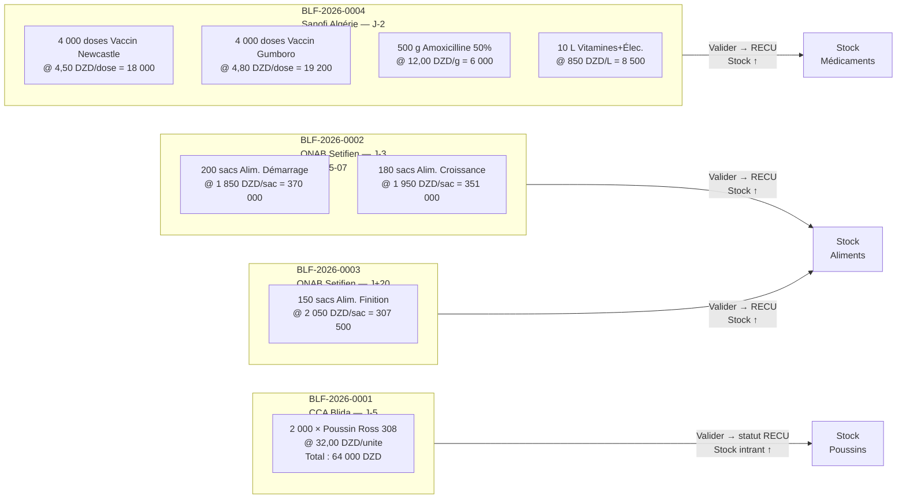

### 3.3 Formulaires BL Fournisseur (`BLFournisseurForm`)

```
Module : ACHATS → BL Fournisseur → [Nouveau]
Règle  : statut ne peut prendre que Brouillon / Reçu / En litige (BR-BLF-02)
         date_bl ≤ aujourd'hui (clean_date_bl)
         pièce jointe : PDF/JPG/PNG ≤ 5 Mo

━━━━━━━━━━━━━━━━━━━━━━━━━━━━━━━━━━━━━━━━━━━━━━━━━━━
BLF-2026-0001 — Poussins CCA
  reference             : BLF-2026-0001
  fournisseur           : Couvoirs du Centre — CCA
  date_bl               : 2026-05-05
  reference_fournisseur : "BC-CCA-0512-2026"
  statut                : Reçu
  notes_reception       : "Arrivée 07h30 — camion frigorifique — bonne condition"

  Lignes (BLFournisseurLigneFormSet) :
  ┌──────────────────────────────────────────────────────────────┐
  │ intrant           │ quantite │ prix_unitaire │ notes         │
  ├───────────────────┼──────────┼───────────────┼───────────────┤
  │ Poussin Ross 308  │ 2 000    │ 32,0000       │ Sexage mixte  │
  └───────────────────┴──────────┴───────────────┴───────────────┘
  → montant_ligne : 64 000,00 DZD
  Action : [Enregistrer] → statut = Reçu → StockIntrant(Poussin R308) ↑ 2 000

━━━━━━━━━━━━━━━━━━━━━━━━━━━━━━━━━━━━━━━━━━━━━━━━━━━
BLF-2026-0002 — Aliments ONAB (lot 1/2)
  reference             : BLF-2026-0002
  fournisseur           : ONAB Setifien
  date_bl               : 2026-05-07
  reference_fournisseur : "ONAB-BL-20260507-088"
  statut                : Reçu

  Lignes :
  ┌────────────────────────────────────────────────────────────────┐
  │ intrant                   │ quantite │ prix_unitaire │ total   │
  ├───────────────────────────┼──────────┼───────────────┼─────────┤
  │ Alim. Démarrage 1er Âge   │ 200,000  │ 1 850,0000    │ 370 000 │
  │ Alim. Croissance 2ème Âge │ 180,000  │ 1 950,0000    │ 351 000 │
  └───────────────────────────┴──────────┴───────────────┴─────────┘
  → Total BL : 721 000,00 DZD
  → Stock Alim-DEM ↑ 200 sacs / Stock Alim-CRO ↑ 180 sacs

━━━━━━━━━━━━━━━━━━━━━━━━━━━━━━━━━━━━━━━━━━━━━━━━━━━
BLF-2026-0003 — Aliments ONAB (finition — J+20)
  reference   : BLF-2026-0003
  fournisseur : ONAB Setifien
  date_bl     : 2026-05-30
  statut      : Reçu

  Lignes :
  ┌───────────────────────────────────────────────────────────────┐
  │ intrant                 │ quantite │ prix_unitaire │ total    │
  ├─────────────────────────┼──────────┼───────────────┼──────────┤
  │ Alim. Finition 3ème Âge │ 150,000  │ 2 050,0000    │ 307 500  │
  └─────────────────────────┴──────────┴───────────────┴──────────┘
  → Total BL : 307 500,00 DZD

━━━━━━━━━━━━━━━━━━━━━━━━━━━━━━━━━━━━━━━━━━━━━━━━━━━
BLF-2026-0004 — Médicaments Sanofi
  reference   : BLF-2026-0004
  fournisseur : Sanofi Algérie (Vétérinaire)
  date_bl     : 2026-05-08
  statut      : Reçu

  Lignes :
  ┌──────────────────────────────────────────────────────────────────┐
  │ intrant                     │ quantite │ prix_unitaire │ total   │
  ├─────────────────────────────┼──────────┼───────────────┼─────────┤
  │ Vaccin Newcastle (H.B1)     │ 4 000    │ 4,5000        │  18 000 │
  │ Vaccin Gumboro (IBD)        │ 4 000    │ 4,8000        │  19 200 │
  │ Amoxicilline 50% poudre     │    500   │ 12,0000       │   6 000 │
  │ Vitamines + Électrolytes    │     10   │ 850,0000      │   8 500 │
  └─────────────────────────────┴──────────┴───────────────┴─────────┘
  → Total BL : 51 700,00 DZD
```

### 3.4 Factures Fournisseur (`FactureFournisseurForm`)

```
Règle  : BR-FAF-01 montant_total auto-calculé depuis lignes BL (pas de saisie manuelle)
         BR-FAF-02 seuls les BL au statut "Reçu" du même fournisseur sont sélectionnables
         BR-FAF-04 statut "Payé" non sélectionnable (piloté par les règlements)

━━━━━━━━━━━━━━━━━━━━━━━━━━━━━━━━━━━━━━━━━━━━━━━━━━━
FRN-2026-0001 — Facture Poussins CCA
  reference      : FRN-2026-0001
  fournisseur    : Couvoirs du Centre — CCA
  bls            : [BLF-2026-0001] ← checkbox sélection
  date_facture   : 2026-05-06
  date_echeance  : 2026-06-05   ← +30 jours
  type_facture   : marchandise
  statut         : Non payée
  montant_total  : 64 000,00 DZD ← auto

FRN-2026-0002 — Facture Aliments ONAB (lot 1/2)
  fournisseur    : ONAB Setifien
  bls            : [BLF-2026-0002]
  date_facture   : 2026-05-08
  date_echeance  : 2026-06-07
  montant_total  : 721 000,00 DZD ← auto

FRN-2026-0003 — Facture Aliments ONAB (finition)
  fournisseur    : ONAB Setifien
  bls            : [BLF-2026-0003]
  date_facture   : 2026-05-31
  date_echeance  : 2026-06-30
  montant_total  : 307 500,00 DZD ← auto

FRN-2026-0004 — Facture Médicaments Sanofi
  fournisseur    : Sanofi Algérie (Vétérinaire)
  bls            : [BLF-2026-0004]
  date_facture   : 2026-05-09
  date_echeance  : 2026-06-08
  montant_total  : 51 700,00 DZD ← auto
```

> ⚠️ **BR-BLF-02** : les BL passent au statut `Facturé` et sont verrouillés dès leur inclusion dans une facture.

### 3.5 Règlements Fournisseur (`ReglementFournisseurForm`)

```
Règle  : BR-REG-03 allocation FIFO automatique sur les factures impayées
         BR-REG-06 règlements immuables après création (pas de formulaire d'édition)

REG-2026-0001 — Règlement CCA
  fournisseur        : Couvoirs du Centre — CCA
  date_reglement     : 2026-05-10
  montant            : 64 000,00
  mode_paiement      : virement
  reference_paiement : "VIR-BNA-10052026-001"
  → Alloué sur FRN-2026-0001 : 64 000,00 DZD → statut = Payée ✅

REG-2026-0002 — Règlement ONAB (acompte)
  fournisseur        : ONAB Setifien
  date_reglement     : 2026-05-10
  montant            : 400 000,00
  mode_paiement      : cheque
  reference_paiement : "CHQ-0455"
  → Alloué FIFO sur FRN-2026-0002 : 400 000,00 DZD
  → FRN-2026-0002 reste à payer : 321 000,00 DZD → Partiellement payée

REG-2026-0003 — Solde ONAB facture aliments J1/2
  fournisseur        : ONAB Setifien
  date_reglement     : 2026-05-25
  montant            : 321 000,00
  mode_paiement      : virement
  → FRN-2026-0002 soldée ✅

REG-2026-0004 — Règlement Sanofi
  fournisseur        : Sanofi Algérie (Vétérinaire)
  date_reglement     : 2026-05-15
  montant            : 51 700,00
  mode_paiement      : virement
  → FRN-2026-0004 soldée ✅
```

---

## 4. Phase 2 — Ouverture du Lot d'Élevage

### 4.1 Flux

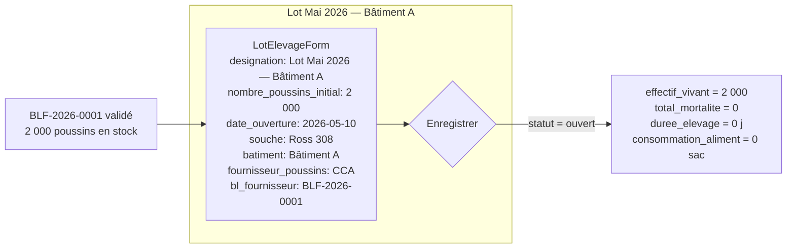

### 4.2 Formulaire LotElevage (`LotElevageForm`)

```
Module : ÉLEVAGE → Lots → [Ouvrir un nouveau lot]
Modèle : LotElevage

  designation              : "Lot Mai 2026 — Bâtiment A"
  date_ouverture           : 2026-05-10   ← ≤ aujourd'hui (BR-LOT clean_date_ouverture)
  nombre_poussins_initial  : 2 000        ← ≥ 1 (BR-LOT clean)
  fournisseur_poussins     : Couvoirs du Centre — CCA
  bl_fournisseur_poussins  : BLF-2026-0001  ← BL statut RECU ou FACTURE
  batiment                 : Bâtiment A
  souche                   : Ross 308
  notes                    : "Densité : 13,3 oiseaux/m² — Surface utile 150 m²"

  → statut = ouvert
  → effectif_vivant = 2 000
```

---

## 5. Phase 3 — Suivi Quotidien

### 5.1 Calendrier du lot (J0 = 10 mai 2026)

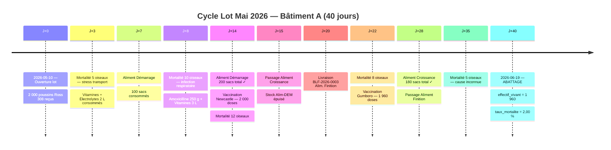

### 5.2 Événements de Mortalité (`MortaliteForm`)

```
Module : ÉLEVAGE → Lot → [Enregistrer mortalité]
Règle  : BR-LOT-03 lot doit être ouvert
         cumul mortalités ≤ nombre_poussins_initial (validation dans clean())

┌──────────────────────────────────────────────────────────────────────────────────┐
│ Date       │ Nombre │ Cause                          │ Cumul après │ Vivants    │
├────────────┼────────┼────────────────────────────────┼─────────────┼────────────┤
│ 2026-05-13 │      5 │ Stress transport / déshydratation│         5  │    1 995   │
│ 2026-05-18 │     10 │ Infection respiratoire précoce │        15  │    1 985   │
│ 2026-05-24 │     12 │ Aspergilllose suspectée        │        27  │    1 973   │
│ 2026-06-01 │      8 │ Coccidiose — traitement lancé  │        35  │    1 965   │
│ 2026-06-14 │      5 │ Cause indéterminée             │        40  │    1 960   │
└────────────┴────────┴────────────────────────────────┴─────────────┴────────────┘
  taux_mortalite final : 40 / 2 000 = 2,00 %
```

### 5.3 Consommations Aliment (`ConsommationForm`)

```
Module : ÉLEVAGE → Lot → [Enregistrer consommation]
Règle  : BR-LOT-03 lot ouvert / BR-INT-03 stock disponible ≥ quantité demandée
         Seuls les intrants catégorie consommable_en_lot=True sont proposés
         (ALIMENT + MEDICAMENT — pas POUSSIN ni AUTRE)

Phase Démarrage — J0 à J14 (200 sacs total)
  ┌─────────────────────────────────────────────────────────────────┐
  │ date       │ intrant              │ quantite │ stock après       │
  ├────────────┼──────────────────────┼──────────┼───────────────────┤
  │ 2026-05-12 │ Alim. Démarrage      │  25,000  │ 175 sacs          │
  │ 2026-05-14 │ Alim. Démarrage      │  25,000  │ 150 sacs          │
  │ 2026-05-17 │ Alim. Démarrage      │  50,000  │ 100 sacs          │
  │ 2026-05-21 │ Alim. Démarrage      │  50,000  │  50 sacs          │
  │ 2026-05-24 │ Alim. Démarrage      │  50,000  │   0 sacs ✓ épuisé │
  └────────────┴──────────────────────┴──────────┴───────────────────┘

Phase Croissance — J15 à J28 (180 sacs total)
  ┌─────────────────────────────────────────────────────────────────┐
  │ date       │ intrant              │ quantite │ stock après       │
  ├────────────┼──────────────────────┼──────────┼───────────────────┤
  │ 2026-05-25 │ Alim. Croissance     │  60,000  │ 120 sacs          │
  │ 2026-06-01 │ Alim. Croissance     │  60,000  │  60 sacs          │
  │ 2026-06-08 │ Alim. Croissance     │  60,000  │   0 sacs ✓ épuisé │
  └────────────┴──────────────────────┴──────────┴───────────────────┘

Phase Finition — J29 à J40 (150 sacs total — livraison BLF-0003 arrivée J+20)
  ┌─────────────────────────────────────────────────────────────────┐
  │ date       │ intrant              │ quantite │ stock après       │
  ├────────────┼──────────────────────┼──────────┼───────────────────┤
  │ 2026-06-08 │ Alim. Finition       │  50,000  │ 100 sacs          │
  │ 2026-06-13 │ Alim. Finition       │  50,000  │  50 sacs          │
  │ 2026-06-18 │ Alim. Finition       │  50,000  │   0 sacs ✓ épuisé │
  └────────────┴──────────────────────┴──────────┴───────────────────┘
```

### 5.4 Consommations Médicaments

```
Phase Préventive & Curative :
  ┌──────────────────────────────────────────────────────────────────────────────┐
  │ date       │ intrant                  │ quantite │ motif                     │
  ├────────────┼──────────────────────────┼──────────┼───────────────────────────┤
  │ 2026-05-13 │ Vitamines + Électrolytes │  2,000 L │ Stress arrivée poussins   │
  │ 2026-05-18 │ Amoxicilline 50%         │  250 g   │ Infection resp. (curée)   │
  │ 2026-05-18 │ Vitamines + Électrolytes │  3,000 L │ Support immunité          │
  │ 2026-05-24 │ Vaccin Newcastle HB1     │ 2 000 d  │ Vaccination primovaccin   │
  │ 2026-06-01 │ Vaccin Gumboro IBD       │ 1 965 d  │ Vaccin Gumboro (1 965 viv)│
  │ 2026-06-01 │ Amoxicilline 50%         │  250 g   │ Traitement coccidiose     │
  │ 2026-06-01 │ Vitamines + Électrolytes │  5,000 L │ Récupération post-traitem.│
  └────────────┴──────────────────────────┴──────────┴───────────────────────────┘

  Stock médicaments restant après cycle :
  Vaccin Newcastle  : 4 000 - 2 000 = 2 000 doses
  Vaccin Gumboro    : 4 000 - 1 965 =  2 035 doses
  Amoxicilline      :   500 -   500 =     0 g ← épuisé
  Vitamines         :    10 -    10 =     0 L ← épuisé
```

---

## 6. Phase 4 — Abattage & Production

### 6.1 Flux

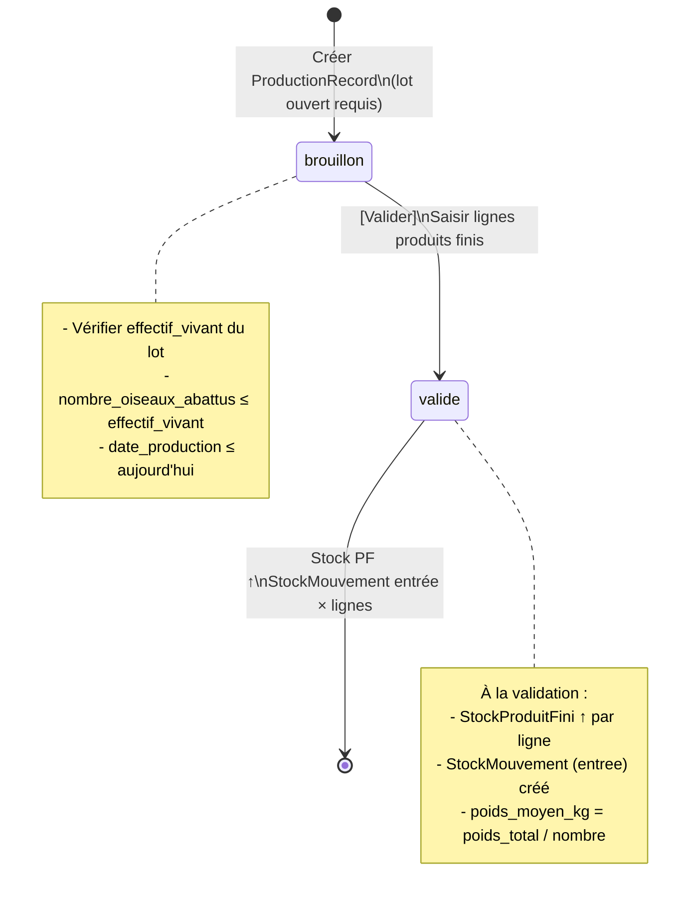

### 6.2 Formulaire ProductionRecord (`ProductionRecordForm`)

```
Module : PRODUCTION → [Nouveau enregistrement]
Modèle : ProductionRecord

  lot                      : Lot Mai 2026 — Bâtiment A  ← statut ouvert requis
  date_production          : 2026-06-19
  nombre_oiseaux_abattus   : 1 960   ← ≤ effectif_vivant (1 960) ✅
  poids_total_kg           : 4 116,000   ← 1 960 × 2,100 kg moy.
  notes                    : "Abattage complet — poids moyen 2,1 kg — Lot clôturé"

  → poids_moyen_kg auto-calculé : 4 116,000 / 1 960 = 2,100 kg
  → statut = brouillon
```

### 6.3 Lignes de production (`ProductionLigneFormSet`)

```
Lignes (1 record → N lignes produits finis) :

  ┌────────────────────────────────────────────────────────────────────────────────┐
  │ produit_fini          │ quantite │ poids_unit │ cout_unit_est │ valeur_totale  │
  ├───────────────────────┼──────────┼────────────┼───────────────┼────────────────┤
  │ Poulet vivant         │  500,000 │ 2,100 kg   │ 320,0000 DZD  │  160 000,00    │
  │ Carcasse entière vide │ 1 460,000│ 1,470 kg   │ 280,0000 DZD  │  408 800,00    │
  └───────────────────────┴──────────┴────────────┴───────────────┴────────────────┘

  Total valeur estimée : 568 800,00 DZD

  Action : [Valider] → statut = valide
    → StockProduitFini(Poulet vivant)    ↑ +500,000 unités
    → StockProduitFini(Carcasse entière) ↑ +1 460,000 unités
    → 2 × StockMouvement (source=production, type=entree)
```

### 6.4 Fermeture du lot (`LotFermetureForm`)

```
Module : ÉLEVAGE → Lot → [Fermer le lot]
Modèle : LotElevage.fermer()

  date_fermeture : 2026-06-19
  notes          : "Lot clôturé après abattage complet. TM=2%. IC=1,62. GMQ=53g/j."

  → lot.statut = fermé
  → Plus aucune mortalité ni consommation possible (BR-LOT-03)
```

### 6.5 Indicateurs zootechniques finaux

| Indicateur                  | Calcul                         | Valeur        |
| --------------------------- | ------------------------------ | ------------- |
| Effectif initial            | —                              | 2 000 oiseaux |
| Mortalités totales          | —                              | 40 oiseaux    |
| Taux de mortalité           | 40 / 2 000 × 100               | **2,00 %**    |
| Oiseaux abattus             | 2 000 − 40                     | **1 960**     |
| Poids moyen à l'abattage    | 4 116 / 1 960                  | **2,100 kg**  |
| Durée d'élevage             | J0 → J40                       | **40 jours**  |
| Consommation aliment totale | 200 + 180 + 150                | **530 sacs**  |
| GMQ (gain moyen quotidien)  | 2 100g / 40j                   | **52,5 g/j**  |
| IC (indice de consommation) | 530 × 25 kg / (1 960 × 2,1 kg) | **≈ 3,24**    |

---

## 7. Phase 5 — Ajustement de Stock

> **Contexte** : inventaire physique le 2026-06-20 révèle 3 carcasses en moins (détérioration chambre froide).

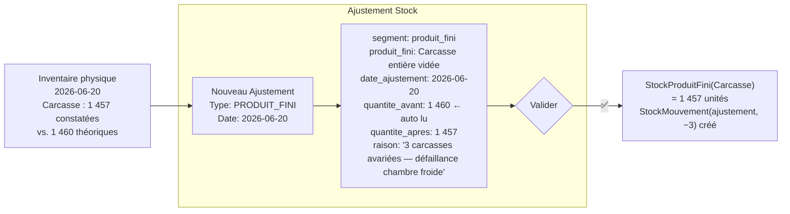

```
Module : STOCK → Ajustements → [Nouveau]
Modèle : StockAjustement

  segment          : PRODUIT_FINI
  produit_fini     : Carcasse entière vidée
  date_ajustement  : 2026-06-20        ← ≤ aujourd'hui (clean)
  quantite_avant   : 1 460,000         ← read-only, auto-rempli par la vue
  quantite_apres   : 1 457,000
  raison           : "3 carcasses avariées suite défaillance chambre froide — lot 20/06"

  Règles : quantite_apres ≥ 0 / segment = PRODUIT_FINI → produit_fini requis / intrant = vide
```

---

## 8. Phase 6 — Vente & Livraison Client

### 8.1 Vue d'ensemble des ventes

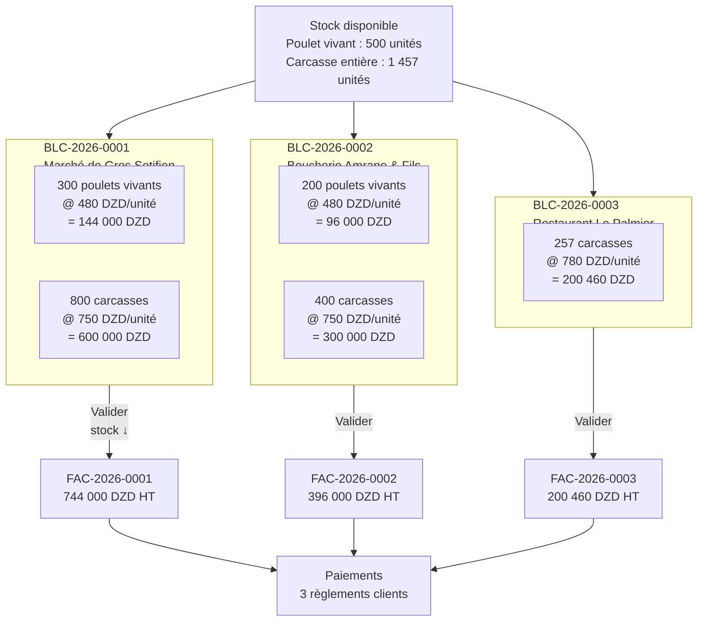

### 8.2 Formulaires BL Client (`BLClientForm`)

```
Module : VENTES → BL Client → [Nouveau]
Règle  : BR-BLC-02 stock vérifié avant validation (quantite ≤ stock_disponible)
         BR-BLC-03 BL Facturé = verrouillé
         statut user choices : Brouillon / Livré / En litige (pas Facturé)

━━━━━━━━━━━━━━━━━━━━━━━━━━━━━━━━━━━━━━━━━━━━━━━━━━━
BLC-2026-0001 — Marché de Gros Setifien
  reference          : BLC-2026-0001
  client             : Marché de Gros Setifien
  date_bl            : 2026-06-20
  adresse_livraison  : "Zone de marché, Route nationale 5, Setifien"
  signe_par          : "Boualem Khaled — Réceptionnaire"
  statut             : Livré

  Lignes :
  ┌──────────────────────────────────────────────────────────────────────────┐
  │ produit_fini          │ quantite  │ prix_unitaire │ montant_total         │
  ├───────────────────────┼───────────┼───────────────┼───────────────────────┤
  │ Poulet vivant         │  300,000  │    480,0000   │  144 000,00           │
  │ Carcasse entière vidée│  800,000  │    750,0000   │  600 000,00           │
  └───────────────────────┴───────────┴───────────────┴───────────────────────┘
  Total BL : 744 000,00 DZD
  Action : [Valider] → statut = Livré
    → StockProduitFini(Poulet vivant)    ↓ −300 (reste 200)
    → StockProduitFini(Carcasse entière) ↓ −800 (reste 657)

━━━━━━━━━━━━━━━━━━━━━━━━━━━━━━━━━━━━━━━━━━━━━━━━━━━
BLC-2026-0002 — Boucherie Amrane & Fils
  reference : BLC-2026-0002
  client    : Boucherie Amrane & Fils
  date_bl   : 2026-06-21
  statut    : Livré

  Lignes :
  ┌──────────────────────────────────────────────────────────────────────────┐
  │ produit_fini          │ quantite  │ prix_unitaire │ montant_total         │
  ├───────────────────────┼───────────┼───────────────┼───────────────────────┤
  │ Poulet vivant         │  200,000  │    480,0000   │   96 000,00           │
  │ Carcasse entière vidée│  400,000  │    750,0000   │  300 000,00           │
  └───────────────────────┴───────────┴───────────────┴───────────────────────┘
  Total BL : 396 000,00 DZD
  → Stock poulet vivant ↓ −200 (reste 0) / Carcasse ↓ −400 (reste 257)

━━━━━━━━━━━━━━━━━━━━━━━━━━━━━━━━━━━━━━━━━━━━━━━━━━━
BLC-2026-0003 — Restaurant Le Palmier
  reference : BLC-2026-0003
  client    : Restaurant Le Palmier
  date_bl   : 2026-06-22
  statut    : Livré

  Lignes :
  ┌──────────────────────────────────────────────────────────────────────────┐
  │ produit_fini          │ quantite  │ prix_unitaire │ montant_total         │
  ├───────────────────────┼───────────┼───────────────┼───────────────────────┤
  │ Carcasse entière vidée│  257,000  │    780,0000   │  200 460,00           │
  └───────────────────────┴───────────┴───────────────┴───────────────────────┘
  Total BL : 200 460,00 DZD
  → Carcasse ↓ −257 (reste 0) ✅ tout vendu
```

### 8.3 Factures Client et Paiements

```
Règle  : BR-FAC-01 montant_ht = auto-somme lignes BL inclus
         BR-FAC-02 seuls les BL au statut Livré du même client
         BR-FAC-03 paiement manuel — user choisit quelle(s) facture(s) couvrir
         Statut Payée = non-sélectionnable (piloté par allocations)

FAC-2026-0001 — Marché de Gros Setifien
  client         : Marché de Gros Setifien
  bls            : [BLC-2026-0001]
  date_facture   : 2026-06-20
  date_echeance  : 2026-07-20   ← +30 jours
  montant_ht     : 744 000,00 ← auto
  taux_tva       : 0,00 %      ← volaille exonérée TVA
  montant_ttc    : 744 000,00

  Paiement 1 :
    client        : Marché de Gros Setifien
    date_paiement : 2026-06-20
    montant       : 744 000,00
    mode_paiement : especes
    Allocation    : → FAC-2026-0001 : 744 000 DZD → statut = Payée ✅

FAC-2026-0002 — Boucherie Amrane & Fils
  bls          : [BLC-2026-0002]
  montant_ht   : 396 000,00
  montant_ttc  : 396 000,00 (exonéré)

  Paiement 2 :
    montant       : 200 000,00
    mode_paiement : cheque
    reference     : "CHQ-AMRANE-1044"
    Allocation    : → FAC-2026-0002 : 200 000 DZD → Partiellement payée
    reste_a_payer : 196 000,00 DZD ← en attente

FAC-2026-0003 — Restaurant Le Palmier
  bls          : [BLC-2026-0003]
  montant_ttc  : 200 460,00

  Paiement 3 :
    montant       : 200 460,00
    mode_paiement : virement
    reference     : "VIR-PALMIER-22062026"
    Allocation    : → FAC-2026-0003 : 200 460 DZD → Payée ✅
```

---

## 9. Phase 7 — Dépenses Opérationnelles

### 9.1 Flux

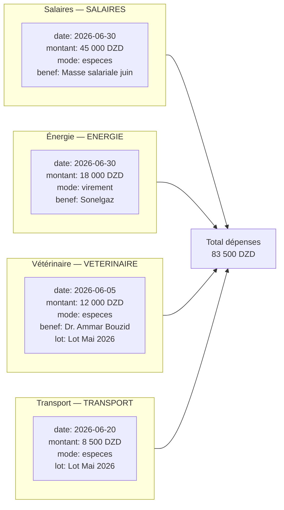

### 9.2 Formulaires Dépense (`DepenseForm`)

```
Module : DÉPENSES → [Nouvelle dépense]
Règle  : BR-DEP-01/03 facture_liee uniquement pour factures TYPE_SERVICE (pas marchandise)
         BR-DEP-04 attribution lot optionnelle (rentabilité analytique)
         date ≤ aujourd'hui / montant > 0

DEP-001 — Salaires juin
  date               : 2026-06-30
  categorie          : Salaires & Main-d'œuvre
  description        : "Salaires ouvriers élevage — lot Mai 2026 — 3 personnes"
  montant            : 45 000,00
  mode_paiement      : especes
  reference_document : "FP-JUIN-2026"
  lot                : Lot Mai 2026 — Bâtiment A   ← attribution analytique (BR-DEP-04)
  facture_liee       : (vide)

DEP-002 — Électricité Sonelgaz
  date               : 2026-06-30
  categorie          : Énergie (Électricité / Gaz)
  description        : "Facture électricité juin 2026 — ventilation + éclairage Bâtiment A"
  montant            : 18 000,00
  mode_paiement      : virement
  reference_document : "SONELGAZ-2026-06-8854"
  lot                : Lot Mai 2026 — Bâtiment A

DEP-003 — Honoraires vétérinaire
  date               : 2026-06-05
  categorie          : Frais Vétérinaires
  description        : "Visite sanitaire + diagnostic coccidiose — Dr. Ammar Bouzid"
  montant            : 12 000,00
  mode_paiement      : especes
  lot                : Lot Mai 2026 — Bâtiment A
  facture_liee       : (vide — honoraires directs, pas de facture service fournisseur)
  notes              : "Ordonnance + protocole de traitement Amoxicilline 250g"

DEP-004 — Transport livraison
  date               : 2026-06-20
  categorie          : Transport & Carburant
  description        : "Transport abattage + livraisons clients — 20 & 21 juin"
  montant            : 8 500,00
  mode_paiement      : especes
  lot                : Lot Mai 2026 — Bâtiment A
```

---

## 10. Compte de résultat du lot

### 10.1 Récapitulatif des flux financiers

```mermaid
sankey-beta
  Recettes,Vente Marché de Gros,744000
  Recettes,Vente Boucherie Amrane,396000
  Recettes,Vente Restaurant Palmier,200460
  Charges,Achat Poussins,64000
  Charges,Achat Aliments,1028500
  Charges,Achat Médicaments,51700
  Charges,Salaires,45000
  Charges,Énergie,18000
  Charges,Vétérinaire,12000
  Charges,Transport,8500
```

### 10.2 P&L analytique — Lot Mai 2026

| Poste                                                | Montant (DZD)      |
| ---------------------------------------------------- | ------------------ |
| **RECETTES**                                         |                    |
| Vente poulet vivant (500 unités × moy. 480 DZD)      | 240 000,00         |
| Vente carcasse entière (1 457 unités × moy. 757 DZD) | 1 103 949,00       |
| Ajustement stock (−3 carcasses avariées)             | −2 271,00          |
| **Total recettes**                                   | **1 341 678,00**   |
|                                                      |                    |
| **CHARGES DIRECTES**                                 |                    |
| Achat poussins (2 000 × 32 DZD)                      | −64 000,00         |
| Achat aliments (200×1850 + 180×1950 + 150×2050)      | −1 028 500,00      |
| Achat médicaments & vaccins                          | −51 700,00         |
| **Total charges directes**                           | **−1 144 200,00**  |
|                                                      |                    |
| **CHARGES OPÉRATIONNELLES**                          |                    |
| Salaires ouvriers                                    | −45 000,00         |
| Énergie électricité                                  | −18 000,00         |
| Honoraires vétérinaire                               | −12 000,00         |
| Transport livraison                                  | −8 500,00          |
| **Total charges opérat.**                            | **−83 500,00**     |
|                                                      |                    |
| **RÉSULTAT NET LOT**                                 | **113 978,00 DZD** |
| **Marge nette**                                      | **~8,5 %**         |
| **Marge par oiseau vendu**                           | **58,15 DZD**      |

### 10.3 Tableau des mouvements de stock produits finis

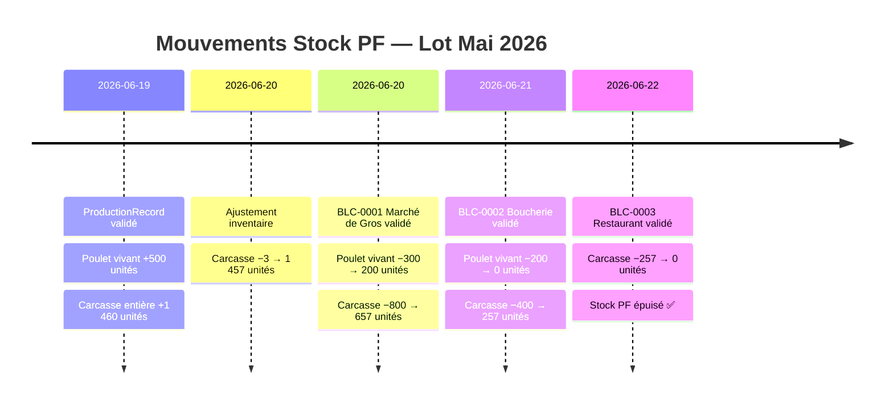

### 10.4 Tableau de bord des créances clients

| Client             | Facture       | Montant TTC   | Réglé         | Reste       | Statut       |
| ------------------ | ------------- | ------------- | ------------- | ----------- | ------------ |
| Marché de Gros     | FAC-2026-0001 | 744 000       | 744 000       | 0           | ✅ Payée     |
| Boucherie Amrane   | FAC-2026-0002 | 396 000       | 200 000       | **196 000** | ⚠️ Partielle |
| Restaurant Palmier | FAC-2026-0003 | 200 460       | 200 460       | 0           | ✅ Payée     |
| **TOTAL**          |               | **1 340 460** | **1 144 460** | **196 000** |              |

---

## 11. Règles métier activées

### 11.1 Tableau des Business Rules par phase

| BR               | Module   | Description                                     | Point d'application                                  |
| ---------------- | -------- | ----------------------------------------------- | ---------------------------------------------------- |
| **BR-BLF-01**    | Achats   | Impact stock uniquement à la validation du BL   | Signal `post_save` BLFournisseurLigne                |
| **BR-BLF-02**    | Achats   | BL Facturé verrouillé — impossible à modifier   | `BLFournisseurForm.clean()` + `est_verrouille`       |
| **BR-BLF-03**    | Achats   | BL En litige exclu de la sélection facture      | Queryset `FactureFournisseurForm`                    |
| **BR-FAF-01**    | Achats   | Montant facture = auto-somme lignes BL          | Signal calcul post-save                              |
| **BR-FAF-02**    | Achats   | Seuls les BL Reçu du même fournisseur           | `FactureFournisseurForm.clean()`                     |
| **BR-FAF-04**    | Achats   | Statut Payé non sélectionnable                  | `STATUT_USER_CHOICES` sans Payé                      |
| **BR-REG-03**    | Achats   | Allocation FIFO automatique                     | Signal `post_save` ReglementFournisseur              |
| **BR-REG-06**    | Achats   | Règlements immuables                            | Pas de formulaire d'édition                          |
| **BR-LOT-01**    | Élevage  | Lot nécessite nb poussins + BL                  | `LotElevageForm.clean()`                             |
| **BR-LOT-03**    | Élevage  | Mortalité/Consommation sur lot ouvert seulement | `MortaliteForm.clean()` + `ConsommationForm.clean()` |
| **BR-LOT-04**    | Élevage  | Fermeture lot requiert ≥ 1 production validée   | Validé dans la vue avant `LotFermetureForm`          |
| **BR-INT-03**    | Stock    | Consommation ≤ stock disponible                 | `ConsommationForm.clean()`                           |
| **BR-INT-05**    | Intrants | Unité mesure immuable si mouvements existent    | `IntrantForm.clean_unite_mesure()`                   |
| **BR-DEP-01/03** | Dépenses | facture_liee = Service uniquement               | `DepenseForm.clean()`                                |
| **BR-DEP-04**    | Dépenses | Attribution lot optionnelle                     | Champ `lot` optionnel                                |
| **BR-BLC-01**    | Ventes   | Stock PF décrémenté à la validation BL          | Signal `post_save` BLClientLigne                     |
| **BR-BLC-02**    | Ventes   | Quantité ≤ stock disponible                     | Vérification vue avant validation                    |
| **BR-BLC-03**    | Ventes   | BL Facturé verrouillé                           | `BLClientForm.est_verrouille`                        |
| **BR-FAC-01**    | Ventes   | Montant facture = auto-somme BL inclus          | Signal calcul                                        |
| **BR-FAC-02**    | Ventes   | Seuls les BL Livré du même client               | `FactureClientForm` queryset                         |
| **BR-FAC-03**    | Ventes   | Allocation manuelle des paiements client        | `PaiementClientAllocation` vue                       |

### 11.2 Transitions de statut

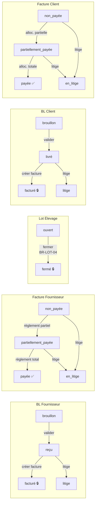

### 11.3 Rôles utilisateurs par phase

| Phase          | Action clé                    | Rôle requis              |
| -------------- | ----------------------------- | ------------------------ |
| 1 — Achats     | Créer BL + valider            | `operateur` ou `manager` |
| 1 — Achats     | Créer facture + règlement     | `comptable` ou `manager` |
| 2 — Lot        | Ouvrir lot                    | `operateur` ou `manager` |
| 3 — Suivi      | Mortalités + consommations    | `operateur` ou `manager` |
| 4 — Production | Saisir + valider abattage     | `operateur` ou `manager` |
| 4 — Production | Fermer lot                    | `manager`                |
| 5 — Ajustement | Créer ajustement stock        | `manager`                |
| 6 — Vente      | BL Client + valider           | `manager` ou `gerant`    |
| 6 — Vente      | Facture + allocation paiement | `comptable` ou `manager` |
| 7 — Dépenses   | Créer dépenses                | `manager` ou `comptable` |

---

## Annexe A — Récapitulatif des entités créées

> **Point de départ** : `seed_db --mode minimal` → master data catégories présentes,
> zéro opérationnel, zéro instance physique.
> **Phase 0** : fournisseurs / clients / bâtiment / intrants saisis manuellement.

| Phase   | Entité                | Référence / Identifiant                | Statut final              |
| ----- | --------------------- | -------------------------------------- | ------------------------- |
| 1     | BL Fournisseur        | BLF-2026-0001 (Poussins CCA)           | Facturé 🔒                |
| 1     | BL Fournisseur        | BLF-2026-0002 (Aliments ONAB lot 1)    | Facturé 🔒                |
| 1     | BL Fournisseur        | BLF-2026-0003 (Aliments ONAB finition) | Facturé 🔒                |
| 1     | BL Fournisseur        | BLF-2026-0004 (Médicaments Sanofi)     | Facturé 🔒                |
| 1     | Facture Fournisseur   | FRN-2026-0001 (CCA 64 000 DZD)         | Payée ✅                  |
| 1     | Facture Fournisseur   | FRN-2026-0002 (ONAB 721 000 DZD)       | Payée ✅                  |
| 1     | Facture Fournisseur   | FRN-2026-0003 (ONAB 307 500 DZD)       | Non payée ⏳              |
| 1     | Facture Fournisseur   | FRN-2026-0004 (Sanofi 51 700 DZD)      | Payée ✅                  |
| 1     | Règlement Fournisseur | REG-2026-0001/0002/0003/0004           | Immuables                 |
| 2     | Lot d'élevage         | Lot Mai 2026 — Bâtiment A              | Fermé 🔒                  |
| 3     | Mortalités            | 5 événements, 40 oiseaux               | —                         |
| 3     | Consommations         | 11 saisies aliment + 7 médicament      | —                         |
| 4     | ProductionRecord      | Production 2026-06-19                  | Validé ✅                 |
| 5     | Ajustement stock      | ADJ-2026-0001 (−3 carcasses)           | —                         |
| 6     | BL Client             | BLC-2026-0001/0002/0003                | Facturés 🔒               |
| 6     | Facture Client        | FAC-2026-0001/0002/0003                | Payée / Partielle / Payée |
| 6     | Paiement Client       | PAY-0001/0002/0003                     | Immuables                 |
| 7     | Dépenses              | DEP-001/002/003/004                    | —                         |

---

_Fin du document — ÉlevageERP Scénario Complet Lot Mai 2026 — Ross 308 — 2 000 oiseaux_
