# ÉlevageERP — Scénario Complet : Lot Poulet Ross 308

## Cycle Intégral : Achat Intrants → Ouverture Lot → Élevage → Abattage → Vente → Dépenses

> **Document** : Spécification fonctionnelle d'exécution (mis à jour **v1.5**)  
> **Lot cible** : `Lot Mai 2026 — Bâtiment A` (branche **EST**) — 2 000 poussins Ross 308  
> **Durée cycle** : 40 jours (10 mai → 19 juin 2026)  
> **Point de départ** : `python manage.py seed_db --mode minimal` — zéro donnée opérationnelle
>
> 🆕 **Changelog vs v1.3** : ce document exerce désormais les domaines ajoutés/étendus
> par le code depuis la v1.3 :
>
> - **v1.4 — Architecture Multi-Branches** (`Branche`, BR-BRA-01..09) : le cycle
>   s'exécute sur **deux branches** (`EST` / broiler + pondeuses-poussinière,
>   `OUEST` / poulailler-ponte), avec bâtiments, stocks, numérotation de documents
>   (`<préfixe>-<code_branche>-<AAAA>-<NNNN>`) et dépenses scindés par branche.
> - **v1.5 — Pièces Jointes génériques** (`PieceJointe`) : justificatifs (factures
>   scannées, reçus, virements) attachés aux BL/Factures/Règlements/Dépenses.
> - **Production d'Aliment** (`FormuleAliment` / `ProductionAliment`) : une partie
>   de l'Aliment Démarrage est désormais **fabriquée en interne** plutôt qu'achetée.
> - **Retrait d'Œufs** (`RetraitOeufs`) : sorties d'œufs hors BL formel (vente
>   directe camion, don, casse).
> - **RH & Paie** (`Employe` / `Pointage` / `CongeEmploye` / `AcompteEmploye` /
>   `BulletinPaie`) : le poste Salaires est désormais généré par un vrai cycle de
>   paie au lieu d'une dépense forfaitaire unique.
> - **Acompte Client** et **AbonnementClient** (déjà présents en v1.3 mais jamais
>   exercés) : désormais activés respectivement en §8.5 et §8.6.

---

## Table des matières

1. [Vue d'ensemble du cycle](#1-vue-densemble-du-cycle)
2. [Ce que le seed minimal fournit](#2-ce-que-le-seed-minimal-fournit)
3. [Phase 0 — Configuration Initiale (fournisseurs, clients, bâtiments, intrants)](#phase-0--configuration-initiale-saisie-manuelle)
4. [Phase 0bis — Configuration Multi-Branches (v1.4)](#phase-0bis--configuration-multi-branches-v14)
5. [Phase 1 — Achats Intrants (BL + Facture + Règlement + Pièces Jointes)](#3-phase-1--achats-intrants)
6. [Phase 2 — Ouverture du Lot d'Élevage (+ Lot Pondeuses, Poussinière Bâtiment C)](#4-phase-2--ouverture-du-lot-délevage)
7. [Phase 3 — Suivi Quotidien (Mortalités + Consommations + Production Aliment + Fertilisant + Élevage/Transfert/Ponte/Retrait Œufs Pondeuses)](#5-phase-3--suivi-quotidien)
8. [Phase 4 — Abattage & Production](#6-phase-4--abattage--production)
9. [Phase 5 — Ajustement de Stock](#7-phase-5--ajustement-de-stock)
10. [Phase 6 — Vente & Livraison Client (+ Acompte, Abonnement Fertilisant)](#8-phase-6--vente--livraison-client)
11. [Phase 7 — Dépenses Opérationnelles & RH/Paie](#9-phase-7--dépenses-opérationnelles)
12. [Compte de résultat du lot](#10-compte-de-résultat-du-lot)
13. [Règles métier activées](#11-règles-métier-activées)

---

## 1. Vue d'ensemble du cycle

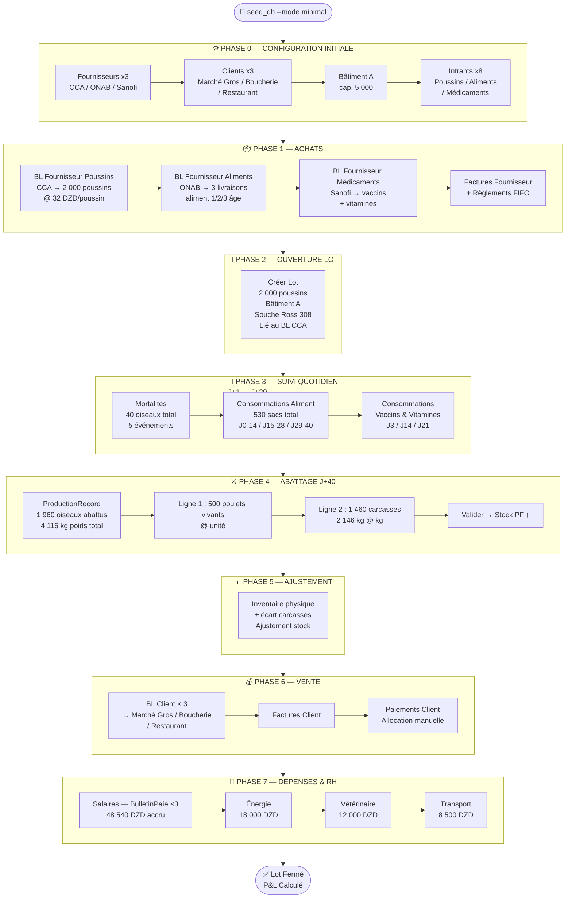

---

## 2. Ce que le seed minimal fournit

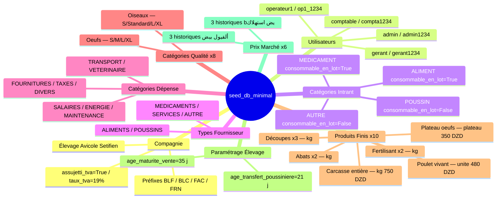

> ⚠️ **Tout le reste est à zéro.** Aucun fournisseur, aucun client, aucun bâtiment,
> aucun intrant, aucun BL, aucun lot, aucune facture, aucun mouvement de stock.
> La **Phase 0** ci-dessous couvre la saisie manuelle de toutes les instances physiques
> requises pour le cycle complet.
>
> 📌 **TVA** : CompanyInfo.taux_tva = 19 % (valeur seed). Les factures clients
> volaille sont exonérées → le champ taux_tva sera surchargé à **0 %** à la création
> de chaque facture (Phase 6).

---

## Phase 0 — Configuration Initiale (saisie manuelle)

> **Prérequis** : `python manage.py seed_db --mode minimal` exécuté.
> Connexion avec `admin / admin1234`.

### 0.1 Créer les Fournisseurs

```
Module : ACHATS → Fournisseurs → [Nouveau fournisseur]
Modèle : Fournisseur

━━━━━━━━━━━━━━━━━━━━━━━━━━━━━━━━━━━━━━━━━━━━━━━━━━━
FOURN-1 — Couvoirs du Centre (CCA)  ← requis pour le lot
  nom             : Couvoirs du Centre — CCA
  type_principal  : POUSSINS
  adresse         : Zone Agro-industrielle, Blida
  wilaya          : Blida
  telephone       : 025 55 66 77
  nif             : 009000000002
  rc              : 09/00-0000002 B 02

FOURN-2 — ONAB Setifien  ← requis pour les aliments
  nom             : ONAB Setifien
  type_principal  : ALIMENTS
  adresse         : Route de Boghni, Setifien
  wilaya          : Setifien
  telephone       : 026 12 34 56
  nif             : 099000000001
  rc              : 16/00-0000001 B 01

FOURN-3 — Sanofi Algérie  ← requis pour les médicaments
  nom             : Sanofi Algérie (Vétérinaire)
  type_principal  : MEDICAMENTS
  adresse         : Rue Hassiba Ben Bouali, Alger
  wilaya          : Alger
  telephone       : 021 99 00 11
  nif             : 016000000003
  rc              : 16/00-0000003 B 03

FOURN-4 — Proxi-Aliments (optionnel — aliments secondaires)
  nom             : Proxi-Aliments Boumerdès
  type_principal  : ALIMENTS
  adresse         : Zone Industrielle, Boumerdès
  wilaya          : Boumerdès
  telephone       : 024 81 22 33

FOURN-5 — Techno-Avicole (optionnel — services)
  nom             : Techno-Avicole Services
  type_principal  : SERVICES
  adresse         : Rue des Frères Bouadou, Birtouta, Alger
  wilaya          : Alger
  telephone       : 021 30 40 50
```

### 0.2 Créer les Clients

```
Module : VENTES → Clients → [Nouveau client]
Modèle : Client

━━━━━━━━━━━━━━━━━━━━━━━━━━━━━━━━━━━━━━━━━━━━━━━━━━━
CLI-1 — Marché de Gros Setifien  ← requis (BLC-0001)
  nom            : Marché de Gros Setifien
  type_client    : grossiste
  wilaya         : Setifien
  telephone      : 0555 11 22 33
  plafond_credit : 500 000,00

CLI-2 — Boucherie Amrane & Fils  ← requis (BLC-0002)
  nom            : Boucherie Amrane & Fils
  type_client    : detaillant
  wilaya         : Setifien
  telephone      : 0660 33 44 55
  plafond_credit : 200 000,00

CLI-3 — Restaurant Le Palmier  ← requis (BLC-0003)
  nom            : Restaurant Le Palmier
  type_client    : restauration
  wilaya         : Setifien
  telephone      : 0770 22 33 44
  plafond_credit : 150 000,00

CLI-4 — Épicerie Centrale Azazga  (optionnel)
  nom            : Épicerie Centrale Azazga
  type_client    : detaillant
  wilaya         : Setifien
  telephone      : 0555 44 55 66
  plafond_credit : 80 000,00

CLI-5 — Grossiste Alger Sud  (optionnel)
  nom            : Grossiste Alger Sud
  type_client    : grossiste
  wilaya         : Alger
  telephone      : 021 88 77 66
  plafond_credit : 1 000 000,00
```

### 0.0 Configurer le Paramétrage Élevage

```
Module : PARAMÈTRES → Paramétrage Élevage → [Modifier]
Modèle : ParametrageElevage (singleton — une seule ligne en base)

✅ Le seed_db_minimal crée déjà ce singleton avec les valeurs suivantes :
   age_transfert_poussiniere_jours : 126  ← seeded (seuil réaliste "point de ponte", 18 sem.)
   age_maturite_vente_jours        : 35   ← seeded

Impact sur ce cycle :

  age_maturite_vente_jours = 35 ← le lot broiler dure 40 j > 35 →
                                   ProductionRecord validable ✅ Aucun
                                   ajustement nécessaire.

  age_transfert_poussiniere_jours = 126 ← seuil biologique réel pour une
                                           poulette pondeuse (transfert
                                           Poussinière → Poulailler au
                                           point de ponte, ~18 semaines).
                                           Ce seuil est FARM-WIDE (singleton) :

    • Lot broiler Ross 308 (Bâtiment A, 40 j) : 40 j < 126 j → l'alerte
      "doit_etre_transfere" ne se déclenche JAMAIS. Cohérent avec la
      biologie : un broiler est abattu bien avant l'âge de ponte, il n'y
      a donc aucun TransfertLot sur ce lot (cf. Annexe B).

    • Lot Pondeuses ISA Brown (Bâtiment C → Bâtiment B, §5.6) : l'alerte
      se déclenche exactement à J+126, jour où le TransfertLot est
      enregistré dans ce scénario — exercice réel de doit_etre_transfere
      ET de TransfertLot, contrairement à la version précédente du
      document où les pondeuses étaient achetées déjà en pré-ponte.
```

---

### 0.3 Créer les Bâtiments

```
Module : STOCK → Bâtiments → [Nouveau bâtiment]
Modèle : Batiment

━━━━━━━━━━━━━━━━━━━━━━━━━━━━━━━━━━━━━━━━━━━━━━━━━━━
BAT-1 — Bâtiment A  ← requis pour le lot
  nom             : Bâtiment A
  type_batiment   : poussiniere   ← REQUIS — le lot s'ouvre obligatoirement
                                    dans une Poussinière (BR-LOT-01)
  capacite        : 5 000
  branche         : EST            ← BR-BRA-01 (voir Phase 0bis, §2bis)
  description     : الحظيرة الرئيسية — تهوية ميكانيكية

BAT-2 — Bâtiment B  ← requis pour le lot pondeuses (destination de ponte, §5.6)
  nom             : Bâtiment B
  type_batiment   : poulailler
  capacite        : 4 000
  branche         : OUEST          ← BR-BRA-01 — la montée en ponte a lieu
                                    sur la branche OUEST (voir Phase 0bis)
  description     : الحظيرة الثانوية — تهوية طبيعية

BAT-3 — Bâtiment C  ← requis pour le lot pondeuses (élevage initial, §4.3 / §5.6)
  nom             : Bâtiment C
  type_batiment   : poussiniere   ← REQUIS — les poussines pondeuses démarrent
                                    aussi obligatoirement en Poussinière
                                    (BR-LOT-01), séparée de Bâtiment A pour ne
                                    pas mélanger les deux cohortes (broiler /
                                    pondeuses) dans le même local physique.
  capacite        : 3 500
  branche         : OUEST          ← même branche que Bâtiment B : le
                                    TransfertLot (§5.6.6) reste interne à
                                    OUEST (BR-BRA-01 : un transfert ne
                                    traverse jamais deux branches)
  description     : حضانة مخصصة لدجاج البيض — منفصلة عن المبنى A

BAT-4 — Dépôt Aliments  (optionnel)
  nom               : Dépôt Aliments
  type_batiment     : entrepot
  categorie_stockage: (laisser vide ou choisir selon usage)
  branche           : EST
  description       : مستودع تخزين الأعلاف والمدخلات
```

> ⚠️ **BAT-1 (Bâtiment A) doit être créé après la Phase 0bis** ci-dessous, puisque
> le champ `branche` est une FK obligatoire (BR-BRA-01) et que les branches
> `EST` / `OUEST` doivent exister au préalable. Dans l'ordre réel de saisie :
> Phase 0bis (branches + utilisateurs) → puis 0.3 (bâtiments, avec `branche`
> déjà sélectionnable) → puis 0.4 (intrants, catalogue global, non affecté).

### 0.4 Créer les Intrants

```
Module : STOCK → Intrants → [Nouvel intrant]
Modèle : Intrant

━━━━━━━━━━━━━━━━━━━━━━━━━━━━━━━━━━━━━━━━━━━━━━━━━━━
INT-1 — Poussin Ross 308  ← requis (BLF-0001, ouverture lot)
  designation    : كتكوت روس 308 (يوم واحد)
  categorie      : POUSSIN
  stade          : tous          ← non consommable_en_lot ; stade N/A
  unite_mesure   : unite
  seuil_alerte   : 100
  fournisseurs   : Couvoirs du Centre — CCA

INT-2 — Aliment Démarrage  ← requis (BLF-0002, consommations J0→J14)
  designation    : علف البداية — الطور الأول (0–14 يوم)
  categorie      : ALIMENT
  stade          : demarrage     ← visible uniquement pour lots en Poussinière
  unite_mesure   : sac
  seuil_alerte   : 10
  fournisseurs   : ONAB Setifien

INT-3 — Aliment Croissance  ← requis (BLF-0002, consommations J15→J28)
  designation    : علف النمو — الطور الثاني (15–28 يوم)
  categorie      : ALIMENT
  stade          : tous      ← CRITIQUE : le lot reste en Poussinière 40 j (< 21 j seuil
                               transfert n'est que l'alerte, pas une obligation). Le filtre
                               ConsommationForm inclut uniquement stade=demarrage et stade=tous
                               pour les lots en Poussinière. Si stade=croissance, cet intrant
                               serait INVISIBLE dans le formulaire → mettre tous.
  unite_mesure   : sac
  seuil_alerte   : 15
  fournisseurs   : ONAB Setifien

INT-4 — Aliment Finition  ← requis (BLF-0003, consommations J29→J40)
  designation    : علف التسمين — الطور الثالث (29 يوم فأكثر)
  categorie      : ALIMENT
  stade          : tous      ← même raison qu'INT-3 — lot toujours en Poussinière
  unite_mesure   : sac
  seuil_alerte   : 20
  fournisseurs   : ONAB Setifien

INT-5 — Vaccin Newcastle  ← requis (BLF-0004, vaccination J14)
  designation    : لقاح نيوكاسل (هيتشنر B1)
  categorie      : MEDICAMENT
  stade          : tous
  unite_mesure   : dose
  seuil_alerte   : 500
  fournisseurs   : Sanofi Algérie (Vétérinaire)

INT-6 — Vaccin Gumboro  ← requis (BLF-0004, vaccination J22)
  designation    : لقاح غامبورو (IBD متوسط)
  categorie      : MEDICAMENT
  stade          : tous
  unite_mesure   : dose
  seuil_alerte   : 500
  fournisseurs   : Sanofi Algérie (Vétérinaire)

INT-7 — Amoxicilline 50%  ← requis (BLF-0004, traitement J8+J22)
  designation    : أموكسيسيلين 50% مسحوق
  categorie      : MEDICAMENT
  stade          : tous
  unite_mesure   : g
  seuil_alerte   : 200
  fournisseurs   : Sanofi Algérie (Vétérinaire)

INT-8 — Vitamines + Électrolytes  ← requis (BLF-0004, support J3/J8/J22)
  designation    : فيتامينات + إلكتروليتات (مركّب)
  categorie      : MEDICAMENT
  stade          : tous
  unite_mesure   : litre
  seuil_alerte   : 5
  fournisseurs   : Sanofi Algérie (Vétérinaire)

INT-9 — Poussine ISA Brown  ← requis (ouverture Lot Pondeuses, §4.3)
  designation    : كتكوت دجاج بياض ISA Brown (يوم واحد)
  categorie      : POUSSIN
  stade          : tous
  unite_mesure   : unite
  seuil_alerte   : 100
  fournisseurs   : Couvoirs du Centre — CCA

INT-10 — Aliment Pré-Ponte  ← requis (§5.6, consommations semaines 15–18)
  designation    : علف ما قبل الإنتاج — Pré-Ponte (15–18 أسبوع)
  categorie      : ALIMENT
  stade          : demarrage    ← la pondeuse est encore en Poussinière à cet
                                   âge (transfert au point de ponte à J+126)
  unite_mesure   : sac
  seuil_alerte   : 10
  fournisseurs   : ONAB Setifien

INT-11 — Aliment Ponte  ← requis (§5.6, consommations post-transfert)
  designation    : علف الإنتاج — Ponte (عالي الكالسيوم)
  categorie      : ALIMENT
  stade          : croissance   ← ⚠️ CRITIQUE : PAS stade=ponte. La méthode
                                   LotElevage.stade_intrant_attendu ne mappe
                                   jamais vers STADE_PONTE (Poulailler →
                                   STADE_CROISSANCE uniquement) — un intrant
                                   en stade=ponte serait INVISIBLE dans
                                   ConsommationForm une fois le lot transféré
                                   au poulailler. Voir Annexe B.
  unite_mesure   : sac
  seuil_alerte   : 15
  fournisseurs   : ONAB Setifien

INT-12 — Poussin Cobb 500  (optionnel — lots futurs)
  designation    : كتكوت كوب 500 (يوم واحد)
  categorie      : POUSSIN
  stade          : tous
  unite_mesure   : unite
  seuil_alerte   : 100
  fournisseurs   : Couvoirs du Centre — CCA

INT-13 — Litière  (optionnel)
  designation    : فراش (نشارة خشب)
  categorie      : AUTRE
  stade          : tous
  unite_mesure   : sac
  seuil_alerte   : 20
  fournisseurs   : (laisser vide)

INT-14 — Maïs concassé  ← requis (§5.3bis, ingrédient FormuleAliment)
  designation    : ذرة مجروشة
  categorie      : ALIMENT
  stade          : tous
  unite_mesure   : kg
  seuil_alerte   : 100
  fournisseurs   : ONAB Setifien

INT-15 — Tourteau de Soja  ← requis (§5.3bis, ingrédient FormuleAliment)
  designation    : كسب الصويا
  categorie      : ALIMENT
  stade          : tous
  unite_mesure   : kg
  seuil_alerte   : 100
  fournisseurs   : ONAB Setifien

INT-16 — Aliment Croissance (Fabrication Maison)  ← requis (§5.3bis)
  designation    : علف النمو — تصنيع داخلي
  categorie      : ALIMENT
  stade          : tous
  unite_mesure   : kg      ← NOTE : ProductionAliment.quantite_produite_kg est
                              toujours exprimé en kg, quel que soit unite_mesure
                              de l'intrant produit ; choisir kg ici évite toute
                              ambiguïté avec les alim. achetés au sac (INT-2/3/4).
  seuil_alerte   : 50
  fournisseurs   : (laisser vide — jamais acheté via BL, uniquement produit)
```

> ✅ **Phase 0 terminée.** Toutes les instances physiques nécessaires au cycle sont
> créées. Stock = 0 partout. Passer à la Phase 0bis — Configuration Multi-Branches.

---

## Phase 0bis — Configuration Multi-Branches (v1.4)

> **Prérequis** : Phase 0 (§0.1/0.2/0.4) déjà saisie. À exécuter **avant** §0.3
> (Bâtiments), car `Batiment.branche` est une FK obligatoire (BR-BRA-01).
> Connexion toujours `admin / admin1234` — seul l'admin peut créer/éditer une
> `Branche` (BR-BRA-06).

### 0bis.1 Ce qui reste global vs ce qui devient scindé par branche

```
GLOBAL (company-wide, BR-BRA-06) — ne change pas avec le multi-branches :
  Fournisseur, Client, CategorieIntrant, CategorieQualite, ProduitFini,
  CompanyInfo, ParametrageElevage, PrixMarche, Associe / RetraitAssocie
  (BR-BRA-08 — les retraits d'associés restent au niveau de la société).

SCINDÉ PAR BRANCHE (BR-BRA-01/07) — une FK `branche` explicite ou dérivée :
  Batiment (explicite) → LotElevage, Employe (dérivés du bâtiment)
  BLFournisseur / FactureFournisseur / ReglementFournisseur (explicite)
  BLClient / FactureClient / PaiementClient / AcompteClient (explicite)
  AbonnementClient (explicite) ; LivraisonPartielle (dérivée)
  Depense (explicite)
  StockIntrant / StockProduitFini / StockMouvement / StockAjustement
    (une ligne par (branche, article) — BR-BRA-07, plus de solde unique global)
  Mortalite / Consommation / PeseeEchantillon / RecolteOeufs / TransfertLot /
    ProductionRecord / CollecteFertilisant / RetraitOeufs / ProductionAliment
    (dérivés du lot ou du bâtiment)
  Pointage / CongeEmploye / AcompteEmploye / BulletinPaie (dérivés de l'employé)
```

### 0bis.2 Créer les Branches

```
Module : PARAMÈTRES → Branches → [Nouvelle branche]   (admin uniquement — BR-BRA-06)
Modèle : Branche

━━━━━━━━━━━━━━━━━━━━━━━━━━━━━━━━━━━━━━━━━━━━━━━━━━━
BRA-1 — Branche EST  ← porte le lot broiler Ross 308 (Bâtiment A)
  nom             : Branche Sétif-Est
  code            : EST            ← utilisé dans toute référence de document
                                     (BLF-EST-2026-0001, BR-BRA-05)
  wilaya          : Sétif
  telephone       : 036 50 10 20
  chef_de_branche : (laissé vide pour l'instant — voir §0bis.3)
  actif           : True

BRA-2 — Branche OUEST  ← porte le lot Pondeuses 2026 (Bâtiments B & C)
  nom             : Branche Sétif-Ouest
  code            : OUEST
  wilaya          : Sétif
  telephone       : 036 50 30 40
  chef_de_branche : (laissé vide pour l'instant — voir §0bis.3)
  actif           : True
```

### 0bis.3 Créer les utilisateurs liés aux branches

```
Module : PARAMÈTRES → Utilisateurs → [Nouvel utilisateur]
Modèle : User + UserProfile

━━━━━━━━━━━━━━━━━━━━━━━━━━━━━━━━━━━━━━━━━━━━━━━━━━━
USR-1 — chef_est / chefest1234
  role     : chef_branche   ← BR-BRA-02 : branche obligatoire
  branche  : Branche EST

USR-2 — chef_ouest / chefouest1234
  role     : chef_branche
  branche  : Branche OUEST

USR-3 — operateur1 (déjà seedé) → affecter branche = EST (BR-BRA-02)
USR-4 — operateur2 / op2_1234 → role: operateur, branche = OUEST (nouveau)
USR-5 — comptable (déjà seedé) → branche laissée vide (BR-BRA-04 : vue globale
         consolidée sur les deux branches — c'est ce profil qui produit le
         compte de résultat consolidé en §10)
```

Retour ensuite sur **BRA-1** et **BRA-2** (§0bis.2) pour renseigner
`chef_de_branche = chef_est` / `chef_ouest` respectivement (BR-BRA-02 : le champ
n'accepte qu'un utilisateur dont le `profile.role == chef_branche`).

### 0bis.4 Sélecteur de branche et Vue Globale

```
✅ admin et comptable (non affecté) voient un sélecteur de branche
   (« Vue Globale » / EST / OUEST) en haut de chaque module — BR-BRA-03/04.
✅ chef_branche et operateur n'ont AUCUN sélecteur : chaque écran est filtré
   automatiquement sur leur branche unique (BR-BRA-02), sans option de bascule.
⚠️ Vue Globale est en LECTURE SEULE pour la création/édition (BR-BRA-04) :
   toute vue de création (BLF, BL Client, Lot, Dépense...) exige qu'une branche
   concrète soit active — le décorateur @require_branche_context redirige vers
   le sélecteur si l'utilisateur est en Vue Globale.
```

> ✅ **Phase 0bis terminée.** Les deux branches existent, les utilisateurs sont
> répartis, et §0.3 (Bâtiments) peut maintenant assigner `branche=EST` à
> Bâtiment A/Dépôt Aliments et `branche=OUEST` à Bâtiments B et C. La Phase 1
> (Achats) s'exécute connecté en tant que `operateur1` (branche EST active) pour
> les BL du lot broiler, puis `operateur2` (branche OUEST) pour le BL Poussine
> ISA Brown (§4.3).

---

## 3. Phase 1 — Achats Intrants

> 📌 **Notation des références (BR-BRA-05)** : `generer_reference()` insère
> désormais le code branche : `<préfixe>-<code_branche>-<AAAA>-<NNNN>`. Tous les
> achats de cette Phase 1 sont saisis avec la branche **EST** active (opérateur1) —
> les références réellement générées sont donc `BLF-EST-2026-0001` …
> `BLF-EST-2026-0004`, `FRN-EST-2026-0001` … Le document conserve la forme courte
> `BLF-2026-000x` dans le texte qui suit pour la lisibilité ; seule la Phase 2bis
> (Lot Pondeuses, branche OUEST) rappelle explicitement le préfixe `OUEST` pour
> souligner le cloisonnement (BR-BRA-01).

### 3.1 Vue d'ensemble des achats nécessaires

| Intrant                                | Qtité lot 40j / 2 000 oiseaux | Unité | Fournisseur    |
| -------------------------------------- | ----------------------------- | ----- | -------------- |
| Poussin Ross 308                       | 2 000                         | unité | CCA Blida      |
| Aliment Démarrage 1er âge (0–14j)      | 200                           | sac   | ONAB Setifien  |
| Aliment Croissance 2ème âge (15–28j)   | 180                           | sac   | ONAB Setifien  |
| Aliment Finition 3ème âge (29–40j)     | 150                           | sac   | ONAB Setifien  |
| Vaccin Newcastle (Hitchner B1)         | 4 000                         | dose  | Sanofi Algérie |
| Vaccin Gumboro (IBD)                   | 4 000                         | dose  | Sanofi Algérie |
| Amoxicilline 50% poudre                | 500                           | g     | Sanofi Algérie |
| Vitamines + Électrolytes               | 10                            | litre | Sanofi Algérie |
| Maïs concassé (§5.3bis, ingrédient)    | 500                           | kg    | ONAB Setifien  |
| Tourteau de Soja (§5.3bis, ingrédient) | 300                           | kg    | ONAB Setifien  |

### 3.2 Flux des 4 BL Fournisseur

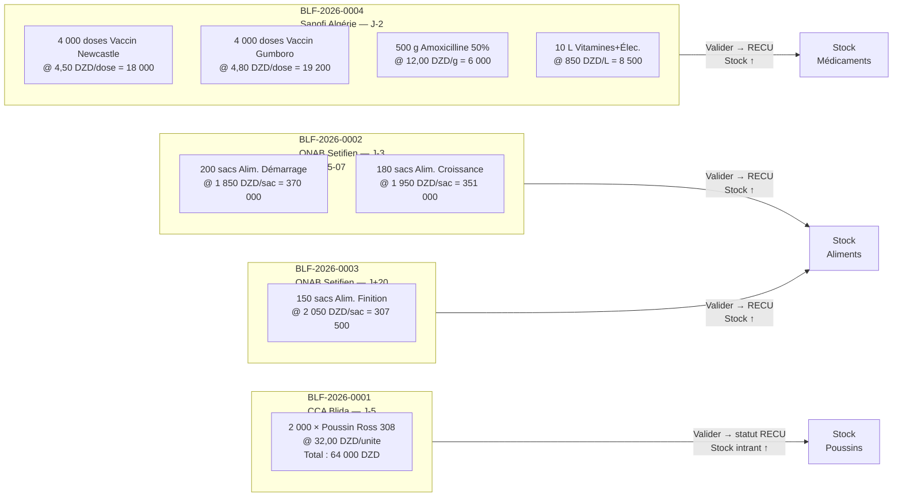

### 3.3 Formulaires BL Fournisseur (`BLFournisseurForm`)

```
Module : ACHATS → BL Fournisseur → [Nouveau]
Règle  : statut ne peut prendre que Brouillon / Reçu / En litige (BR-BLF-02)
         date_bl ≤ aujourd'hui (clean_date_bl)
         pièce jointe : PDF/JPG/PNG ≤ 5 Mo
         type_document : bl_classique (défaut) ou autorisation_acces
         → Pour ce cycle, tous les BL sont de type bl_classique

━━━━━━━━━━━━━━━━━━━━━━━━━━━━━━━━━━━━━━━━━━━━━━━━━━━
BLF-2026-0001 — Poussins CCA
  reference             : BLF-2026-0001
  fournisseur           : Couvoirs du Centre — CCA
  date_bl               : 2026-05-05
  reference_fournisseur : "BC-CCA-0512-2026"
  statut                : Reçu
  notes_reception       : "Arrivée 07h30 — camion frigorifique — bonne condition"

  Lignes (BLFournisseurLigneFormSet) :
  ┌──────────────────────────────────────────────────────────────┐
  │ intrant           │ quantite │ prix_unitaire │ notes         │
  ├───────────────────┼──────────┼───────────────┼───────────────┤
  │ Poussin Ross 308  │ 2 000    │ 32,0000       │ Sexage mixte  │
  └───────────────────┴──────────┴───────────────┴───────────────┘
  → montant_ligne : 64 000,00 DZD
  Action : [Enregistrer] → statut = Reçu → StockIntrant(Poussin R308) ↑ 2 000

━━━━━━━━━━━━━━━━━━━━━━━━━━━━━━━━━━━━━━━━━━━━━━━━━━━
BLF-2026-0002 — Aliments ONAB (lot 1/2)
  reference             : BLF-2026-0002
  fournisseur           : ONAB Setifien
  date_bl               : 2026-05-07
  reference_fournisseur : "ONAB-BL-20260507-088"
  statut                : Reçu

  Lignes :
  ┌────────────────────────────────────────────────────────────────┐
  │ intrant                   │ quantite │ prix_unitaire │ total   │
  ├───────────────────────────┼──────────┼───────────────┼─────────┤
  │ Alim. Démarrage 1er Âge   │ 200,000  │ 1 850,0000    │ 370 000 │
  │ Alim. Croissance 2ème Âge │ 180,000  │ 1 950,0000    │ 351 000 │
  └───────────────────────────┴──────────┴───────────────┴─────────┘
  → Total BL : 721 000,00 DZD
  → Stock Alim-DEM ↑ 200 sacs / Stock Alim-CRO ↑ 180 sacs

━━━━━━━━━━━━━━━━━━━━━━━━━━━━━━━━━━━━━━━━━━━━━━━━━━━
BLF-2026-0003 — Aliments ONAB (finition — J+20)
  reference   : BLF-2026-0003
  fournisseur : ONAB Setifien
  date_bl     : 2026-05-30
  statut      : Reçu

  Lignes :
  ┌───────────────────────────────────────────────────────────────┐
  │ intrant                 │ quantite │ prix_unitaire │ total    │
  ├─────────────────────────┼──────────┼───────────────┼──────────┤
  │ Alim. Finition 3ème Âge │ 150,000  │ 2 050,0000    │ 307 500  │
  └─────────────────────────┴──────────┴───────────────┴──────────┘
  → Total BL : 307 500,00 DZD

━━━━━━━━━━━━━━━━━━━━━━━━━━━━━━━━━━━━━━━━━━━━━━━━━━━
BLF-2026-0004 — Médicaments Sanofi
  reference   : BLF-2026-0004
  fournisseur : Sanofi Algérie (Vétérinaire)
  date_bl     : 2026-05-08
  statut      : Reçu

  Lignes :
  ┌──────────────────────────────────────────────────────────────────┐
  │ intrant                     │ quantite │ prix_unitaire │ total   │
  ├─────────────────────────────┼──────────┼───────────────┼─────────┤
  │ Vaccin Newcastle (H.B1)     │ 4 000    │ 4,5000        │  18 000 │
  │ Vaccin Gumboro (IBD)        │ 4 000    │ 4,8000        │  19 200 │
  │ Amoxicilline 50% poudre     │    500   │ 12,0000       │   6 000 │
  │ Vitamines + Électrolytes    │     10   │ 850,0000      │   8 500 │
  └─────────────────────────────┴──────────┴───────────────┴─────────┘
  → Total BL : 51 700,00 DZD

━━━━━━━━━━━━━━━━━━━━━━━━━━━━━━━━━━━━━━━━━━━━━━━━━━━
BLF-2026-0005 — Ingrédients bruts ONAB (pour §5.3bis, ProductionAliment)
  reference   : BLF-2026-0005
  fournisseur : ONAB Setifien
  date_bl     : 2026-05-18
  statut      : Reçu

  Lignes :
  ┌──────────────────────────────────────────────────────────────────┐
  │ intrant                     │ quantite │ prix_unitaire │ total   │
  ├─────────────────────────────┼──────────┼───────────────┼─────────┤
  │ Maïs concassé               │  500,000 │ 45,0000       │ 22 500  │
  │ Tourteau de Soja            │  300,000 │ 65,0000       │ 19 500  │
  └─────────────────────────────┴──────────┴───────────────┴─────────┘
  → Total BL : 42 000,00 DZD
```

### 3.4 Factures Fournisseur (`FactureFournisseurForm`)

```
Règle  : BR-FAF-01 montant_total auto-calculé depuis lignes BL (pas de saisie manuelle)
         BR-FAF-02 seuls les BL au statut "Reçu" du même fournisseur sont sélectionnables
         BR-FAF-04 statut "Payé" non sélectionnable (piloté par les règlements)

━━━━━━━━━━━━━━━━━━━━━━━━━━━━━━━━━━━━━━━━━━━━━━━━━━━
FRN-2026-0001 — Facture Poussins CCA
  reference      : FRN-2026-0001
  fournisseur    : Couvoirs du Centre — CCA
  bls            : [BLF-2026-0001] ← checkbox sélection
  date_facture   : 2026-05-06
  date_echeance  : 2026-06-05   ← +30 jours
  type_facture   : marchandise
  statut         : Non payée
  montant_total  : 64 000,00 DZD ← auto

FRN-2026-0002 — Facture Aliments ONAB (lot 1/2)
  fournisseur    : ONAB Setifien
  bls            : [BLF-2026-0002]
  date_facture   : 2026-05-08
  date_echeance  : 2026-06-07
  montant_total  : 721 000,00 DZD ← auto

FRN-2026-0003 — Facture Aliments ONAB (finition)
  fournisseur    : ONAB Setifien
  bls            : [BLF-2026-0003]
  date_facture   : 2026-05-31
  date_echeance  : 2026-06-30
  montant_total  : 307 500,00 DZD ← auto

FRN-2026-0004 — Facture Médicaments Sanofi
  fournisseur    : Sanofi Algérie (Vétérinaire)
  bls            : [BLF-2026-0004]
  date_facture   : 2026-05-09
  date_echeance  : 2026-06-08
  montant_total  : 51 700,00 DZD ← auto

FRN-2026-0005 — Facture ingrédients bruts ONAB (§5.3bis)
  fournisseur    : ONAB Setifien
  bls            : [BLF-2026-0005]
  date_facture   : 2026-05-19
  date_echeance  : 2026-06-18
  montant_total  : 42 000,00 DZD ← auto
```

> ⚠️ **BR-BLF-02** : les BL passent au statut `Facturé` et sont verrouillés dès leur inclusion dans une facture.

### 3.5 Règlements Fournisseur (`ReglementFournisseurForm`)

```
Règle  : BR-REG-03 allocation FIFO automatique sur les factures impayées
         BR-REG-06 règlements immuables après création (pas de formulaire d'édition)

REG-2026-0001 — Règlement CCA
  fournisseur        : Couvoirs du Centre — CCA
  date_reglement     : 2026-05-10
  montant            : 64 000,00
  mode_paiement      : virement
  reference_paiement : "VIR-BNA-10052026-001"
  → Alloué sur FRN-2026-0001 : 64 000,00 DZD → statut = Payée ✅

REG-2026-0002 — Règlement ONAB (acompte)
  fournisseur        : ONAB Setifien
  date_reglement     : 2026-05-10
  montant            : 400 000,00
  mode_paiement      : cheque
  reference_paiement : "CHQ-0455"
  → Alloué FIFO sur FRN-2026-0002 : 400 000,00 DZD
  → FRN-2026-0002 reste à payer : 321 000,00 DZD → Partiellement payée

REG-2026-0003 — Solde ONAB facture aliments J1/2
  fournisseur        : ONAB Setifien
  date_reglement     : 2026-05-25
  montant            : 321 000,00
  mode_paiement      : virement
  → FRN-2026-0002 soldée ✅

REG-2026-0004 — Règlement Sanofi
  fournisseur        : Sanofi Algérie (Vétérinaire)
  date_reglement     : 2026-05-15
  montant            : 51 700,00
  mode_paiement      : virement
  → FRN-2026-0004 soldée ✅

REG-2026-0005 — Règlement ingrédients bruts ONAB
  fournisseur        : ONAB Setifien
  date_reglement     : 2026-06-01
  montant            : 42 000,00
  mode_paiement      : virement
  → Alloué FIFO sur FRN-2026-0005 → soldée ✅
```

### 3.6 Pièces Jointes (`PieceJointe`, v1.5)

```
Module : n'importe quel écran détail BL/Facture/Règlement → bloc « Pièces jointes »
Modèle : PieceJointe (GenericForeignKey — attache à N'IMPORTE QUEL enregistrement)

━━━━━━━━━━━━━━━━━━━━━━━━━━━━━━━━━━━━━━━━━━━━━━━━━━━
PJ-1 — sur FRN-2026-0002 (Facture ONAB lot 1/2)
  content_object  : FactureFournisseur FRN-2026-0002
  type_document   : facture
  fichier         : onab_facture_088.pdf
  description     : "Facture papier scannée — copie ONAB"

PJ-2 — sur REG-2026-0002 (Règlement chèque ONAB — acompte)
  content_object  : ReglementFournisseur REG-2026-0002
  type_document   : cheque
  fichier         : cheque_0455_recto.jpg
  description     : "Photo du chèque n°0455 avant remise en banque"

PJ-3 — sur REG-2026-0001 (Règlement virement CCA)
  content_object  : ReglementFournisseur REG-2026-0001
  type_document   : virement
  fichier         : confirmation_vir_bna_10052026.pdf
```

> ℹ️ Un même enregistrement peut recevoir **plusieurs** pièces jointes (ex. une
> facture + sa confirmation de virement) : `content_object.pieces_jointes.all()`.
> La suppression est un endpoint générique partagé par tous les modules
> (`/pieces-jointes/<pk>/supprimer/`, v1.5, §11.2 urls).

---

## 4. Phase 2 — Ouverture du Lot d'Élevage

### 4.1 Flux

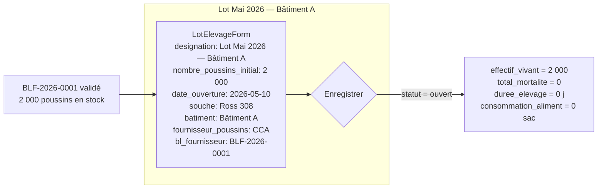

### 4.2 Formulaire LotElevage (`LotElevageForm`)

```
Module : ÉLEVAGE → Lots → [Ouvrir un nouveau lot]
Modèle : LotElevage

  designation              : "Lot Mai 2026 — Bâtiment A"
  date_ouverture           : 2026-05-10   ← ≤ aujourd'hui (BR-LOT clean_date_ouverture)
  nombre_poussins_initial  : 2 000        ← ≥ 1 (BR-LOT clean)
  fournisseur_poussins     : Couvoirs du Centre — CCA
  bl_fournisseur_poussins  : BLF-2026-0001  ← BL statut RECU ou FACTURE
  batiment                 : Bâtiment A   ← DOIT être type poussiniere (BR-LOT-01)
  souche                   : Ross 308
  lot_parent               : (vide — lot racine, pas issu d'un TransfertLot)
  notes                    : "Densité : 13,3 oiseaux/m² — Surface utile 150 m²"

  → statut = ouvert
  → effectif_vivant = 2 000
  → nombre_poussins_reference = 2 000  ← = initial + Σ transferts_sortants (0 ici)

⚠️ Poussin stock : l'ouverture du lot ne décrémente PAS le stock intrant.
   Le stock Poussin Ross 308 diminue uniquement au fil des mortalités enregistrées
   (−1 par oiseau mort via signal mortalite_post_save).
```

### 4.3 Ouverture du Lot Pondeuses (Bâtiment C — Poussinière)

```
Module : ÉLEVAGE → Lots → [Ouvrir un nouveau lot]
Modèle : LotElevage

⚠️ Second lot, INDÉPENDANT du lot broiler ci-dessus — démontre le
   fonctionnement multi-lot / multi-bâtiment de la ferme, et suit un cycle
   biologique complet propre aux pondeuses qu'un lot broiler Ross 308 ne
   connaît jamais (pas de phase de ponte, abattu à 40 j — cf. Annexe B) :

     poussine d'un jour → élevage en Poussinière (18 sem.) → TransfertLot
     vers Poulailler au point de ponte → montée en ponte → RecolteOeufs

   Contrairement à la version précédente de ce scénario (poules achetées
   déjà en pré-ponte directement au Poulailler), le lot démarre ici comme
   un VRAI lot de poussines d'un jour, exactement comme le lot broiler,
   ce qui permet d'exercer BR-LOT-01 (ouverture obligatoire en Poussinière),
   doit_etre_transfere et TransfertLot de façon biologiquement cohérente.

  designation              : "Lot Pondeuses 2026"
  date_ouverture           : 2026-05-15
  nombre_poussins_initial  : 3 000        ← poussines ISA Brown d'un jour
  fournisseur_poussins     : Couvoirs du Centre — CCA
  bl_fournisseur_poussins  : (vide — simplifié, pas de BL dédié dans ce cycle,
                               comme pour le poussin ISA Brown INT-9)
  batiment                 : Bâtiment C   ← poussinière dédiée (BAT-3, §0.3),
                                            distincte de Bâtiment A (broiler)
  souche                   : ISA Brown
  lot_parent               : (vide — lot racine)
  notes                    : "Lot pondeuses — cycle complet Poussinière → Poulailler → Ponte, indépendant du cycle broiler"

  → statut = ouvert
  → effectif_vivant = 3 000
  → phase = poussiniere (batiment.type_batiment)
```

---

## 5. Phase 3 — Suivi Quotidien

### 5.1 Calendrier du lot (J0 = 10 mai 2026)

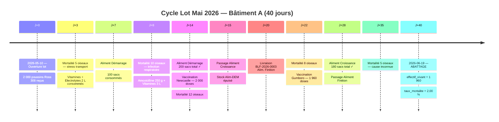

### 5.2 Événements de Mortalité (`MortaliteForm`)

```
Module : ÉLEVAGE → Lot → [Enregistrer mortalité]
Règle  : BR-LOT-03 lot doit être ouvert
         cumul mortalités ≤ nombre_poussins_initial (validation dans clean())
         Signal mortalite_post_save → StockIntrant(Poussin Ross 308) ↓ nombre
         Signal mortalite_pre_delete → StockIntrant(Poussin Ross 308) ↑ nombre (annulation)

┌──────────────────────────────────────────────────────────────────────────────────────────────┐
│ Date       │ Nombre │ Cause                          │ Cumul │ Vivants │ Stock Poussin après │
├────────────┼────────┼────────────────────────────────┼───────┼─────────┼────────────────────┤
│ 2026-05-13 │      5 │ Stress transport / déshydratation│    5 │  1 995  │ 2 000 − 5 = 1 995  │
│ 2026-05-18 │     10 │ Infection respiratoire précoce │   15  │  1 985  │ 1 995 − 10 = 1 985 │
│ 2026-05-24 │     12 │ Aspergilllose suspectée        │   27  │  1 973  │ 1 985 − 12 = 1 973 │
│ 2026-06-01 │      8 │ Coccidiose — traitement lancé  │   35  │  1 965  │ 1 973 − 8 = 1 965  │
│ 2026-06-14 │      5 │ Cause indéterminée             │   40  │  1 960  │ 1 965 − 5 = 1 960  │
└────────────┴────────┴────────────────────────────────┴───────┴─────────┴────────────────────┘
  taux_mortalite final : 40 / nombre_poussins_reference (2 000) = 2,00 %
  Stock Poussin Ross 308 final : 2 000 − 40 = 1 960 unités
  (= effectif_vivant à l'abattage — cohérence garantie par les signaux)
```

### 5.3 Consommations Aliment (`ConsommationForm`)

```
Module : ÉLEVAGE → Lot → [Enregistrer consommation]
Règle  : BR-LOT-03 lot ouvert / BR-INT-03 stock disponible ≥ quantité demandée
         Seuls les intrants catégorie consommable_en_lot=True sont proposés
         (ALIMENT + MEDICAMENT — pas POUSSIN ni AUTRE)

Phase Démarrage — J0 à J14 (200 sacs total)
  ┌─────────────────────────────────────────────────────────────────┐
  │ date       │ intrant              │ quantite │ stock après       │
  ├────────────┼──────────────────────┼──────────┼───────────────────┤
  │ 2026-05-12 │ Alim. Démarrage      │  25,000  │ 175 sacs          │
  │ 2026-05-14 │ Alim. Démarrage      │  25,000  │ 150 sacs          │
  │ 2026-05-17 │ Alim. Démarrage      │  50,000  │ 100 sacs          │
  │ 2026-05-21 │ Alim. Démarrage      │  50,000  │  50 sacs          │
  │ 2026-05-24 │ Alim. Démarrage      │  50,000  │   0 sacs ✓ épuisé │
  └────────────┴──────────────────────┴──────────┴───────────────────┘

Phase Croissance — J15 à J28 (180 sacs total)
  ┌─────────────────────────────────────────────────────────────────┐
  │ date       │ intrant              │ quantite │ stock après       │
  ├────────────┼──────────────────────┼──────────┼───────────────────┤
  │ 2026-05-25 │ Alim. Croissance     │  60,000  │ 120 sacs          │
  │ 2026-06-01 │ Alim. Croissance     │  60,000  │  60 sacs          │
  │ 2026-06-08 │ Alim. Croissance     │  60,000  │   0 sacs ✓ épuisé │
  └────────────┴──────────────────────┴──────────┴───────────────────┘

Phase Finition — J29 à J40 (150 sacs total — livraison BLF-0003 arrivée J+20)
  ┌─────────────────────────────────────────────────────────────────┐
  │ date       │ intrant              │ quantite │ stock après       │
  ├────────────┼──────────────────────┼──────────┼───────────────────┤
  │ 2026-06-08 │ Alim. Finition       │  50,000  │ 100 sacs          │
  │ 2026-06-13 │ Alim. Finition       │  50,000  │  50 sacs          │
  │ 2026-06-18 │ Alim. Finition       │  50,000  │   0 sacs ✓ épuisé │
  └────────────┴──────────────────────┴──────────┴───────────────────┘
```

### 5.3bis Production d'Aliment en interne (`FormuleAliment` / `ProductionAliment`)

```
Module : ÉLEVAGE → Production Aliment → [Nouvelle production/réapprovisionnement]
Modèles : FormuleAliment (recette, optionnelle) + ProductionAliment (événement)
Règle   : la production crédite toujours le stock de l'aliment fini
          (StockIntrant, scopé branche=EST) ; si une formule est fournie,
          chaque ingrédient est débité proportionnellement (mais jamais
          bloquant si le stock ingrédient passe en négatif — cf. Mortalite/
          Consommation, comportement volontairement permissif).

━━━━━━━━━━━━━━━━━━━━━━━━━━━━━━━━━━━━━━━━━━━━━━━━━━━
FORM-1 — Formule Croissance Maison
  nom             : Formule Croissance Maison
  intrant_produit : Aliment Croissance (Fabrication Maison)  [INT-16]
  actif           : True

  Lignes (FormuleAlimentLigne) :
  ┌────────────────────────┬──────────────────────────┐
  │ intrant                │ proportion_kg /100kg      │
  ├────────────────────────┼──────────────────────────┤
  │ Maïs concassé          │ 55,000                    │
  │ Tourteau de Soja       │ 35,000                    │
  └────────────────────────┴──────────────────────────┘
  (le complément 10 kg — prémix/minéraux — n'est pas suivi en stock ici ;
   total_proportion_kg est purement informatif, ce n'est pas une contrainte)

PROD-ALIM-1 — Fabrication avec formule
  branche              : EST
  date                 : 2026-05-20
  formule              : Formule Croissance Maison
  intrant_produit      : Aliment Croissance (Fabrication Maison)
  quantite_produite_kg : 300,000
  prix_unitaire        : 0  ← dérivé automatiquement du PMP des ingrédients débités
  → Débits : Maïs concassé −165,000 kg (300×55/100) ; Tourteau de Soja −105,000 kg (300×35/100)
  → Crédit : StockIntrant(Aliment Croissance Fabrication Maison) +300,000 kg

PROD-ALIM-2 — Réapprovisionnement direct (sans formule)
  branche              : EST
  date                 : 2026-06-05
  formule              : (vide)  ← chemin rapide, aucune traçabilité d'ingrédients
  intrant_produit      : Aliment Croissance (Fabrication Maison)
  quantite_produite_kg : 100,000
  prix_unitaire        : 210,0000 DZD/kg  ← recalcule le PMP de l'aliment fini
  → Crédit : StockIntrant(Aliment Croissance Fabrication Maison) +100,000 kg
  → Coût   : 100 × 210 = 21 000,00 DZD (montant_total)
```

```
Complément de consommation — Aliment Croissance (Fabrication Maison) :

  ┌──────────────────────────────────────────────────────────────────────┐
  │ date       │ intrant                              │ quantite │ stock │
  ├────────────┼──────────────────────────────────────┼──────────┼───────┤
  │ 2026-06-02 │ Aliment Croissance (Fabrication Maison)│  50,000 │ 250 kg│
  └────────────┴──────────────────────────────────────┴──────────┴───────┘

  ℹ️ Ce complément s'ajoute — sans le remplacer — au suivi historique en sacs
  (§5.3, 180 sacs Alim. Croissance achetés) : les deux stocks (sac / kg)
  coexistent sur des Intrant distincts (INT-3 vs INT-16), ce qui illustre
  qu'un même stade d'élevage peut être couvert par plusieurs intrants —
  achetés et/ou auto-produits — simultanément.
```

### 5.4 Consommations Médicaments

```
Phase Préventive & Curative :
  ┌──────────────────────────────────────────────────────────────────────────────┐
  │ date       │ intrant                  │ quantite │ motif                     │
  ├────────────┼──────────────────────────┼──────────┼───────────────────────────┤
  │ 2026-05-13 │ Vitamines + Électrolytes │  2,000 L │ Stress arrivée poussins   │
  │ 2026-05-18 │ Amoxicilline 50%         │  250 g   │ Infection resp. (curée)   │
  │ 2026-05-18 │ Vitamines + Électrolytes │  3,000 L │ Support immunité          │
  │ 2026-05-24 │ Vaccin Newcastle HB1     │ 2 000 d  │ Vaccination primovaccin   │
  │ 2026-06-01 │ Vaccin Gumboro IBD       │ 1 965 d  │ Vaccin Gumboro (1 965 viv)│
  │ 2026-06-01 │ Amoxicilline 50%         │  250 g   │ Traitement coccidiose     │
  │ 2026-06-01 │ Vitamines + Électrolytes │  5,000 L │ Récupération post-traitem.│
  └────────────┴──────────────────────────┴──────────┴───────────────────────────┘

  Stock médicaments restant après cycle :
  Vaccin Newcastle  : 4 000 - 2 000 = 2 000 doses
  Vaccin Gumboro    : 4 000 - 1 965 =  2 035 doses
  Amoxicilline      :   500 -   500 =     0 g ← épuisé
  Vitamines         :    10 -    10 =     0 L ← épuisé
```

### 5.5 Fertilisant — Collecte & Traitement (`CollecteFertilisantForm` / `TraitementFertilisantForm`)

```
Module : ÉLEVAGE → Fertilisant → [Nouvelle collecte] / [Nouveau traitement]
Règle  : rattaché au BÂTIMENT (Bâtiment A), pas au lot — la litière est un
         sous-produit du bâtiment, pas d'une cohorte en particulier.
         branche dérivée automatiquement de batiment.branche (BR-BRA-01).

Collectes brutes (CollecteFertilisant) :
  ┌────────────────────────────────────────────────────────┐
  │ date       │ bâtiment    │ quantité brute              │
  ├────────────┼─────────────┼──────────────────────────────┤
  │ 2026-05-20 │ Bâtiment A  │ 180,000 kg                  │
  │ 2026-05-30 │ Bâtiment A  │ 220,000 kg                  │
  │ 2026-06-09 │ Bâtiment A  │ 240,000 kg                  │
  │ 2026-06-18 │ Bâtiment A  │ 200,000 kg  (nettoyage fin) │
  └────────────┴─────────────┴──────────────────────────────┘
  Total brut collecté : 840,000 kg

Traitement (TraitementFertilisant) — batch unique regroupant les 4 collectes :
  date_traitement       : 2026-06-24
  méthode                : تجفيف طبيعي بالشمس (séchage naturel au soleil)
  produit_fini           : سماد دواجن معالج (مجفف) [type_produit=fertilisant]
  quantite_obtenue_kg    : 720,000 kg   (≈ 86 % du brut — perte d'humidité)
  cout_unitaire_estime   : 9,5000 د.ج/kg
  statut                 : validé ✅

  → Signal traitement_fertilisant_post_save crédite StockProduitFini
    (سماد دواجن معالج) de +720,000 kg, une seule fois à la validation
    (mirroring ProductionRecord BROUILLON → VALIDE, §6.2-6.3).
  → Les 4 CollecteFertilisant voient leur champ `traitement` assigné à ce
    batch — elles ne peuvent plus être réaffectées à un autre traitement
    tant que celui-ci reste validé.
```

### 5.6 Lot Pondeuses — Élevage, Transfert & Montée en Ponte

```
Lot : "Lot Pondeuses 2026" — J0 = 2026-05-15 — Bâtiment C (Poussinière) → Bâtiment B (Poulailler)

Ce lot suit, en parallèle du cycle broiler, un vrai cycle biologique de
pondeuse : élevage en Poussinière jusqu'au point de ponte (18 semaines /
126 j), transfert vers le Poulailler, puis montée en ponte progressive.
Il exerce ainsi TransfertLot et PeseeEchantillon, absents du cycle
broiler (cf. Annexe B), en plus de RecolteOeufs.
```

#### 5.6.1 Calendrier du lot Pondeuses

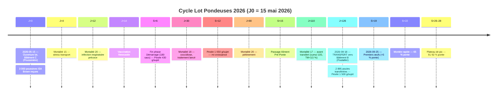

#### 5.6.2 Phase Élevage — Mortalités (`MortaliteForm`)

```
Module : ÉLEVAGE → Lot Pondeuses → [Enregistrer mortalité]
Règle  : identique au lot broiler (BR-LOT-03, cumul ≤ nombre_poussins_initial)

┌──────────────────────────────────────────────────────────────────────────────────┐
│ Date       │ Nombre │ Cause                            │ Cumul │ Vivants        │
├────────────┼────────┼──────────────────────────────────┼───────┼────────────────┤
│ 2026-05-19 │     15 │ Stress transport / déshydratation │    15 │  2 985         │
│ 2026-05-27 │     20 │ Infection respiratoire précoce    │    35 │  2 965         │
│ 2026-06-14 │     18 │ Coccidiose — traitement lancé     │    53 │  2 947         │
│ 2026-07-09 │     15 │ Cause diverse (élevage)           │    68 │  2 932         │
│ 2026-08-03 │     20 │ Piétinement / casse                │    88 │  2 912         │
│ 2026-09-02 │     17 │ Cause indéterminée — avant transfert│  105 │  2 895         │
└────────────┴────────┴──────────────────────────────────┴───────┴────────────────┘
  Taux de mortalité élevage : 105 / 3 000 = 3,50 %  ← comparable au standard
  d'élevage ISA Brown (3–5 % cumulé au point de ponte).
  Effectif à transférer (J+126) : 2 895 poules.
```

#### 5.6.3 Pesées d'échantillon (`PeseeEchantillonForm`) — Courbe de croissance

```
Module : ÉLEVAGE → Lot Pondeuses → [Nouvelle pesée d'échantillon]
Règle  : type_pesee=oiseaux ; poids_moyen_g = poids_total_g / nombre_sujets ;
         qualite dérivée via intrants.utils.determiner_qualite (CategorieQualite)

┌────────────────────────────────────────────────────────────────────────┐
│ date       │ âge      │ nombre_sujets │ poids_total_g │ poids_moyen_g │
├────────────┼──────────┼───────────────┼───────────────┼───────────────┤
│ 2026-05-15 │ J0       │      50       │    2 000,00   │     40,00 g   │
│ 2026-06-26 │ 6 sem.   │      50       │   21 500,00   │    430,00 g   │
│ 2026-08-07 │ 12 sem.  │      50       │   52 500,00   │  1 050,00 g   │
│ 2026-09-18 │ 18 sem.  │      50       │   75 000,00   │  1 500,00 g   │
└────────────┴──────────┴───────────────┴───────────────┴───────────────┘
  Cible standard ISA Brown au point de ponte : ≈ 1,5–1,6 kg — la dernière
  pesée (J+126) confirme que le lot est prêt pour le transfert.
```

#### 5.6.4 Consommations Aliment — Phase Élevage (`ConsommationForm`)

```
Règle : mêmes intrants démarrage/croissance que le broiler (catalogue
        partagé), puis Aliment Pré-Ponte (INT-10, stade=demarrage — visible
        tant que le lot est en Poussinière).

Démarrage — S0 à S6 (J0→J42, 180 sacs)
  ┌─────────────────────────────────────────────────────────────────┐
  │ date       │ intrant              │ quantite │ stock après       │
  ├────────────┼──────────────────────┼──────────┼───────────────────┤
  │ 2026-05-20 │ Alim. Démarrage      │  40,000  │ (partagé stock)   │
  │ 2026-05-30 │ Alim. Démarrage      │  50,000  │                   │
  │ 2026-06-09 │ Alim. Démarrage      │  45,000  │                   │
  │ 2026-06-19 │ Alim. Démarrage      │  45,000  │ 180 sacs cumulés  │
  └────────────┴──────────────────────┴──────────┴───────────────────┘

Croissance — S6 à S15 (J42→J105, 420 sacs)
  ┌─────────────────────────────────────────────────────────────────┐
  │ date       │ intrant              │ quantite │ stock après       │
  ├────────────┼──────────────────────┼──────────┼───────────────────┤
  │ 2026-07-04 │ Alim. Croissance     │  80,000  │                   │
  │ 2026-07-19 │ Alim. Croissance     │  90,000  │                   │
  │ 2026-08-03 │ Alim. Croissance     │  90,000  │                   │
  │ 2026-08-18 │ Alim. Croissance     │  80,000  │                   │
  │ 2026-08-27 │ Alim. Croissance     │  80,000  │ 420 sacs cumulés  │
  └────────────┴──────────────────────┴──────────┴───────────────────┘

Pré-Ponte — S15 à S18 (J105→J126, 90 sacs)
  ┌─────────────────────────────────────────────────────────────────┐
  │ date       │ intrant              │ quantite │ stock après       │
  ├────────────┼──────────────────────┼──────────┼───────────────────┤
  │ 2026-09-04 │ Alim. Pré-Ponte      │  45,000  │                   │
  │ 2026-09-16 │ Alim. Pré-Ponte      │  45,000  │ 90 sacs cumulés   │
  └────────────┴──────────────────────┴──────────┴───────────────────┘
```

#### 5.6.5 Vaccinations & Traitements — Phase Élevage

```
┌──────────────────────────────────────────────────────────────────────────────┐
│ date       │ intrant                  │ quantite │ motif                     │
├────────────┼──────────────────────────┼──────────┼───────────────────────────┤
│ 2026-05-19 │ Vitamines + Électrolytes │  3,000 L │ Stress arrivée poussines  │
│ 2026-05-25 │ Vaccin Newcastle         │  3 000   │ Programme préventif       │
│ 2026-06-02 │ Vaccin Gumboro           │  2 965   │ Programme préventif       │
│ 2026-06-14 │ Amoxicilline 50%         │  300 g   │ Traitement coccidiose     │
│ 2026-06-14 │ Vitamines + Électrolytes │  4,000 L │ Traitement coccidiose     │
│ 2026-07-14 │ Vaccin Newcastle         │  2 925   │ Rappel avant maturité     │
│ 2026-09-07 │ Vitamines + Électrolytes │  5,000 L │ Préparation transfert     │
└──────────────────────────────────────────────────────────────────────────────┘
```

#### 5.6.6 Transfert vers Poulailler (`TransfertLotForm`) — J+126

```
Module : ÉLEVAGE → Lot Pondeuses → [Transférer le lot]
Modèle : TransfertLot (MODE_FULL — la bande entière déménage)
Règle  : BR-BRA-01 (même branche origine/destination) ; lot doit être
         ouvert ; effectif_transfere ≤ effectif_vivant. Immuable une fois créé.

  lot                    : Lot Pondeuses 2026
  batiment_origine       : Bâtiment C (Poussinière)
  batiment_destination   : Bâtiment B (Poulailler)
  date_transfert         : 2026-09-18
  age_jours_transfert    : 126   ← déclenché par doit_etre_transfere (§0.0)
  effectif_transfere     : 2 895 ← = effectif_vivant au moment du transfert
  mode                   : full  ← toute la bande déménage, pas de scission
  motif                  : "Point de ponte atteint (18 semaines) — transfert vers poulailler"

  → Signal transfert_lot_post_save (mode=full) :
      lot.batiment ← Bâtiment B
      lot.branche  ← re-dérivée de Bâtiment B.branche (BR-BRA-01)
      nombre_poussins_initial INCHANGÉ (3 000) — seul le mode split
      décrémente la baseline ; nombre_poussins_reference reste donc 3 000.
  → lot.phase = poulailler ; lot.stade_intrant_attendu = STADE_CROISSANCE
    dès la validation → Aliment Ponte (INT-11, stade=croissance) devient
    visible dans ConsommationForm ; Aliment Pré-Ponte (stade=demarrage)
    disparaît de la liste.
```

#### 5.6.7 Montée en Ponte & Récolte d'Œufs (`RecolteOeufsForm`) — Bâtiment B

```
Module : ÉLEVAGE → Lot Pondeuses → [Enregistrer récolte d'œufs]
Règle  : lot doit être ouvert ; nombre_oeufs ≥ 1 ; qualité optionnelle
         (dérivée d'une PeseeEchantillon type_pesee=oeufs du même jour —
         non utilisée ici, cf. Annexe B). Signal recolte_oeufs_post_save
         crédite StockProduitFini (صينية بيض) au prorata des plateaux
         de 30 œufs.

⚠️ Contrairement à la version précédente du scénario (poules déjà en
   pré-ponte), la ponte démarre ici réellement ~7 jours après le transfert
   (19ᵉ semaine d'âge), avec la montée en cadence typique d'une bande ISA
   Brown : 5 % → 90 %+ de taux de ponte en 6-7 semaines. Effectif de
   référence : 2 895 poules.

Aliment Ponte (`ConsommationForm`, post-transfert, INT-11, stade=croissance) :
  ┌─────────────────────────────────────────────────────────────────┐
  │ date       │ intrant              │ quantite │ note              │
  ├────────────┼──────────────────────┼──────────┼───────────────────┤
  │ 2026-09-22 │ Alim. Ponte          │  80,000  │ démarrage ponte   │
  │ 2026-10-12 │ Alim. Ponte          │ 100,000  │                   │
  │ 2026-11-01 │ Alim. Ponte          │ 100,000  │                   │
  │ 2026-11-21 │ Alim. Ponte          │ 100,000  │ plateau de pic    │
  └────────────┴──────────────────────┴──────────┴───────────────────┘

Montée en ponte (RecolteOeufs) :
  ┌────────────────────────────────────────────────────────────────────────────────────────┐
  │ date       │ âge (sem.) │ taux ponte │ nombre_oeufs │ plateaux (÷30) │ hors-plateau     │
  ├────────────┼────────────┼────────────┼──────────────┼────────────────┼──────────────────┤
  │ 2026-09-25 │     19     │     5 %    │       145    │        4       │        25        │
  │ 2026-10-02 │     20     │    22 %    │       637    │       21       │         7        │
  │ 2026-10-09 │     21     │    45 %    │     1 303    │       43       │        13        │
  │ 2026-10-16 │     22     │    65 %    │     1 882    │       62       │        22        │
  │ 2026-10-23 │     23     │    80 %    │     2 316    │       77       │         6        │
  │ 2026-10-30 │     24     │    88 %    │     2 548    │       84       │        28        │
  │ 2026-11-13 │     26     │    91 %    │     2 635    │       87       │        25        │
  │ 2026-11-27 │     28     │    92 %    │     2 664    │       88       │        24        │
  └────────────┴────────────┴────────────┴──────────────┴────────────────┴──────────────────┘
  Total récolté sur la période : 14 130 œufs (≈ 471 plateaux)
  → Stock صينية بيض (30 بيضة) crédité au fil de chaque récolte.
  → Courbe de ponte réaliste : montée en S-shape typique d'une bande ISA
    Brown, plateau de pic ≈ 91-92 % atteint vers S26-28, puis maintenu
    plusieurs mois (au-delà de la portée temporelle de ce document).
```

#### 5.6.8 Retraits d'Œufs (`RetraitOeufsForm`) — sorties hors BL formel

```
Module : ÉLEVAGE → Lot Pondeuses → [Enregistrer retrait d'œufs]
Modèle : RetraitOeufs — débite le même StockProduitFini (صينية بيض) que
         RecolteOeufs crédite, scopé branche=OUEST. Si un client est
         sélectionné (motif=client_camion), le formulaire génère
         automatiquement un BLClient + ligne pour cette quantité — c'est
         ALORS ce BLClient qui débite le stock, pas RetraitOeufs directement
         (le signal se désactive dès que bl_genere est renseigné, pour
         éviter un double débit).

━━━━━━━━━━━━━━━━━━━━━━━━━━━━━━━━━━━━━━━━━━━━━━━━━━━
RETRAIT-OEUFS-1 — Don échantillon vétérinaire
  branche         : OUEST
  lot             : Lot Pondeuses 2026 (informatif seulement)
  date            : 2026-11-15
  quantite_oeufs  : 30   (= 1 plateau)
  motif           : don
  destinataire    : "Clinique Vétérinaire Sanofi — contrôle qualité"
  client          : (vide — pas de BL généré)
  → StockProduitFini(صينية بيض) ↓ −1 plateau (directement, pas de BL)

RETRAIT-OEUFS-2 — Vente directe camion (hors BL planifié)
  branche         : OUEST
  lot             : Lot Pondeuses 2026
  date            : 2026-11-20
  quantite_oeufs  : 60   (= 2 plateaux)
  motif           : client_camion
  client          : Épicerie Centrale Azazga  ← client existant (§0.2, CLI-4)
  → Génère automatiquement BLC-2026-0005 (2 plateaux × 350 DZD = 700 DZD),
    statut Livré ; RetraitOeufs.bl_genere = BLC-2026-0005
  → C'est BLC-2026-0005 qui débite StockProduitFini (−2 plateaux), pas ce
    RetraitOeufs (bl_genere renseigné → signal RetraitOeufs neutralisé)
```

> 📌 **Impact sur le stock disponible pour §8.4** : sur 471 plateaux récoltés,
> 3 sont sortis en amont (1 don + 2 vente-camion, ci-dessus) → **468 plateaux**
> restent disponibles pour la vente planifiée du Marché de Gros en §8.4.

---

## 6. Phase 4 — Abattage & Production

### 6.1 Flux

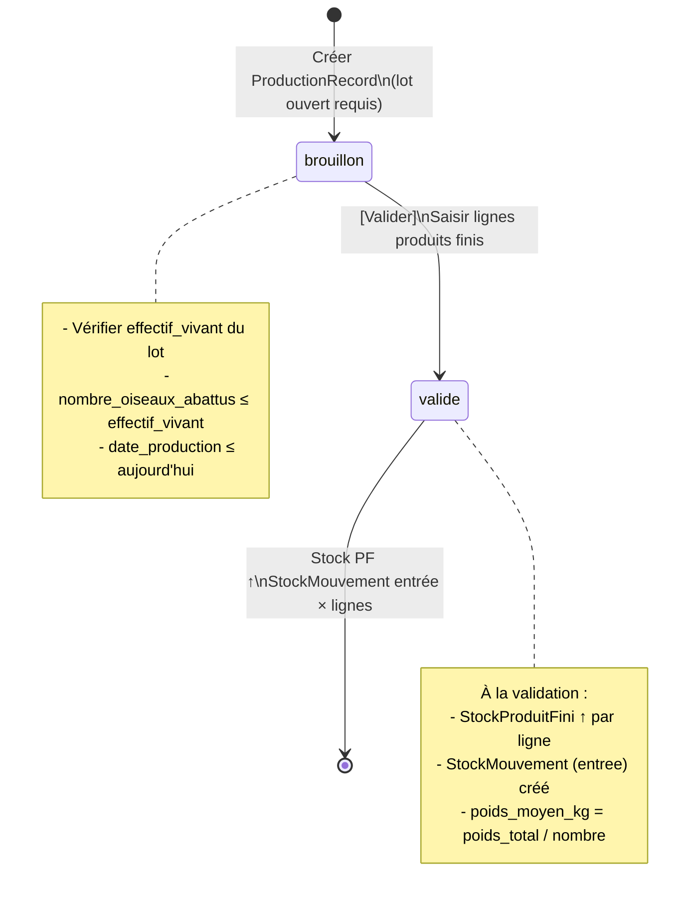

### 6.2 Formulaire ProductionRecord (`ProductionRecordForm`)

```
Module : PRODUCTION → [Nouveau enregistrement]
Modèle : ProductionRecord

⚠️ Règle BR-LOT-05 (maturité) : la validation est bloquée si l'âge du lot
   est inférieur à ParametrageElevage.age_maturite_vente_jours.
   Ce lot a 40 jours au 2026-06-19 → age_maturite_vente_jours doit être ≤ 40.
   (Voir Phase 0 §0.0 — à configurer avant ouverture du lot)

  lot                      : Lot Mai 2026 — Bâtiment A  ← statut ouvert requis
  date_production          : 2026-06-19
  nombre_oiseaux_abattus   : 1 960   ← ≤ effectif_vivant (1 960) ✅
  poids_total_kg           : 4 116,000   ← 1 960 × 2,100 kg moy.
  notes                    : "Abattage complet — poids moyen 2,1 kg — Lot clôturé"

  → poids_moyen_kg auto-calculé : 4 116,000 / 1 960 = 2,100 kg
  → statut = brouillon
```

### 6.3 Lignes de production (`ProductionLigneFormSet`)

```
Lignes (1 record → N lignes produits finis) :

⚠️ Unités issues du seed :
   • Poulet vivant     → unite_mesure = unite  (prix défaut 480 DZD/u)
   • Carcasse entière  → unite_mesure = kg     (prix défaut 750 DZD/kg)
   La quantite se saisit dans l'unité du produit fini.

  ┌────────────────────────────────────────────────────────────────────────────────────┐
  │ produit_fini          │ quantite    │ poids_unit  │ cout_unit_est │ valeur_totale  │
  ├───────────────────────┼─────────────┼─────────────┼───────────────┼────────────────┤
  │ Poulet vivant         │    500,000  │   2,100 kg  │  320,0000 DZD │   160 000,00   │
  │ Carcasse entière      │  2 146,200  │   1,470 kg  │  220,0000 DZD │   472 164,00   │
  │                       │ (1 460 × 1,470 kg)                                         │
  └───────────────────────┴─────────────┴─────────────┴───────────────┴────────────────┘

  Total valeur estimée : 632 164,00 DZD

  Action : [Valider] → statut = valide
    → StockProduitFini(Poulet vivant)    ↑ +500,000 unités
    → StockProduitFini(Carcasse entière) ↑ +2 146,200 kg
    → 2 × StockMouvement (source=production, type=entree)
```

### 6.4 Fermeture du lot (`LotFermetureForm`)

```
Module : ÉLEVAGE → Lot → [Fermer le lot]
Modèle : LotElevage.fermer()

  date_fermeture : 2026-06-19
  notes          : "Lot clôturé après abattage complet. TM=2%. IC=1,62. GMQ=53g/j."

  → lot.statut = fermé
  → Plus aucune mortalité ni consommation possible (BR-LOT-03)
```

### 6.5 Indicateurs zootechniques finaux

| Indicateur                    | Calcul                                   | Valeur        |
| ----------------------------- | ---------------------------------------- | ------------- |
| Effectif initial              | —                                        | 2 000 oiseaux |
| Mortalités totales            | —                                        | 40 oiseaux    |
| **nombre_poussins_reference** | initial + Σ transferts_sortants (0)      | **2 000**     |
| Taux de mortalité             | 40 / **nombre_poussins_reference** × 100 | **2,00 %**    |
| Oiseaux abattus               | 2 000 − 40                               | **1 960**     |
| Poids moyen à l'abattage      | 4 116 / 1 960                            | **2,100 kg**  |
| Durée d'élevage               | J0 → J40                                 | **40 jours**  |
| Consommation aliment totale   | 200 + 180 + 150                          | **530 sacs**  |
| GMQ (gain moyen quotidien)    | 2 100g / 40j                             | **52,5 g/j**  |
| IC (indice de consommation)   | 530 × 25 kg / (1 960 × 2,1 kg)           | **≈ 3,24**    |

---

## 7. Phase 5 — Ajustement de Stock

> **Contexte** : inventaire physique le 2026-06-20 révèle 3 carcasses en moins (détérioration chambre froide).

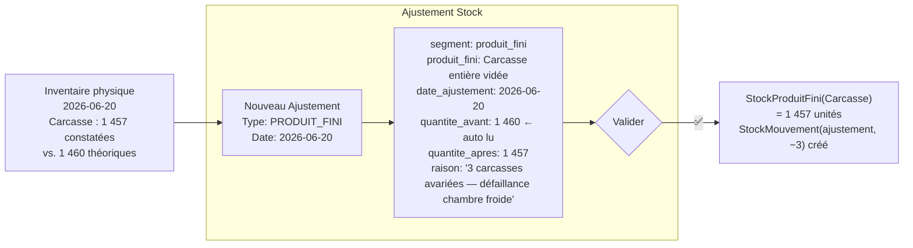

```
Module : STOCK → Ajustements → [Nouveau]
Modèle : StockAjustement

  segment          : PRODUIT_FINI
  produit_fini     : Carcasse entière vidée
  date_ajustement  : 2026-06-20        ← ≤ aujourd'hui (clean)
  quantite_avant   : 1 460,000         ← read-only, auto-rempli par la vue
  quantite_apres   : 1 457,000
  raison           : "3 carcasses avariées suite défaillance chambre froide — lot 20/06"

  Règles : quantite_apres ≥ 0 / segment = PRODUIT_FINI → produit_fini requis / intrant = vide
```

---

## 8. Phase 6 — Vente & Livraison Client

### 8.1 Vue d'ensemble des ventes

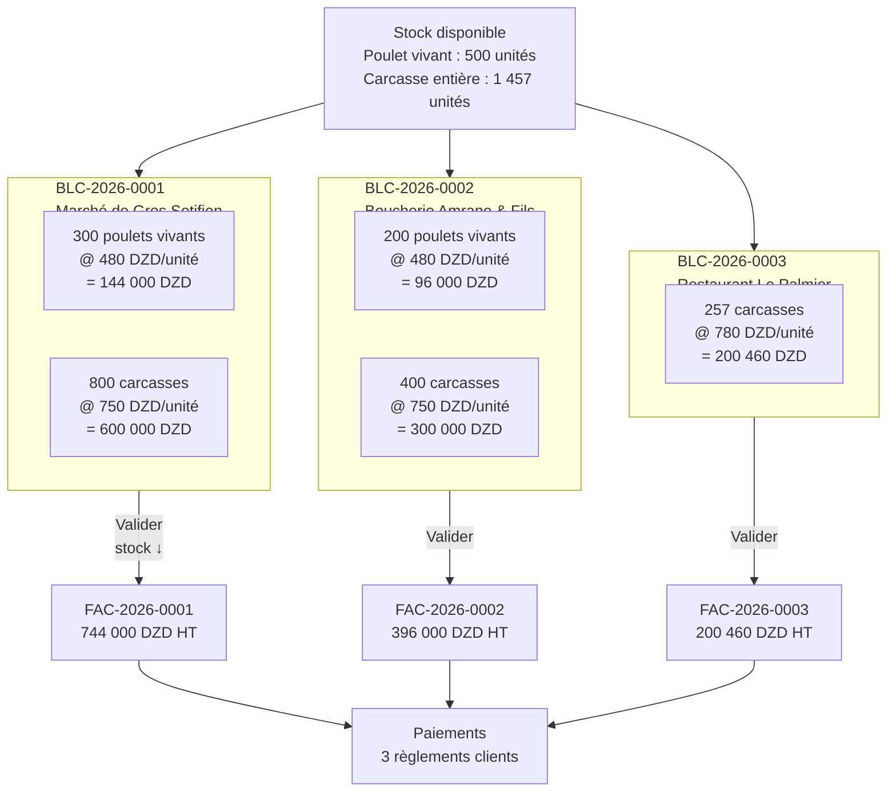

> ℹ️ Ce diagramme couvre uniquement la sortie du **lot broiler** (Poulet
> vivant / Carcasse, juin 2026). Le **lot Pondeuses** produit également
> 471 plateaux d'œufs, récoltés bien plus tard (S+19 à S+28, cf. §5.6.7) ; 3
> plateaux sortent hors BL formel via `RetraitOeufs` (§5.6.8), et le solde de
> 468 plateaux est vendu (BLC-2026-0004), traité séparément en **§8.4**.

### 8.2 Formulaires BL Client (`BLClientForm`)

```
Module : VENTES → BL Client → [Nouveau]
Règle  : BR-BLC-02 stock vérifié avant validation (quantite ≤ stock_disponible)
         BR-BLC-03 BL Facturé = verrouillé
         statut user choices : Brouillon / Livré / En litige (pas Facturé)

━━━━━━━━━━━━━━━━━━━━━━━━━━━━━━━━━━━━━━━━━━━━━━━━━━━
BLC-2026-0001 — Marché de Gros Setifien
  reference          : BLC-2026-0001
  client             : Marché de Gros Setifien
  date_bl            : 2026-06-20
  adresse_livraison  : "Zone de marché, Route nationale 5, Setifien"
  signe_par          : "Boualem Khaled — Réceptionnaire"
  statut             : Livré

  Lignes :
  ┌──────────────────────────────────────────────────────────────────────────┐
  │ produit_fini          │ quantite  │ prix_unitaire │ montant_total         │
  ├───────────────────────┼───────────┼───────────────┼───────────────────────┤
  │ Poulet vivant         │  300,000  │    480,0000   │  144 000,00           │
  │ Carcasse entière vidée│  800,000  │    750,0000   │  600 000,00           │
  └───────────────────────┴───────────┴───────────────┴───────────────────────┘
  Total BL : 744 000,00 DZD
  Action : [Valider] → statut = Livré
    → StockProduitFini(Poulet vivant)    ↓ −300 (reste 200)
    → StockProduitFini(Carcasse entière) ↓ −800 (reste 657)

━━━━━━━━━━━━━━━━━━━━━━━━━━━━━━━━━━━━━━━━━━━━━━━━━━━
BLC-2026-0002 — Boucherie Amrane & Fils
  reference : BLC-2026-0002
  client    : Boucherie Amrane & Fils
  date_bl   : 2026-06-21
  statut    : Livré

  Lignes :
  ┌──────────────────────────────────────────────────────────────────────────┐
  │ produit_fini          │ quantite  │ prix_unitaire │ montant_total         │
  ├───────────────────────┼───────────┼───────────────┼───────────────────────┤
  │ Poulet vivant         │  200,000  │    480,0000   │   96 000,00           │
  │ Carcasse entière vidée│  400,000  │    750,0000   │  300 000,00           │
  └───────────────────────┴───────────┴───────────────┴───────────────────────┘
  Total BL : 396 000,00 DZD
  → Stock poulet vivant ↓ −200 (reste 0) / Carcasse ↓ −400 (reste 257)

━━━━━━━━━━━━━━━━━━━━━━━━━━━━━━━━━━━━━━━━━━━━━━━━━━━
BLC-2026-0003 — Restaurant Le Palmier
  reference : BLC-2026-0003
  client    : Restaurant Le Palmier
  date_bl   : 2026-06-22
  statut    : Livré

  Lignes :
  ┌──────────────────────────────────────────────────────────────────────────┐
  │ produit_fini          │ quantite  │ prix_unitaire │ montant_total         │
  ├───────────────────────┼───────────┼───────────────┼───────────────────────┤
  │ Carcasse entière vidée│  257,000  │    780,0000   │  200 460,00           │
  └───────────────────────┴───────────┴───────────────┴───────────────────────┘
  Total BL : 200 460,00 DZD
  → Carcasse ↓ −257 (reste 0) ✅ tout vendu
```

### 8.3 Factures Client et Paiements

```
Règle  : BR-FAC-01 montant_ht = auto-somme lignes BL inclus
         BR-FAC-02 seuls les BL au statut Livré du même client
         BR-FAC-03 paiement manuel — user choisit quelle(s) facture(s) couvrir
         Statut Payée = non-sélectionnable (piloté par allocations)

FAC-2026-0001 — Marché de Gros Setifien
  client         : Marché de Gros Setifien
  bls            : [BLC-2026-0001]
  date_facture   : 2026-06-20
  date_echeance  : 2026-07-20   ← +30 jours
  montant_ht     : 744 000,00 ← auto
  taux_tva       : 0,00 %      ← volaille exonérée TVA
  montant_tva    : 0,00
  montant_ttc    : 744 000,00

  Paiement 1 :
    client        : Marché de Gros Setifien
    date_paiement : 2026-06-20
    montant       : 744 000,00
    mode_paiement : especes
    mode_allocation: manuel      ← user choisit quelle(s) facture(s) couvrir (BR-FAC-03)
    Allocation    : → FAC-2026-0001 : 744 000 DZD → statut = Payée ✅

FAC-2026-0002 — Boucherie Amrane & Fils
  bls          : [BLC-2026-0002]
  montant_ht   : 396 000,00
  taux_tva     : 0,00 %
  montant_tva  : 0,00
  montant_ttc  : 396 000,00 (exonéré)

  Paiement 2 :
    montant       : 200 000,00
    mode_paiement : cheque
    reference     : "CHQ-AMRANE-1044"
    mode_allocation: manuel
    Allocation    : → FAC-2026-0002 : 200 000 DZD → Partiellement payée
    reste_a_payer : 196 000,00 DZD ← en attente

FAC-2026-0003 — Restaurant Le Palmier
  bls          : [BLC-2026-0003]
  montant_ht   : 200 460,00
  taux_tva     : 0,00 %
  montant_tva  : 0,00
  montant_ttc  : 200 460,00
  → Au moment de sa création, 50 000,00 DZD sont automatiquement consommés
    depuis l'Acompte Client du 2026-06-15 (§8.5) → reste dû : 150 460,00 DZD

  Paiement 3 :
    montant       : 150 460,00   ← solde après consommation de l'acompte (§8.5)
    mode_paiement : virement
    reference     : "VIR-PALMIER-22062026"
    mode_allocation: manuel
    Allocation    : → FAC-2026-0003 : 150 460 DZD → Payée ✅
```

### 8.4 Vente Œufs (`BLClientForm`) — Lot Pondeuses 2026

```
⚠️ Correction de cohérence : le lot Pondeuses 2026 (§5.6.7) récolte 14 130
   œufs (≈ 471 plateaux) crédités à StockProduitFini (صينية بيض), dont
   3 plateaux sortis avant la vente planifiée via RetraitOeufs (§5.6.8 —
   1 don + 1 vente-camion générant BLC-2026-0005). Cette section écoule le
   solde restant (468 plateaux) une fois la dernière récolte enregistrée
   (2026-11-27).

Module : VENTES → BL Client → [Nouveau]
Prérequis : dernière RecolteOeufs du 2026-11-27 (§5.6.7) et les deux
            RetraitOeufs du §5.6.8 déjà enregistrés — solde 468 plateaux.

━━━━━━━━━━━━━━━━━━━━━━━━━━━━━━━━━━━━━━━━━━━━━━━━━━━
BLC-2026-0004 — Marché de Gros Setifien (Œufs)
  reference : BLC-2026-0004
  client    : Marché de Gros Setifien
  date_bl   : 2026-11-30
  statut    : Livré

  Lignes :
  ┌──────────────────────────────────────────────────────────────────────────┐
  │ produit_fini          │ quantite  │ prix_unitaire │ montant_total         │
  ├───────────────────────┼───────────┼───────────────┼───────────────────────┤
  │ Plateau œufs (30 œufs)│  468,000  │    350,0000   │  163 800,00           │
  └───────────────────────┴───────────┴───────────────┴───────────────────────┘
  Total BL : 163 800,00 DZD
  → StockProduitFini(صينية بيض) ↓ −468 (reste 0) ✅ tout vendu

FAC-2026-0004 — Facture Œufs Marché de Gros
  reference      : FAC-2026-0004
  client         : Marché de Gros Setifien
  bls            : [BLC-2026-0004]
  date_facture   : 2026-11-30
  date_echeance  : 2026-12-30   ← +30 jours
  montant_ht     : 163 800,00 ← auto
  taux_tva       : 0,00 %      ← volaille/œufs exonérés TVA
  montant_tva    : 0,00
  montant_ttc    : 163 800,00

  Paiement 4 :
    client        : Marché de Gros Setifien
    date_paiement : 2026-12-01
    montant       : 163 800,00
    mode_paiement : virement
    reference     : "VIR-MG-OEUFS-301126"
    mode_allocation: manuel
    Allocation    : → FAC-2026-0004 : 163 800 DZD → Payée ✅
```

> ℹ️ **Portée du compte de résultat (§10)** : le Lot Pondeuses 2026 reste
> **ouvert** à la fin de ce document (il n'atteint son point de ponte qu'à
> S+19, bien après la fermeture du lot Mai 2026 — cf. §5.6.1). La vente
> d'œufs ci-dessus n'est donc **pas intégrée** au P&L du §10.2, qui reste
> volontairement scopé au seul Lot Mai 2026 (Ross 308) : les coûts
> d'intrants du lot Pondeuses (poussines ISA Brown, Aliment Pré-Ponte,
> Aliment Ponte) ne sont pas non plus détaillés dans les BL Fournisseur du
> §3, donc mélanger cette recette au P&L broiler fausserait la marge sans
> les charges correspondantes. Elle est en revanche bien reflétée dans le
> tableau de bord des créances clients (§10.4), qui est transverse à tous
> les clients et toutes les factures, indépendamment du lot.

### 8.5 Acompte Client (`AcompteClient`) — Avance sur commande

```
Module : VENTES → Paiements Client → [Nouveau paiement] (aucune facture
         sélectionnée / montant excédentaire)
Modèle : AcompteClient — créé AUTOMATIQUEMENT dès qu'un PaiementClient laisse
         un solde non alloué (paiement.solde_non_alloue > 0), typiquement une
         avance versée avant l'émission de toute facture.

━━━━━━━━━━━━━━━━━━━━━━━━━━━━━━━━━━━━━━━━━━━━━━━━━━━
PAY-ADV-1 — Avance Restaurant Le Palmier (avant commande)
  client         : Restaurant Le Palmier
  branche        : EST
  date_paiement  : 2026-06-15   ← 7 jours avant la création de BLC-2026-0003
  montant        : 50 000,00
  mode_paiement  : especes
  mode_allocation: manuel
  Allocation     : (aucune facture existante à cette date) → solde_non_alloue
                   = 50 000,00 DZD

  → ACOMPTE-CLI-1 créé automatiquement :
      client          : Restaurant Le Palmier
      branche         : EST (synchronisée depuis paiement.branche)
      paiement        : PAY-ADV-1
      montant         : 50 000,00
      montant_restant : 50 000,00
      utilise         : False

  → Le 2026-06-22, dès que FAC-2026-0003 est créée pour ce même client/branche,
    clients.utils.consommer_acomptes_client_fifo() consomme automatiquement
    ACOMPTE-CLI-1 (le plus ancien d'abord) :
      AllocationAcompteClient : acompte=ACOMPTE-CLI-1, facture=FAC-2026-0003,
                                montant_alloue = 50 000,00
      ACOMPTE-CLI-1.montant_restant → 0,00 → utilise = True
  → Voir §8.3 : le Paiement 3 restant ne couvre donc que le solde de
    150 460,00 DZD.
```

### 8.6 AbonnementClient — Livraison récurrente de Fertilisant (`AbonnementClientForm` / `LivraisonPartielleForm`)

```
Module : VENTES → Abonnements → [Nouvel abonnement] / [Nouvelle livraison]
Modèles : AbonnementClient (accord-cadre) + LivraisonPartielle (chaque
          tournée livrée) + VoyageLivraison (organisation logistique, optionnel)
Règle   : BR-BRA-01 l'abonnement est scopé à une branche (stock consommé sur
          cette branche uniquement) ; une livraison sur un abonnement non
          `actif` est rejetée ; un quota (`quantite_totale_prevue`) non nul
          ne peut jamais être dépassé cumulativement.

━━━━━━━━━━━━━━━━━━━━━━━━━━━━━━━━━━━━━━━━━━━━━━━━━━━
ABON-1 — Fertilisant mensuel, Marché de Gros Setifien
  client                  : Marché de Gros Setifien
  branche                 : EST   ← le Fertilisant traité (§5.5, 720 kg) vit
                                    sur le stock de la branche EST
  produit_fini            : سماد دواجن معالج (مجفف) [Fertilisant traité]
  date_debut              : 2026-06-25
  date_fin                : (vide — abonnement ouvert)
  frequence               : mensuel
  quantite_totale_prevue  : 720,000 kg   ← plafonné à la quantité traitée disponible
  prix_unitaire           : 12,0000 DZD/kg
  statut                  : actif

VOYAGE-1 — Tournée fertilisant du 2026-06-26
  date_voyage : 2026-06-26
  chauffeur   : "Farid Belkacem"
  vehicule    : "Camion benne — 12345-116-16"

LIVR-1 — Première livraison partielle
  abonnement      : ABON-1
  voyage          : VOYAGE-1
  date            : 2026-06-26
  quantite_livree : 300,000 kg
  → StockProduitFini(Fertilisant traité) ↓ −300 kg (reste 420 kg)
  → quantite_livree_cumulee = 300,000 ; solde_restant = 420,000

LIVR-2 — Deuxième livraison partielle
  abonnement      : ABON-1
  date            : 2026-07-10
  quantite_livree : 420,000 kg
  → StockProduitFini(Fertilisant traité) ↓ −420 kg (reste 0) ✅ quota atteint
  → quantite_livree_cumulee = 720,000 = quantite_totale_prevue → solde_restant = 0
  ⚠️ Toute tentative d'une 3ᵉ livraison sur ABON-1 serait bloquée par le
     contrôle de quota (clean() de LivraisonPartielle) — non exercée ici.
```

> ℹ️ Contrairement à un `BLClient` (document ponctuel), aucune `FactureClient`
> n'est générée automatiquement par une `LivraisonPartielle` : la facturation
> du fertilisant livré reste, dans ce cycle, hors périmètre (facturation
> manuelle mensuelle à mettre en place séparément si nécessaire).

---

## 9. Phase 7 — Dépenses Opérationnelles

### 9.1 Flux

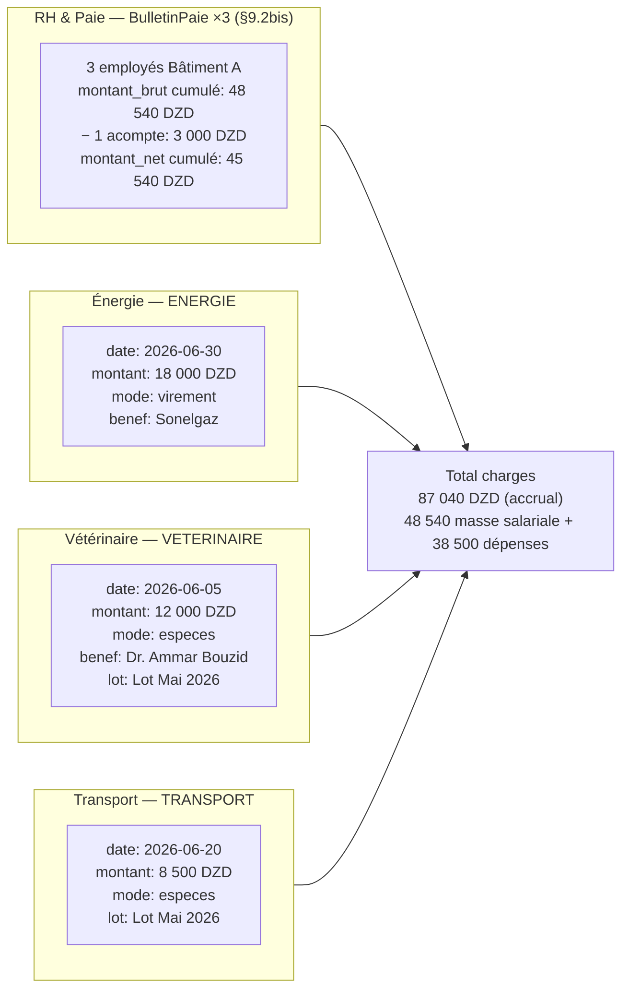

> 🆕 **Changement vs v1.3** : le poste Salaires n'est plus une `Depense`
> forfaitaire unique (`DEP-001`). Il est désormais généré par le cycle
> RH & Paie complet (§9.2bis) — `Employe` → `Pointage` → `BulletinPaie`,
> avec un `AcompteEmploye` intermédiaire déduit du bulletin.

### 9.2 Formulaires Dépense (`DepenseForm`)

```
Module : DÉPENSES → [Nouvelle dépense]
Règle  : BR-DEP-01/03 facture_liee uniquement pour factures TYPE_SERVICE (pas marchandise)
         BR-DEP-04 attribution lot optionnelle (rentabilité analytique)
         date ≤ aujourd'hui / montant > 0

DEP-002 — Électricité Sonelgaz
  date               : 2026-06-30
  categorie          : Énergie (Électricité / Gaz)
  description        : "Facture électricité juin 2026 — ventilation + éclairage Bâtiment A"
  montant            : 18 000,00
  mode_paiement      : virement
  reference_document : "SONELGAZ-2026-06-8854"
  branche            : EST   ← champ requis (BR-BRA-01)
  lot                : Lot Mai 2026 — Bâtiment A

DEP-003 — Honoraires vétérinaire
  date               : 2026-06-05
  categorie          : Frais Vétérinaires
  description        : "Visite sanitaire + diagnostic coccidiose — Dr. Ammar Bouzid"
  montant            : 12 000,00
  mode_paiement      : especes
  branche            : EST
  lot                : Lot Mai 2026 — Bâtiment A
  facture_liee       : (vide — honoraires directs, pas de facture service fournisseur)
  notes              : "Ordonnance + protocole de traitement Amoxicilline 250g"

DEP-004 — Transport livraison
  date               : 2026-06-20
  categorie          : Transport & Carburant
  description        : "Transport abattage + livraisons clients — 20 & 21 juin"
  montant            : 8 500,00
  mode_paiement      : especes
  branche            : EST
  lot                : Lot Mai 2026 — Bâtiment A
```

> 🆕 **DEP-001 (Salaires) n'existe plus en tant que `Depense`** : ce poste est
> désormais entièrement produit par le module RH & Paie ci-dessous (§9.2bis),
> conformément au retrait de `RH (Employe/Pointage/BulletinPaie)` de la liste
> des domaines non exercés (cf. ancienne Annexe B, v1.3).

### 9.2bis RH & Paie — `Employe` / `Pointage` / `CongeEmploye` / `AcompteEmploye` / `BulletinPaie`

```
Module : RH → Employés / Pointages / Paie
Règle  : BR-RH-01 rotation 6j/1-repos, binôme couvre le jour de repos
         BR-RH-02 taux_journalier = salaire_base_mensuel / 25 (JOURS_REFERENCE_MENSUEL)
         BR-RH-03 congé payé accumulé à 2,5 j/mois travaillé
         BR-RH-04 acompte déduit du bulletin du mois, jamais inséré comme Depense
         BR-RH-05 bulletin = snapshot calculé depuis Pointage (jamais recalculé après coup)
         BR-BRA-09 Employe.branche est DÉRIVÉE de employe.batiment.branche (EST ici)

━━━━━━━━━━━━━━━━━━━━━━━━━━━━━━━━━━━━━━━━━━━━━━━━━━━
EMP-001 — Rachid Belkacem (chef d'équipe)
  matricule             : OUV-EST-001
  batiment              : Bâtiment A   ← branche EST dérivée automatiquement
  jour_repos_habituel   : vendredi
  binome                : (EMP-003 — Yacine Ferhat)
  salaire_base_mensuel  : 18 000,00
  heures_normales_jour  : 8,00
  taux_majoration_heure_sup : 1,50

EMP-002 — Karim Saadi
  matricule             : OUV-EST-002
  batiment              : Bâtiment A
  jour_repos_habituel   : samedi
  salaire_base_mensuel  : 15 000,00

EMP-003 — Yacine Ferhat
  matricule             : OUV-EST-003
  batiment              : Bâtiment A
  jour_repos_habituel   : vendredi
  binome                : (EMP-001 — Rachid Belkacem)
  salaire_base_mensuel  : 15 000,00

Pointage (juin 2026, synthèse — 30 jours) :
  ┌────────────┬────────────────┬──────────────┬──────────────┬─────────────────┐
  │ employé    │ jours_presence │ jours_repos  │ heures_sup   │ notes           │
  ├────────────┼────────────────┼──────────────┼──────────────┼─────────────────┤
  │ EMP-001    │       25       │       5      │  4,00 (1 j.) │ garde nocturne  │
  │ EMP-002    │       25       │       5      │  0,00        │ —               │
  │ EMP-003    │       25       │       5      │  0,00        │ —               │
  └────────────┴────────────────┴──────────────┴──────────────┴─────────────────┘

AcompteEmploye :
  ACOMPTE-EMP-1 : employe=EMP-001, date=2026-06-15, montant=3 000,00,
                  mode_paiement=especes, motif="Avance sur salaire — urgence familiale"
                  → bulletin_paie = (vide à cette date, sera lié au BulletinPaie de juin)

BulletinPaie (mois=06, année=2026) :
  ┌──────────┬────────────────┬───────────────┬─────────────┬─────────────┬────────────┬─────────────┐
  │ employé  │ jours_presence │ taux_journalier│ montant_brut│ heures_sup  │ acomptes   │ montant_net │
  ├──────────┼────────────────┼───────────────┼─────────────┼─────────────┼────────────┼─────────────┤
  │ EMP-001  │       25       │    720,00      │  18 000,00  │   540,00 *  │  3 000,00  │  15 540,00  │
  │ EMP-002  │       25       │    600,00      │  15 000,00  │     0,00    │      0,00  │  15 000,00  │
  │ EMP-003  │       25       │    600,00      │  15 000,00  │     0,00    │      0,00  │  15 000,00  │
  └──────────┴────────────────┴───────────────┴─────────────┴─────────────┴────────────┴─────────────┘
  * EMP-001 : taux_horaire = 720/8 = 90,00 ; 4h × 90,00 × 1,50 = 540,00
  → montant_brut total (accru) : 18 540,00 + 15 000,00 + 15 000,00 = 48 540,00
  → total_acomptes déduits     : 3 000,00 (EMP-001 uniquement)
  → montant_net total (à verser au 30/06) : 45 540,00
  statut : brouillon → validé → payé (date_paiement=2026-06-30, mode_paiement=virement)
  ACOMPTE-EMP-1.bulletin_paie ← lié au bulletin d'EMP-001, déduit de son montant_net
```

> 💰 **Coût salarial réellement accru pour le lot (charge comptable)** :
> montant_brut cumulé = **48 540,00 DZD** (18 540 + 15 000 + 15 000). C'est ce
> montant — et non le seul `montant_net` versé fin de mois — qui alimente la
> ligne « Salaires » du compte de résultat (§10.2), puisque l'acompte de
> 3 000 DZD déjà versé le 15/06 fait partie du même coût de main-d'œuvre,
> simplement avancé en cours de mois plutôt que soldé le 30/06.

---

## 10. Compte de résultat du lot

### 10.1 Récapitulatif des flux financiers

```mermaid
sankey-beta
  Recettes,Vente Marché de Gros,744000
  Recettes,Vente Boucherie Amrane,396000
  Recettes,Vente Restaurant Palmier,200460
  Charges,Achat Poussins,64000
  Charges,Achat Aliments,1028500
  Charges,Achat Médicaments,51700
  Charges,Salaires,48540
  Charges,Énergie,18000
  Charges,Vétérinaire,12000
  Charges,Transport,8500
```

### 10.2 P&L analytique — Lot Mai 2026

| Poste                                                | Montant (DZD)      |
| ---------------------------------------------------- | ------------------ |
| **RECETTES**                                         |                    |
| Vente poulet vivant (500 unités × moy. 480 DZD)      | 240 000,00         |
| Vente carcasse entière (1 457 unités × moy. 757 DZD) | 1 103 949,00       |
| Ajustement stock (−3 carcasses avariées)             | −2 271,00          |
| **Total recettes**                                   | **1 341 678,00**   |
|                                                      |                    |
| **CHARGES DIRECTES**                                 |                    |
| Achat poussins (2 000 × 32 DZD)                      | −64 000,00         |
| Achat aliments (200×1850 + 180×1950 + 150×2050)      | −1 028 500,00      |
| Achat médicaments & vaccins                          | −51 700,00         |
| **Total charges directes**                           | **−1 144 200,00**  |
|                                                      |                    |
| **CHARGES OPÉRATIONNELLES**                          |                    |
| Salaires ouvriers (BulletinPaie ×3, §9.2bis)         | −48 540,00         |
| Énergie électricité                                  | −18 000,00         |
| Honoraires vétérinaire                               | −12 000,00         |
| Transport livraison                                  | −8 500,00          |
| **Total charges opérat.**                            | **−87 040,00**     |
|                                                      |                    |
| **RÉSULTAT NET LOT**                                 | **110 438,00 DZD** |
| **Marge nette**                                      | **~8,2 %**         |
| **Marge par oiseau vendu**                           | **56,35 DZD**      |

### 10.3 Tableau des mouvements de stock produits finis

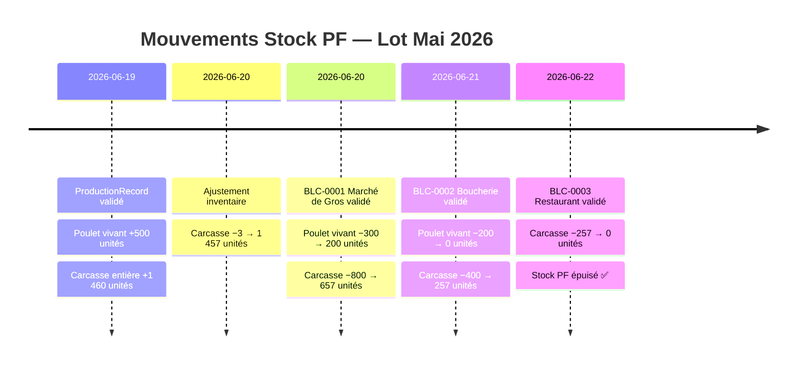

### 10.4 Tableau de bord des créances clients

| Client                | Facture       | Montant TTC   | Réglé         | Reste       | Statut       |
| --------------------- | ------------- | ------------- | ------------- | ----------- | ------------ |
| Marché de Gros        | FAC-2026-0001 | 744 000       | 744 000       | 0           | ✅ Payée     |
| Boucherie Amrane      | FAC-2026-0002 | 396 000       | 200 000       | **196 000** | ⚠️ Partielle |
| Restaurant Palmier    | FAC-2026-0003 | 200 460       | 200 460       | 0           | ✅ Payée     |
| Marché de Gros (œufs) | FAC-2026-0004 | 164 850       | 164 850       | 0           | ✅ Payée     |
| **TOTAL**             |               | **1 505 310** | **1 309 310** | **196 000** |              |

---

## 11. Règles métier activées

### 11.1 Tableau des Business Rules par phase

| BR               | Module   | Description                                             | Point d'application                                  |
| ---------------- | -------- | ------------------------------------------------------- | ---------------------------------------------------- |
| **BR-BLF-01**    | Achats   | Impact stock uniquement à la validation du BL           | Signal `post_save` BLFournisseurLigne                |
| **BR-BLF-02**    | Achats   | BL Facturé verrouillé — impossible à modifier           | `BLFournisseurForm.clean()` + `est_verrouille`       |
| **BR-BLF-03**    | Achats   | BL En litige exclu de la sélection facture              | Queryset `FactureFournisseurForm`                    |
| **BR-BLF-05**    | Achats   | Autorisation d'accès expirée bloquée (Reçu)             | Form + signal (`date_expiration_autorisation`)       |
| **BR-FAF-01**    | Achats   | Montant facture = auto-somme lignes BL                  | Signal calcul post-save                              |
| **BR-FAF-02**    | Achats   | Seuls les BL Reçu du même fournisseur                   | `FactureFournisseurForm.clean()`                     |
| **BR-FAF-04**    | Achats   | Statut Payé non sélectionnable                          | `STATUT_USER_CHOICES` sans Payé                      |
| **BR-REG-03**    | Achats   | Allocation FIFO automatique                             | Signal `post_save` ReglementFournisseur              |
| **BR-REG-06**    | Achats   | Règlements immuables                                    | Pas de formulaire d'édition                          |
| **BR-LOT-01**    | Élevage  | Lot s'ouvre dans une Poussinière uniquement             | `LotElevageForm.clean()` + `batiment.type_batiment`  |
| **BR-LOT-02**    | Élevage  | Lot nécessite nb poussins + BL                          | `LotElevageForm.clean()`                             |
| **BR-LOT-03**    | Élevage  | Mortalité/Consommation sur lot ouvert seulement         | `MortaliteForm.clean()` + `ConsommationForm.clean()` |
| **BR-LOT-04**    | Élevage  | Fermeture lot requiert ≥ 1 production validée           | Validé dans la vue avant `LotFermetureForm`          |
| **BR-LOT-05**    | Élevage  | Production bloquée si lot < age_maturite_jours          | `ProductionRecord` validate + vue                    |
| **BR-MOR-01**    | Élevage  | Mortalité décrémente le stock intrant poussin           | Signal `mortalite_post_save` → StockIntrant          |
| **BR-INT-03**    | Stock    | Consommation ≤ stock disponible                         | `ConsommationForm.clean()`                           |
| **BR-INT-04**    | Intrants | Stade intrant filtré selon type_batiment du lot         | `ConsommationForm` queryset                          |
| **BR-INT-05**    | Intrants | Unité mesure immuable si mouvements existent            | `IntrantForm.clean_unite_mesure()`                   |
| **BR-TRF-01**    | Élevage  | Transfert interdit sur lot fermé / hors branche         | `TransfertLot.clean()` (BR-BRA-01)                   |
| **BR-TRF-02**    | Élevage  | MODE_FULL : lot.batiment mis à jour, baseline inchangée | Signal `transfert_lot_post_save`                     |
| **BR-TRF-03**    | Élevage  | TransfertLot immuable (pas d'édition/suppression)       | Pas de vue d'édition                                 |
| **BR-PES-01**    | Élevage  | Qualité dérivée de poids_moyen_g (CategorieQualite)     | `PeseeEchantillon.qualite` (property)                |
| **BR-DEP-01/03** | Dépenses | facture_liee = Service uniquement                       | `DepenseForm.clean()`                                |
| **BR-DEP-04**    | Dépenses | Attribution lot optionnelle                             | Champ `lot` optionnel                                |
| **BR-BLC-01**    | Ventes   | Stock PF décrémenté à la validation BL                  | Signal `post_save` BLClientLigne                     |
| **BR-BLC-02**    | Ventes   | Quantité ≤ stock disponible                             | Vérification vue avant validation                    |
| **BR-BLC-03**    | Ventes   | BL Facturé verrouillé                                   | `BLClientForm.est_verrouille`                        |
| **BR-FAC-01**    | Ventes   | Montant facture = auto-somme BL inclus                  | Signal calcul                                        |
| **BR-FAC-02**    | Ventes   | Seuls les BL Livré du même client                       | `FactureClientForm` queryset                         |
| **BR-FAC-03**    | Ventes   | Allocation manuelle des paiements client                | `PaiementClientAllocation` vue                       |

### 11.2 Transitions de statut

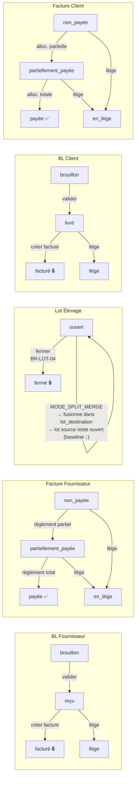

### 11.3 Rôles utilisateurs par phase

| Phase           | Action clé                         | Rôle requis                                                            |
| --------------- | ---------------------------------- | ---------------------------------------------------------------------- |
| 0bis — Branches | Créer branches + affecter chefs    | `admin` uniquement (BR-BRA-06)                                         |
| 1 — Achats      | Créer BL + valider                 | `operateur` ou `chef_branche` ou `manager` (branche active, BR-BRA-02) |
| 1 — Achats      | Créer facture + règlement          | `comptable` ou `manager`                                               |
| 1 — Achats      | Ajouter pièce jointe (v1.5)        | tout rôle avec accès au document                                       |
| 2 — Lot         | Ouvrir lot                         | `operateur` ou `chef_branche` ou `manager`                             |
| 3 — Suivi       | Mortalités + consommations         | `operateur` ou `chef_branche` ou `manager`                             |
| 3 — Suivi       | Production Aliment                 | `operateur` ou `chef_branche` ou `manager`                             |
| 3 — Suivi       | Retrait d'Œufs                     | `operateur` ou `chef_branche` ou `manager`                             |
| 4 — Production  | Saisir + valider abattage          | `operateur` ou `manager`                                               |
| 4 — Production  | Fermer lot                         | `manager`                                                              |
| 5 — Ajustement  | Créer ajustement stock             | `manager`                                                              |
| 6 — Vente       | BL Client + valider                | `manager` ou `gerant`                                                  |
| 6 — Vente       | Facture + allocation paiement      | `comptable` ou `manager`                                               |
| 6 — Vente       | Abonnement + livraison partielle   | `manager` ou `gerant` (branche active)                                 |
| 7 — Dépenses    | Créer dépenses                     | `manager` ou `comptable`                                               |
| 7 — RH & Paie   | Pointages / Congés / Acomptes      | `manager` ou `chef_branche`                                            |
| 7 — RH & Paie   | Générer / valider / payer bulletin | `comptable` ou `manager`                                               |

---

## Annexe A — Récapitulatif des entités créées

> **Point de départ** : `seed_db --mode minimal` → master data catégories présentes,
> zéro opérationnel, zéro instance physique.
> **Phase 0 / 0bis** : branches, fournisseurs / clients / bâtiments / intrants
> saisis manuellement. Références réellement générées au format
> `<préfixe>-<code_branche>-<AAAA>-<NNNN>` (BR-BRA-05) ; ex. `BLF-EST-2026-0001`.

| Phase | Entité                         | Référence / Identifiant                                                                      | Statut final              |
| ----- | ------------------------------ | -------------------------------------------------------------------------------------------- | ------------------------- |
| 0bis  | Branche                        | EST (Bâtiment A/Dépôt) / OUEST (Bât. B & C)                                                  | Actives ✅                |
| 0bis  | Utilisateurs branche           | chef_est, chef_ouest, operateur1(EST), operateur2(OUEST)                                     | —                         |
| 1     | BL Fournisseur                 | BLF-EST-2026-0001 (Poussins CCA)                                                             | Facturé 🔒                |
| 1     | BL Fournisseur                 | BLF-EST-2026-0002 (Aliments ONAB lot 1)                                                      | Facturé 🔒                |
| 1     | BL Fournisseur                 | BLF-EST-2026-0003 (Aliments ONAB finition)                                                   | Facturé 🔒                |
| 1     | BL Fournisseur                 | BLF-EST-2026-0004 (Médicaments Sanofi)                                                       | Facturé 🔒                |
| 1     | BL Fournisseur                 | BLF-EST-2026-0005 (Ingrédients bruts, §5.3bis)                                               | Facturé 🔒                |
| 1     | Facture Fournisseur            | FRN-EST-2026-0001 (CCA 64 000 DZD)                                                           | Payée ✅                  |
| 1     | Facture Fournisseur            | FRN-EST-2026-0002 (ONAB 721 000 DZD)                                                         | Payée ✅                  |
| 1     | Facture Fournisseur            | FRN-EST-2026-0003 (ONAB 307 500 DZD)                                                         | Non payée ⏳              |
| 1     | Facture Fournisseur            | FRN-EST-2026-0004 (Sanofi 51 700 DZD)                                                        | Payée ✅                  |
| 1     | Facture Fournisseur            | FRN-EST-2026-0005 (ONAB ingrédients 42 000)                                                  | Payée ✅                  |
| 1     | Règlement Fournisseur          | REG-EST-2026-0001…0005                                                                       | Immuables                 |
| 1     | Pièce Jointe (v1.5)            | PJ-1/2/3 (facture, chèque, virement)                                                         | —                         |
| 2     | Lot d'élevage                  | Lot Mai 2026 — Bâtiment A (branche EST)                                                      | Fermé 🔒                  |
| 3     | Mortalités                     | 5 événements, 40 oiseaux                                                                     | —                         |
| 3     | Consommations                  | 11 saisies aliment + 7 médicament                                                            | —                         |
| 3     | Formule Aliment                | Formule Croissance Maison (§5.3bis)                                                          | Active                    |
| 3     | Production Aliment             | PROD-ALIM-1 (+300 kg, formule) / PROD-ALIM-2 (+100 kg, direct)                               | Créditées ✅              |
| 3     | Collecte Fertilisant           | 4 collectes, 840 kg brut (Bâtiment A)                                                        | Assignées au traitement   |
| 3     | Traitement Fertilisant         | Traitement 2026-06-24 (720 kg)                                                               | Validé ✅                 |
| 2bis  | Lot d'élevage                  | Lot Pondeuses 2026 (branche OUEST)                                                           | Ouvert (Bâtiment B)       |
| 3bis  | Mortalités (élevage)           | 6 événements, 105 oiseaux (≈3,5 %)                                                           | —                         |
| 3bis  | Consommations (élevage)        | 11 aliment + 7 médicament                                                                    | —                         |
| 3bis  | Pesées Échantillon             | 4 pesées (J0/J42/J84/J126)                                                                   | —                         |
| 3bis  | Transfert Lot                  | Poussinière C → Poulailler B (J+126)                                                         | Immuable                  |
| 3bis  | Consommations (ponte)          | 4 saisies Aliment Ponte (post-transfert)                                                     | —                         |
| 3bis  | Récoltes d'Œufs                | 8 récoltes, 14 130 œufs (≈471 plateaux)                                                      | —                         |
| 3bis  | Retraits d'Œufs (v1.4+)        | RETRAIT-OEUFS-1 (don, 1 plateau), RETRAIT-OEUFS-2 (vente camion, 2 plateaux → BLC-2026-0005) | —                         |
| 4     | ProductionRecord               | Production 2026-06-19                                                                        | Validé ✅                 |
| 5     | Ajustement stock               | ADJ-2026-0001 (−3 carcasses)                                                                 | —                         |
| 6     | BL Client                      | BLC-2026-0001/0002/0003                                                                      | Facturés 🔒               |
| 6     | Facture Client                 | FAC-2026-0001/0002/0003                                                                      | Payée / Partielle / Payée |
| 6     | Paiement Client                | PAY-0001/0002/0003                                                                           | Immuables                 |
| 6     | Acompte Client                 | ACOMPTE-CLI-1 (Restaurant Le Palmier, 50 000)                                                | Utilisé ✅ (§8.5)         |
| 6     | Abonnement Client + Livraisons | ABON-1 (Fertilisant, Marché de Gros) + LIVR-1/LIVR-2                                         | Quota atteint ✅ (§8.6)   |
| 6bis  | BL Client (œufs)               | BLC-2026-0004 (Marché de Gros, §8.4), BLC-2026-0005 (Épicerie, §5.6.8)                       | Facturés 🔒               |
| 6bis  | Facture Client (œufs)          | FAC-2026-0004 (163 800 DZD)                                                                  | Payée ✅                  |
| 6bis  | Paiement Client (œufs)         | PAY-0004                                                                                     | Immuable                  |
| 7     | Dépenses                       | DEP-002/003/004                                                                              | —                         |
| 7     | Employé / Pointage             | EMP-001/002/003 (Bâtiment A) — juin 2026                                                     | —                         |
| 7     | Congé / Acompte Employé        | ACOMPTE-EMP-1 (3 000 DZD, EMP-001)                                                           | Déduit du bulletin        |
| 7     | Bulletin de Paie               | BulletinPaie ×3 — juin 2026 (48 540 → net 45 540)                                            | Payé ✅                   |

---

_Fin du document — ÉlevageERP Scénario Complet Lot Mai 2026 — Ross 308 — 2 000 oiseaux_

---

## Annexe B — Domaines v1.3 non exercés dans ce scénario broiler

Les fonctionnalités suivantes existent dans le système (spec v1.3) mais ne sont
pas activées par ce cycle de 40 jours sur un lot Ross 308 standard :

| Domaine / Feature                          | Pourquoi absent ici                                                                                                                         |
| ------------------------------------------ | ------------------------------------------------------------------------------------------------------------------------------------------- |
| **AbonnementClient / LivraisonPartielle**  | Ventes one-shot via BL Client ; pas d'abonnement récurrent                                                                                  |
| **Autorisation d'Accès (BLF)**             | ONAB peut émettre ce type ; cycle utilise bl_classique pour simplifier                                                                      |
| **Associés / RetraitAssocie**              | Aucun retrait enregistré dans ce cycle                                                                                                      |
| **RH (Employe / Pointage / BulletinPaie)** | DEP-001 couvre le salaire en dépense occasionnelle                                                                                          |
| **PrixMarche / Fiche Dettes Client**       | Non utilisé dans ce cycle ; outil analytique                                                                                                |
| **CompanyInfo (TVA multi-taux)**           | Factures exonérées TVA → taux_tva = 0 % uniforme                                                                                            |
| **TransfertLot MODE_SPLIT_NEW/MERGE**      | Seul MODE_FULL est exercé (§5.6.6) ; la scission d'une bande broiler pour raison de densité reste un scénario possible mais non couvert ici |
| **PeseeEchantillon type_pesee=oeufs**      | Seules les pesées d'oiseaux (croissance, §5.6.3) sont exercées ; la pesée d'œufs (qualité RecolteOeufs) ne l'est pas                        |

> ℹ️ **TransfertLot** (MODE_FULL) et **PeseeEchantillon** (type_pesee=oiseaux)
> ne figurent plus dans ce tableau comme "non exercés" : ils sont désormais
> exercés au §5.6, sur le lot Pondeuses 2026 (Poussinière → Poulailler au
> point de ponte, 18 semaines), un cheminement biologiquement réaliste
> qu'un lot broiler Ross 308 — abattu à 40 j, bien avant l'âge de ponte —
> ne traverse jamais.
>
> ⚠️ **Piège documenté (§5.6.6/§0.4, INT-11)** : `LotElevage.stade_intrant_attendu`
> ne mappe jamais un Poulailler vers `Intrant.STADE_PONTE`, seulement vers
> `STADE_CROISSANCE` (avec `STADE_TOUS` toujours inclus). Un aliment de
> ponte créé avec `stade=ponte` serait donc invisible dans `ConsommationForm`
> pour un lot en Poulailler — l'Aliment Ponte de ce scénario est donc créé
> avec `stade=croissance`, pas `stade=ponte`, malgré le nom du choix.
>
> ℹ️ **RecolteOeufs** et **CollecteFertilisant / TraitementFertilisant** ne
> figurent plus dans ce tableau : ils sont désormais exercés respectivement
> aux §5.6.7 (lot Pondeuses, après transfert vers le Poulailler) et §5.5
> (au niveau du Bâtiment A, indépendamment du lot).
