# PoultryERP — Complete Scenario: Ross 308 Broiler Batch

## Full Cycle: Input Purchases → Batch Opening → Rearing → Slaughter → Sale → Expenses

> **Document**: Functional execution specification (updated **v1.5**)
> **Target batch**: `May 2026 Batch — Building A` (branch **EST**) — 2,000 Ross 308 chicks
> **Cycle duration**: 40 days (May 10 → June 19, 2026)
> **Starting point**: `python manage.py seed_db --mode minimal` — zero operational data
>
> 🆕 **Changelog vs v1.3**: this document now exercises the domains added/extended
> by the code since v1.3:
>
> - **v1.4 — Multi-Branch Architecture** (`Branch`, BR-BRA-01..09): the cycle
>   runs across **two branches** (`EST` / broiler + layers-pullet-rearing,
>   `OUEST` / laying house), with buildings, stock, document numbering
>   (`<prefix>-<branch_code>-<YYYY>-<NNNN>`) and expenses split by branch.
> - **v1.5 — Generic Attachments** (`Attachment`): supporting documents (scanned
>   invoices, receipts, transfer confirmations) attached to Delivery Notes/Invoices/Payments/Expenses.
> - **In-house Feed Production** (`FeedFormula` / `FeedProduction`): part
>   of the Starter Feed is now **manufactured in-house** rather than purchased.
> - **Egg Withdrawal** (`EggWithdrawal`): egg outflows outside of a formal
>   delivery note (direct truck sale, donation, breakage).
> - **HR & Payroll** (`Employee` / `TimeSheet` / `EmployeeLeave` /
>   `EmployeeAdvance` / `Payslip`): the Salaries line item is now generated by a real
>   payroll cycle instead of a single lump-sum expense.
> - **Customer Deposit** and **CustomerSubscription** (already present in v1.3 but never
>   exercised): now activated in §8.5 and §8.6 respectively.

---

## Table of Contents

1. [Cycle Overview](#1-cycle-overview)
2. [What the Minimal Seed Provides](#2-what-the-minimal-seed-provides)
3. [Phase 0 — Initial Configuration (suppliers, customers, buildings, inputs)](#phase-0--initial-configuration-manual-entry)
4. [Phase 0bis — Multi-Branch Configuration (v1.4)](#phase-0bis--multi-branch-configuration-v14)
5. [Phase 1 — Input Purchases (Delivery Note + Invoice + Payment + Attachments)](#3-phase-1--input-purchases)
6. [Phase 2 — Opening the Rearing Batch (+ Layer Batch, Pullet House Building C)](#4-phase-2--opening-the-rearing-batch)
7. [Phase 3 — Daily Tracking (Mortalities + Consumption + Feed Production + Fertilizer + Layer Rearing/Transfer/Laying/Egg Withdrawal)](#5-phase-3--daily-tracking)
8. [Phase 4 — Slaughter & Production](#6-phase-4--slaughter--production)
9. [Phase 5 — Stock Adjustment](#7-phase-5--stock-adjustment)
10. [Phase 6 — Customer Sale & Delivery (+ Deposit, Fertilizer Subscription)](#8-phase-6--customer-sale--delivery)
11. [Phase 7 — Operating Expenses & HR/Payroll](#9-phase-7--operating-expenses)
12. [Batch Income Statement](#10-batch-income-statement)
13. [Activated Business Rules](#11-activated-business-rules)

---

## 1. Cycle Overview

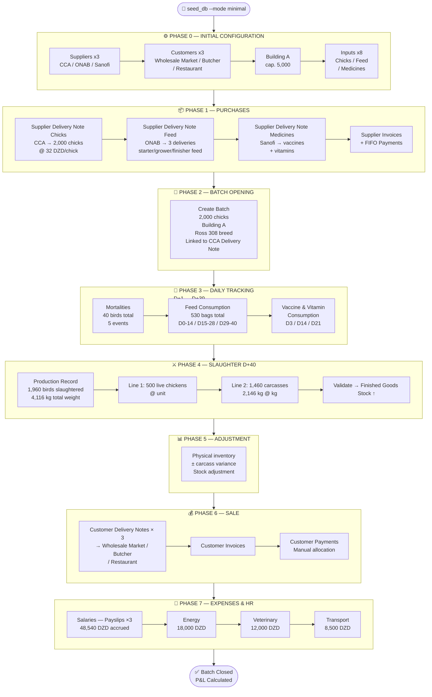

---

## 2. What the Minimal Seed Provides

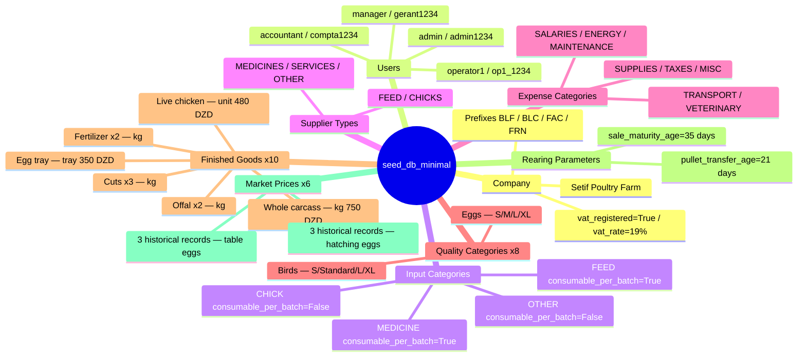

> ⚠️ **Everything else is at zero.** No suppliers, no customers, no buildings,
> no inputs, no delivery notes, no batches, no invoices, no stock movements.
> **Phase 0** below covers the manual entry of all physical instances
> required for the complete cycle.
>
> 📌 **VAT**: CompanyInfo.vat_rate = 19% (seed value). Poultry customer
> invoices are VAT-exempt → the vat_rate field is overridden to **0%** when
> each invoice is created (Phase 6).

---

## Phase 0 — Initial Configuration (manual entry)

> **Prerequisite**: `python manage.py seed_db --mode minimal` executed.
> Logged in as `admin / admin1234`.

### 0.1 Create the Suppliers

```
Module: PURCHASES → Suppliers → [New supplier]
Model: Supplier

━━━━━━━━━━━━━━━━━━━━━━━━━━━━━━━━━━━━━━━━━━━━━━━━━━━
SUPP-1 — Couvoirs du Centre (CCA)  ← required for the batch
  name             : Couvoirs du Centre — CCA
  main_type        : CHICKS
  address          : Agro-industrial Zone, Blida
  province         : Blida
  phone            : 025 55 66 77
  tax_id           : 009000000002
  trade_reg        : 09/00-0000002 B 02

SUPP-2 — ONAB Setifien  ← required for feed
  name             : ONAB Setifien
  main_type        : FEED
  address          : Route de Boghni, Setif
  province         : Setif
  phone            : 026 12 34 56
  tax_id           : 099000000001
  trade_reg        : 16/00-0000001 B 01

SUPP-3 — Sanofi Algérie  ← required for medicines
  name             : Sanofi Algérie (Veterinary)
  main_type        : MEDICINES
  address          : Rue Hassiba Ben Bouali, Algiers
  province         : Algiers
  phone            : 021 99 00 11
  tax_id           : 016000000003
  trade_reg        : 16/00-0000003 B 03

SUPP-4 — Proxi-Aliments (optional — secondary feed)
  name             : Proxi-Aliments Boumerdès
  main_type        : FEED
  address          : Industrial Zone, Boumerdès
  province         : Boumerdès
  phone            : 024 81 22 33

SUPP-5 — Techno-Avicole (optional — services)
  name             : Techno-Avicole Services
  main_type        : SERVICES
  address          : Rue des Frères Bouadou, Birtouta, Algiers
  province         : Algiers
  phone            : 021 30 40 50
```

### 0.2 Create the Customers

```
Module: SALES → Customers → [New customer]
Model: Customer

━━━━━━━━━━━━━━━━━━━━━━━━━━━━━━━━━━━━━━━━━━━━━━━━━━━
CUST-1 — Setif Wholesale Market  ← required (BLC-0001)
  name              : Setif Wholesale Market
  customer_type     : wholesaler
  province          : Setif
  phone             : 0555 11 22 33
  credit_limit      : 500,000.00

CUST-2 — Amrane & Sons Butcher  ← required (BLC-0002)
  name              : Amrane & Sons Butcher
  customer_type     : retailer
  province          : Setif
  phone             : 0660 33 44 55
  credit_limit      : 200,000.00

CUST-3 — Le Palmier Restaurant  ← required (BLC-0003)
  name              : Le Palmier Restaurant
  customer_type     : restaurant
  province          : Setif
  phone             : 0770 22 33 44
  credit_limit      : 150,000.00

CUST-4 — Azazga Central Grocery  (optional)
  name              : Azazga Central Grocery
  customer_type     : retailer
  province          : Setif
  phone             : 0555 44 55 66
  credit_limit      : 80,000.00

CUST-5 — Algiers South Wholesaler  (optional)
  name              : Algiers South Wholesaler
  customer_type     : wholesaler
  province          : Algiers
  phone             : 021 88 77 66
  credit_limit      : 1,000,000.00
```

### 0.0 Configure Rearing Parameters

```
Module: SETTINGS → Rearing Parameters → [Edit]
Model: RearingParameters (singleton — a single row in the database)

✅ seed_db_minimal already creates this singleton with the following values:
   pullet_transfer_age_days   : 126  ← seeded (realistic "point of lay" threshold, 18 wks.)
   sale_maturity_age_days     : 35   ← seeded

Impact on this cycle:

  sale_maturity_age_days = 35 ← the broiler batch lasts 40 days > 35 →
                                 ProductionRecord can be validated ✅ No
                                 adjustment needed.

  pullet_transfer_age_days = 126 ← real biological threshold for a
                                    laying pullet (transfer from
                                    Pullet House → Laying House at
                                    point of lay, ~18 weeks).
                                    This threshold is FARM-WIDE (singleton):

    • Ross 308 broiler batch (Building A, 40 days): 40 d < 126 d → the
      "must_be_transferred" alert NEVER fires. Consistent with
      biology: a broiler is slaughtered well before laying age, so
      there is no BatchTransfer on this batch (see Appendix B).

    • ISA Brown Layer batch (Building C → Building B, §5.6): the alert
      fires exactly at D+126, the day the BatchTransfer is
      recorded in this scenario — a genuine exercise of must_be_transferred
      AND of BatchTransfer, unlike the previous version of the
      document where the layers were purchased already at pre-lay stage.
```

---

### 0.3 Create the Buildings

```
Module: STOCK → Buildings → [New building]
Model: Building

━━━━━━━━━━━━━━━━━━━━━━━━━━━━━━━━━━━━━━━━━━━━━━━━━━━
BLD-1 — Building A  ← required for the batch
  name              : Building A
  building_type     : pullet_house   ← REQUIRED — the batch must open
                                        in a Pullet House (BR-LOT-01)
  capacity          : 5,000
  branch            : EST            ← BR-BRA-01 (see Phase 0bis, §2bis)
  description       : Main house — mechanical ventilation

BLD-2 — Building B  ← required for the layer batch (laying destination, §5.6)
  name              : Building B
  building_type     : laying_house
  capacity          : 4,000
  branch            : OUEST          ← BR-BRA-01 — the laying phase takes
                                        place on the OUEST branch (see Phase 0bis)
  description       : Secondary house — natural ventilation

BLD-3 — Building C  ← required for the layer batch (initial rearing, §4.3 / §5.6)
  name              : Building C
  building_type     : pullet_house   ← REQUIRED — laying pullets also must
                                        start in a Pullet House
                                        (BR-LOT-01), separate from Building A to
                                        avoid mixing the two cohorts (broiler /
                                        layers) in the same physical space.
  capacity          : 3,500
  branch            : OUEST          ← same branch as Building B: the
                                        BatchTransfer (§5.6.6) stays internal to
                                        OUEST (BR-BRA-01: a transfer never
                                        crosses two branches)
  description       : Pullet house dedicated to layer hens — separate from Building A

BLD-4 — Feed Warehouse  (optional)
  name                 : Feed Warehouse
  building_type        : warehouse
  storage_category     : (leave blank or choose per usage)
  branch               : EST
  description           : Storage facility for feed and inputs
```

> ⚠️ **BLD-1 (Building A) must be created after Phase 0bis** below, since
> the `branch` field is a mandatory FK (BR-BRA-01) and the `EST` / `OUEST`
> branches must exist beforehand. Actual entry order: Phase 0bis
> (branches + users) → then 0.3 (buildings, with `branch`
> already selectable) → then 0.4 (inputs, global catalog, unaffected).

### 0.4 Create the Inputs

```
Module: STOCK → Inputs → [New input]
Model: Input

━━━━━━━━━━━━━━━━━━━━━━━━━━━━━━━━━━━━━━━━━━━━━━━━━━━
INP-1 — Ross 308 Chick  ← required (BLF-0001, batch opening)
  designation    : Ross 308 chick (day-old)
  category       : CHICK
  stage          : all             ← not consumable_per_batch; stage N/A
  unit           : unit
  alert_threshold: 100
  suppliers      : Couvoirs du Centre — CCA

INP-2 — Starter Feed  ← required (BLF-0002, consumption D0→D14)
  designation    : Starter feed — Phase 1 (0–14 days)
  category       : FEED
  stage          : starter          ← visible only for batches in Pullet House
  unit           : bag
  alert_threshold: 10
  suppliers      : ONAB Setifien

INP-3 — Grower Feed  ← required (BLF-0002, consumption D15→D28)
  designation    : Grower feed — Phase 2 (15–28 days)
  category       : FEED
  stage          : all       ← CRITICAL: the batch stays in the Pullet House for 40 d
                               (< 21-day transfer threshold, which is only an alert, not an
                               obligation). The ConsumptionForm filter only includes
                               stage=starter and stage=all for batches in the Pullet House.
                               If stage=grower, this input would be INVISIBLE in the
                               form → set to "all".
  unit           : bag
  alert_threshold: 15
  suppliers      : ONAB Setifien

INP-4 — Finisher Feed  ← required (BLF-0003, consumption D29→D40)
  designation    : Finisher feed — Phase 3 (29 days onward)
  category       : FEED
  stage          : all       ← same reason as INP-3 — batch always in Pullet House
  unit           : bag
  alert_threshold: 20
  suppliers      : ONAB Setifien

INP-5 — Newcastle Vaccine  ← required (BLF-0004, vaccination D14)
  designation    : Newcastle vaccine (Hitchner B1)
  category       : MEDICINE
  stage          : all
  unit           : dose
  alert_threshold: 500
  suppliers      : Sanofi Algérie (Veterinary)

INP-6 — Gumboro Vaccine  ← required (BLF-0004, vaccination D22)
  designation    : Gumboro vaccine (intermediate IBD)
  category       : MEDICINE
  stage          : all
  unit           : dose
  alert_threshold: 500
  suppliers      : Sanofi Algérie (Veterinary)

INP-7 — Amoxicillin 50%  ← required (BLF-0004, treatment D8+D22)
  designation    : Amoxicillin 50% powder
  category       : MEDICINE
  stage          : all
  unit           : g
  alert_threshold: 200
  suppliers      : Sanofi Algérie (Veterinary)

INP-8 — Vitamins + Electrolytes  ← required (BLF-0004, support D3/D8/D22)
  designation    : Vitamins + electrolytes (compound)
  category       : MEDICINE
  stage          : all
  unit           : liter
  alert_threshold: 5
  suppliers      : Sanofi Algérie (Veterinary)

INP-9 — ISA Brown Pullet  ← required (opening Layer Batch, §4.3)
  designation    : ISA Brown layer chick (day-old)
  category       : CHICK
  stage          : all
  unit           : unit
  alert_threshold: 100
  suppliers      : Couvoirs du Centre — CCA

INP-10 — Pre-Lay Feed  ← required (§5.6, consumption weeks 15–18)
  designation    : Pre-lay feed (15–18 weeks)
  category       : FEED
  stage          : starter    ← the pullet is still in the Pullet House at this
                                 age (transfer at point of lay at D+126)
  unit           : bag
  alert_threshold: 10
  suppliers      : ONAB Setifien

INP-11 — Layer Feed  ← required (§5.6, post-transfer consumption)
  designation    : Layer feed (high calcium)
  category       : FEED
  stage          : grower    ← ⚠️ CRITICAL: NOT stage=laying. The
                                 LotElevage.stade_intrant_attendu method
                                 never maps to STAGE_LAYING (Laying House →
                                 STAGE_GROWER only) — an input
                                 with stage=laying would be INVISIBLE in
                                 ConsumptionForm once the batch is transferred
                                 to the laying house. See Appendix B.
  unit           : bag
  alert_threshold: 15
  suppliers      : ONAB Setifien

INP-12 — Cobb 500 Chick  (optional — future batches)
  designation    : Cobb 500 chick (day-old)
  category       : CHICK
  stage          : all
  unit           : unit
  alert_threshold: 100
  suppliers      : Couvoirs du Centre — CCA

INP-13 — Litter/Bedding  (optional)
  designation    : Bedding (wood shavings)
  category       : OTHER
  stage          : all
  unit           : bag
  alert_threshold: 20
  suppliers      : (leave blank)

INP-14 — Cracked Corn  ← required (§5.3bis, FeedFormula ingredient)
  designation    : Cracked corn
  category       : FEED
  stage          : all
  unit           : kg
  alert_threshold: 100
  suppliers      : ONAB Setifien

INP-15 — Soybean Meal  ← required (§5.3bis, FeedFormula ingredient)
  designation    : Soybean meal
  category       : FEED
  stage          : all
  unit           : kg
  alert_threshold: 100
  suppliers      : ONAB Setifien

INP-16 — Grower Feed (In-House Production)  ← required (§5.3bis)
  designation    : Grower feed — in-house production
  category       : FEED
  stage          : all
  unit           : kg      ← NOTE: FeedProduction.quantity_produced_kg is
                              always expressed in kg, regardless of the unit
                              of the produced input; choosing kg here avoids any
                              ambiguity with feed purchased by the bag (INP-2/3/4).
  alert_threshold: 50
  suppliers      : (leave blank — never purchased via delivery note, only produced)
```

> ✅ **Phase 0 complete.** All physical instances needed for the cycle are
> created. Stock = 0 everywhere. Proceed to Phase 0bis — Multi-Branch Configuration.

---

## Phase 0bis — Multi-Branch Configuration (v1.4)

> **Prerequisite**: Phase 0 (§0.1/0.2/0.4) already entered. To be executed **before** §0.3
> (Buildings), since `Building.branch` is a mandatory FK (BR-BRA-01).
> Still logged in as `admin / admin1234` — only the admin can create/edit a
> `Branch` (BR-BRA-06).

### 0bis.1 What stays global vs what becomes split by branch

```
GLOBAL (company-wide, BR-BRA-06) — unchanged by the multi-branch feature:
  Supplier, Customer, InputCategory, QualityCategory, FinishedGood,
  CompanyInfo, RearingParameters, MarketPrice, Partner / PartnerWithdrawal
  (BR-BRA-08 — partner withdrawals remain at the company level).

SPLIT BY BRANCH (BR-BRA-01/07) — an explicit or derived `branch` FK:
  Building (explicit) → RearingBatch, Employee (derived from the building)
  SupplierDeliveryNote / SupplierInvoice / SupplierPayment (explicit)
  CustomerDeliveryNote / CustomerInvoice / CustomerPayment / CustomerDeposit (explicit)
  CustomerSubscription (explicit); PartialDelivery (derived)
  Expense (explicit)
  InputStock / FinishedGoodStock / StockMovement / StockAdjustment
    (one row per (branch, item) — BR-BRA-07, no more single global balance)
  Mortality / Consumption / SampleWeighing / EggCollection / BatchTransfer /
    ProductionRecord / FertilizerCollection / EggWithdrawal / FeedProduction
    (derived from the batch or building)
  TimeSheet / EmployeeLeave / EmployeeAdvance / Payslip (derived from the employee)
```

### 0bis.2 Create the Branches

```
Module: SETTINGS → Branches → [New branch]   (admin only — BR-BRA-06)
Model: Branch

━━━━━━━━━━━━━━━━━━━━━━━━━━━━━━━━━━━━━━━━━━━━━━━━━━━
BRA-1 — EST Branch  ← carries the Ross 308 broiler batch (Building A)
  name              : Setif-East Branch
  code              : EST            ← used in every document reference
                                        (BLF-EST-2026-0001, BR-BRA-05)
  province          : Setif
  phone             : 036 50 10 20
  branch_manager    : (left blank for now — see §0bis.3)
  active            : True

BRA-2 — OUEST Branch  ← carries the Layer Batch 2026 (Buildings B & C)
  name              : Setif-West Branch
  code              : OUEST
  province          : Setif
  phone             : 036 50 30 40
  branch_manager    : (left blank for now — see §0bis.3)
  active            : True
```

### 0bis.3 Create the branch-linked users

```
Module: SETTINGS → Users → [New user]
Model: User + UserProfile

━━━━━━━━━━━━━━━━━━━━━━━━━━━━━━━━━━━━━━━━━━━━━━━━━━━
USR-1 — chef_est / chefest1234
  role      : branch_manager   ← BR-BRA-02: branch mandatory
  branch    : EST Branch

USR-2 — chef_ouest / chefouest1234
  role      : branch_manager
  branch    : OUEST Branch

USR-3 — operator1 (already seeded) → assign branch = EST (BR-BRA-02)
USR-4 — operator2 / op2_1234 → role: operator, branch = OUEST (new)
USR-5 — accountant (already seeded) → branch left blank (BR-BRA-04: consolidated
         global view across both branches — this is the profile that produces
         the consolidated income statement in §10)
```

Then return to **BRA-1** and **BRA-2** (§0bis.2) to fill in
`branch_manager = chef_est` / `chef_ouest` respectively (BR-BRA-02: the field
only accepts a user whose `profile.role == branch_manager`).

### 0bis.4 Branch Selector and Global View

```
✅ admin and accountant (unassigned) see a branch selector
   ("Global View" / EST / OUEST) at the top of each module — BR-BRA-03/04.
✅ branch_manager and operator have NO selector: every screen is filtered
   automatically to their single branch (BR-BRA-02), with no toggle option.
⚠️ Global View is READ-ONLY for creation/editing (BR-BRA-04):
   any creation view (Supplier Delivery Note, Customer Delivery Note, Batch, Expense...) requires
   an actual branch to be active — the @require_branch_context decorator redirects to
   the selector if the user is in Global View.
```

> ✅ **Phase 0bis complete.** Both branches exist, users are
> distributed, and §0.3 (Buildings) can now assign `branch=EST` to
> Building A/Feed Warehouse and `branch=OUEST` to Buildings B and C. Phase 1
> (Purchases) runs logged in as `operator1` (EST branch active) for
> the broiler batch's delivery notes, then `operator2` (OUEST branch) for the ISA Brown
> Pullet delivery note (§4.3).

---

## 3. Phase 1 — Input Purchases

> 📌 **Reference notation (BR-BRA-05)**: `generate_reference()` now inserts
> the branch code: `<prefix>-<branch_code>-<YYYY>-<NNNN>`. All
> purchases in this Phase 1 are entered with the **EST** branch active (operator1) —
> the references actually generated are therefore `BLF-EST-2026-0001` …
> `BLF-EST-2026-0004`, `FRN-EST-2026-0001` … The document keeps the short form
> `BLF-2026-000x` in the text below for readability; only Phase 2bis
> (Layer Batch, OUEST branch) explicitly restates the `OUEST` prefix to
> emphasize the separation (BR-BRA-01).

### 3.1 Overview of Required Purchases

| Input                              | Qty per 40-day batch / 2,000 birds | Unit  | Supplier       |
| ---------------------------------- | ---------------------------------- | ----- | -------------- |
| Ross 308 Chick                     | 2,000                              | unit  | CCA Blida      |
| Starter Feed Phase 1 (0–14d)       | 200                                | bag   | ONAB Setifien  |
| Grower Feed Phase 2 (15–28d)       | 180                                | bag   | ONAB Setifien  |
| Finisher Feed Phase 3 (29–40d)     | 150                                | bag   | ONAB Setifien  |
| Newcastle Vaccine (Hitchner B1)    | 4,000                              | dose  | Sanofi Algérie |
| Gumboro Vaccine (IBD)              | 4,000                              | dose  | Sanofi Algérie |
| Amoxicillin 50% powder             | 500                                | g     | Sanofi Algérie |
| Vitamins + Electrolytes            | 10                                 | liter | Sanofi Algérie |
| Cracked Corn (§5.3bis, ingredient) | 500                                | kg    | ONAB Setifien  |
| Soybean Meal (§5.3bis, ingredient) | 300                                | kg    | ONAB Setifien  |

### 3.2 Flow of the 4 Supplier Delivery Notes

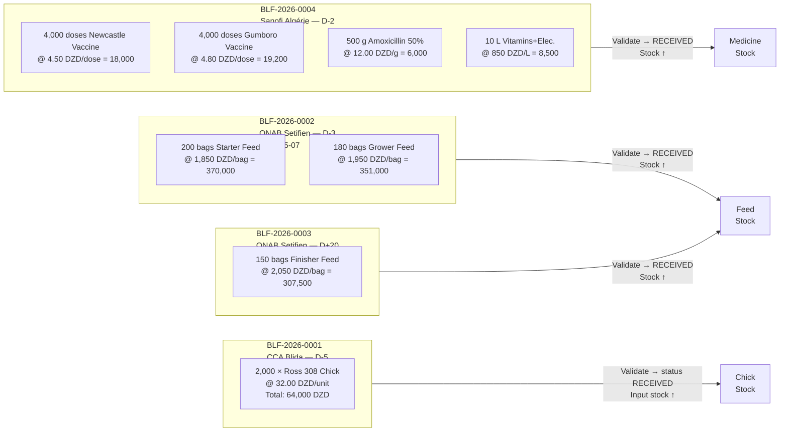

### 3.3 Supplier Delivery Note Forms (`SupplierDeliveryNoteForm`)

```
Module: PURCHASES → Supplier Delivery Note → [New]
Rule   : status can only be Draft / Received / Disputed (BR-BLF-02)
         delivery_date ≤ today (clean_date_bl)
         attachment: PDF/JPG/PNG ≤ 5 MB
         document_type: standard_note (default) or access_authorization
         → For this cycle, all delivery notes are of type standard_note

━━━━━━━━━━━━━━━━━━━━━━━━━━━━━━━━━━━━━━━━━━━━━━━━━━━
BLF-2026-0001 — CCA Chicks
  reference             : BLF-2026-0001
  supplier               : Couvoirs du Centre — CCA
  delivery_date          : 2026-05-05
  supplier_reference     : "BC-CCA-0512-2026"
  status                 : Received
  reception_notes        : "Arrival 07:30 — refrigerated truck — good condition"

  Lines (SupplierDeliveryNoteLineFormSet):
  ┌──────────────────────────────────────────────────────────────┐
  │ input             │ quantity │ unit_price    │ notes         │
  ├───────────────────┼──────────┼───────────────┼───────────────┤
  │ Ross 308 Chick    │ 2,000    │ 32.0000       │ Mixed sexing  │
  └───────────────────┴──────────┴───────────────┴───────────────┘
  → line amount: 64,000.00 DZD
  Action: [Save] → status = Received → InputStock(Ross 308 Chick) ↑ 2,000

━━━━━━━━━━━━━━━━━━━━━━━━━━━━━━━━━━━━━━━━━━━━━━━━━━━
BLF-2026-0002 — ONAB Feed (batch 1/2)
  reference              : BLF-2026-0002
  supplier                : ONAB Setifien
  delivery_date           : 2026-05-07
  supplier_reference      : "ONAB-BL-20260507-088"
  status                  : Received

  Lines:
  ┌────────────────────────────────────────────────────────────────┐
  │ input                     │ quantity │ unit_price    │ total   │
  ├───────────────────────────┼──────────┼───────────────┼─────────┤
  │ Starter Feed Phase 1      │ 200.000  │ 1,850.0000    │ 370,000 │
  │ Grower Feed Phase 2       │ 180.000  │ 1,950.0000    │ 351,000 │
  └───────────────────────────┴──────────┴───────────────┴─────────┘
  → Total note: 721,000.00 DZD
  → Starter feed stock ↑ 200 bags / Grower feed stock ↑ 180 bags

━━━━━━━━━━━━━━━━━━━━━━━━━━━━━━━━━━━━━━━━━━━━━━━━━━━
BLF-2026-0003 — ONAB Feed (finisher — D+20)
  reference    : BLF-2026-0003
  supplier     : ONAB Setifien
  delivery_date: 2026-05-30
  status       : Received

  Lines:
  ┌───────────────────────────────────────────────────────────────┐
  │ input                   │ quantity │ unit_price    │ total    │
  ├─────────────────────────┼──────────┼───────────────┼──────────┤
  │ Finisher Feed Phase 3   │ 150.000  │ 2,050.0000    │ 307,500  │
  └─────────────────────────┴──────────┴───────────────┴──────────┘
  → Total note: 307,500.00 DZD

━━━━━━━━━━━━━━━━━━━━━━━━━━━━━━━━━━━━━━━━━━━━━━━━━━━
BLF-2026-0004 — Sanofi Medicines
  reference    : BLF-2026-0004
  supplier     : Sanofi Algérie (Veterinary)
  delivery_date: 2026-05-08
  status       : Received

  Lines:
  ┌──────────────────────────────────────────────────────────────────┐
  │ input                       │ quantity │ unit_price    │ total   │
  ├─────────────────────────────┼──────────┼───────────────┼─────────┤
  │ Newcastle Vaccine (H.B1)    │ 4,000    │ 4.5000        │  18,000 │
  │ Gumboro Vaccine (IBD)       │ 4,000    │ 4.8000        │  19,200 │
  │ Amoxicillin 50% powder      │    500   │ 12.0000       │   6,000 │
  │ Vitamins + Electrolytes     │     10   │ 850.0000      │   8,500 │
  └─────────────────────────────┴──────────┴───────────────┴─────────┘
  → Total note: 51,700.00 DZD

━━━━━━━━━━━━━━━━━━━━━━━━━━━━━━━━━━━━━━━━━━━━━━━━━━━
BLF-2026-0005 — Raw ONAB Ingredients (for §5.3bis, FeedProduction)
  reference    : BLF-2026-0005
  supplier     : ONAB Setifien
  delivery_date: 2026-05-18
  status       : Received

  Lines:
  ┌──────────────────────────────────────────────────────────────────┐
  │ input                       │ quantity │ unit_price    │ total   │
  ├─────────────────────────────┼──────────┼───────────────┼─────────┤
  │ Cracked Corn                │  500.000 │ 45.0000       │ 22,500  │
  │ Soybean Meal                │  300.000 │ 65.0000       │ 19,500  │
  └─────────────────────────────┴──────────┴───────────────┴─────────┘
  → Total note: 42,000.00 DZD
```

seed_phase0.py: added the 3 missing intrants — Cracked Corn (INT-14), Soybean Meal (INT-15), both unit KG / supplier ONAB, and Grower Feed In-House Production (INT-16), unit KG, no supplier (produced, never purchased).
seed_achats_scenario.py: added BLF-2026-0005 (500 kg Cracked Corn @ 45 + 300 kg Soybean Meal @ 65 = 42,000 DZD), FRN-2026-0005, and REG-2026-0005 (full settlement, 2026-06-01) — matching §3.3/§3.4/§3.5's raw-ingredients purchase for the in-house formula.
Note: seed_elevage_lot.py still needs the actual FeedFormula/FeedProduction records (FORM-1, FEED-PROD-1/2) from §5.3bis — that part wasn't in scope of what you flagged, but let me know if you want that added too.

### 3.4 Supplier Invoices (`SupplierInvoiceForm`)

```
Rule   : BR-FAF-01 total_amount auto-calculated from delivery note lines (no manual entry)
         BR-FAF-02 only delivery notes with status "Received" from the same supplier are selectable
         BR-FAF-04 status "Paid" not selectable (driven by payments)

━━━━━━━━━━━━━━━━━━━━━━━━━━━━━━━━━━━━━━━━━━━━━━━━━━━
FRN-2026-0001 — CCA Chick Invoice
  reference       : FRN-2026-0001
  supplier        : Couvoirs du Centre — CCA
  notes           : [BLF-2026-0001] ← checkbox selection
  invoice_date    : 2026-05-06
  due_date        : 2026-06-05   ← +30 days
  invoice_type    : goods
  status          : Unpaid
  total_amount    : 64,000.00 DZD ← auto

FRN-2026-0002 — ONAB Feed Invoice (batch 1/2)
  supplier        : ONAB Setifien
  notes           : [BLF-2026-0002]
  invoice_date    : 2026-05-08
  due_date        : 2026-06-07
  total_amount    : 721,000.00 DZD ← auto

FRN-2026-0003 — ONAB Feed Invoice (finisher)
  supplier        : ONAB Setifien
  notes           : [BLF-2026-0003]
  invoice_date    : 2026-05-31
  due_date        : 2026-06-30
  total_amount    : 307,500.00 DZD ← auto

FRN-2026-0004 — Sanofi Medicine Invoice
  supplier        : Sanofi Algérie (Veterinary)
  notes           : [BLF-2026-0004]
  invoice_date    : 2026-05-09
  due_date        : 2026-06-08
  total_amount    : 51,700.00 DZD ← auto

FRN-2026-0005 — Raw Ingredients Invoice ONAB (§5.3bis)
  supplier        : ONAB Setifien
  notes           : [BLF-2026-0005]
  invoice_date    : 2026-05-19
  due_date        : 2026-06-18
  total_amount    : 42,000.00 DZD ← auto
```

> ⚠️ **BR-BLF-02**: delivery notes move to `Invoiced` status and are locked as soon as they are included in an invoice.

### 3.5 Supplier Payments (`SupplierPaymentForm`)

```
Rule   : BR-REG-03 automatic FIFO allocation on unpaid invoices
         BR-REG-06 payments immutable after creation (no edit form)

REG-2026-0001 — CCA Payment
  supplier            : Couvoirs du Centre — CCA
  payment_date        : 2026-05-10
  amount              : 64,000.00
  payment_method      : bank transfer
  payment_reference   : "VIR-BNA-10052026-001"
  → Allocated to FRN-2026-0001: 64,000.00 DZD → status = Paid ✅

REG-2026-0002 — ONAB Payment (partial)
  supplier            : ONAB Setifien
  payment_date        : 2026-05-10
  amount              : 400,000.00
  payment_method      : check
  payment_reference   : "CHQ-0455"
  → Allocated FIFO to FRN-2026-0002: 400,000.00 DZD
  → FRN-2026-0002 remaining balance: 321,000.00 DZD → Partially paid

REG-2026-0003 — Balance ONAB Feed Invoice batch 1/2
  supplier            : ONAB Setifien
  payment_date        : 2026-05-25
  amount              : 321,000.00
  payment_method      : bank transfer
  → FRN-2026-0002 fully settled ✅

REG-2026-0004 — Sanofi Payment
  supplier            : Sanofi Algérie (Veterinary)
  payment_date        : 2026-05-15
  amount              : 51,700.00
  payment_method      : bank transfer
  → FRN-2026-0004 fully settled ✅

REG-2026-0005 — Raw Ingredients Payment ONAB
  supplier            : ONAB Setifien
  payment_date        : 2026-06-01
  amount              : 42,000.00
  payment_method      : bank transfer
  → Allocated FIFO to FRN-2026-0005 → fully settled ✅
```

### 3.6 Attachments (`Attachment`, v1.5)

```
Module: any detail screen — Delivery Note/Invoice/Payment → "Attachments" block
Model: Attachment (GenericForeignKey — attaches to ANY record)

━━━━━━━━━━━━━━━━━━━━━━━━━━━━━━━━━━━━━━━━━━━━━━━━━━━
ATT-1 — on FRN-2026-0002 (ONAB Invoice batch 1/2)
  content_object  : SupplierInvoice FRN-2026-0002
  document_type   : invoice
  file            : onab_facture_088.pdf
  description     : "Scanned paper invoice — ONAB copy"

ATT-2 — on REG-2026-0002 (ONAB check payment — partial)
  content_object  : SupplierPayment REG-2026-0002
  document_type   : check
  file            : cheque_0455_recto.jpg
  description     : "Photo of check no. 0455 before bank deposit"

ATT-3 — on REG-2026-0001 (CCA bank transfer payment)
  content_object  : SupplierPayment REG-2026-0001
  document_type   : bank_transfer
  file            : confirmation_vir_bna_10052026.pdf
```

> ℹ️ The same record can receive **multiple** attachments (e.g. an
> invoice + its transfer confirmation): `content_object.attachments.all()`.
> Deletion is a generic endpoint shared by all modules
> (`/attachments/<pk>/delete/`, v1.5, §11.2 urls).

---

## 4. Phase 2 — Opening the Rearing Batch

### 4.1 Flow

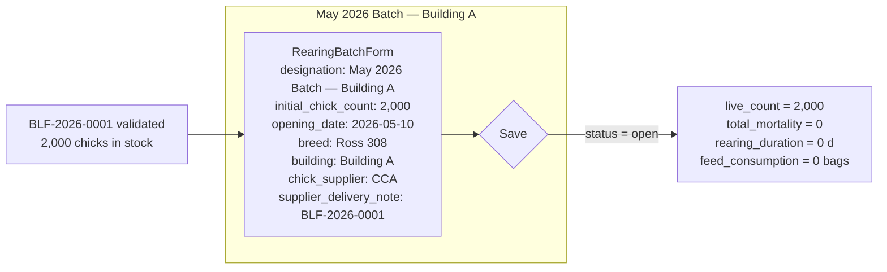

### 4.2 RearingBatch Form (`RearingBatchForm`)

```
Module: REARING → Batches → [Open a new batch]
Model: RearingBatch

  designation                : "May 2026 Batch — Building A"
  opening_date                : 2026-05-10   ← ≤ today (BR-LOT clean_date_ouverture)
  initial_chick_count         : 2,000        ← ≥ 1 (BR-LOT clean)
  chick_supplier               : Couvoirs du Centre — CCA
  supplier_delivery_note        : BLF-2026-0001  ← delivery note status RECEIVED or INVOICED
  building                      : Building A   ← MUST be type pullet_house (BR-LOT-01)
  breed                         : Ross 308
  parent_batch                  : (empty — root batch, not from a BatchTransfer)
  notes                         : "Density: 13.3 birds/m² — Usable surface 150 m²"

  → status = open
  → live_count = 2,000
  → reference_chick_count = 2,000  ← = initial + Σ outgoing_transfers (0 here)

⚠️ Chick stock: opening the batch does NOT decrement input stock.
   The Ross 308 Chick stock decreases only as mortalities are recorded
   (−1 per dead bird via the mortality_post_save signal).
```

### 4.3 Opening the Layer Batch (Building C — Pullet House)

```
Module: REARING → Batches → [Open a new batch]
Model: RearingBatch

⚠️ Second batch, INDEPENDENT of the broiler batch above — demonstrates
   the farm's multi-batch / multi-building operation, and follows a
   complete biological cycle specific to layers that a Ross 308
   broiler batch never experiences (no laying phase, slaughtered at 40 d — see
   Appendix B):

     day-old pullet → rearing in Pullet House (18 wks.) → BatchTransfer
     to Laying House at point of lay → ramp-up to lay → EggCollection

   Unlike the previous version of this scenario (hens purchased
   already at pre-lay stage directly to the Laying House), the batch here starts as
   a TRUE day-old pullet batch, exactly like the broiler batch,
   which allows BR-LOT-01 (mandatory opening in Pullet House),
   must_be_transferred and BatchTransfer to be exercised in a biologically
   consistent way.

  designation                  : "Layer Batch 2026"
  opening_date                  : 2026-05-15
  initial_chick_count           : 3,000        ← day-old ISA Brown pullets
  chick_supplier                 : Couvoirs du Centre — CCA
  supplier_delivery_note          : (empty — simplified, no dedicated delivery note in this cycle,
                                       as for the ISA Brown chick INP-9)
  building                        : Building C   ← dedicated pullet house (BLD-3, §0.3),
                                                    separate from Building A (broiler)
  breed                           : ISA Brown
  parent_batch                    : (empty — root batch)
  notes                            : "Layer batch — full cycle Pullet House → Laying House → Laying, independent of broiler cycle"

  → status = open
  → live_count = 3,000
  → phase = pullet_house (building.building_type)
```

---

## 5. Phase 3 — Daily Tracking

### 5.1 Batch Calendar (D0 = May 10, 2026)

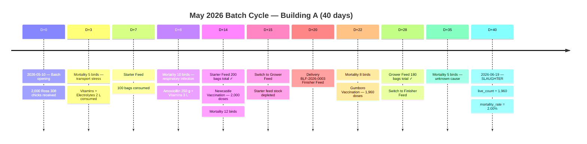

### 5.2 Mortality Events (`MortalityForm`)

```
Module: REARING → Batch → [Record mortality]
Rule   : BR-LOT-03 batch must be open
         cumulative mortality ≤ initial_chick_count (validated in clean())
         Signal mortality_post_save → InputStock(Ross 308 Chick) ↓ count
         Signal mortality_pre_delete → InputStock(Ross 308 Chick) ↑ count (reversal)

┌──────────────────────────────────────────────────────────────────────────────────────────────┐
│ Date       │ Count  │ Cause                            │ Cumul │ Live    │ Chick Stock after │
├────────────┼────────┼──────────────────────────────────┼───────┼─────────┼────────────────────┤
│ 2026-05-13 │      5 │ Transport stress / dehydration   │     5 │  1,995  │ 2,000 − 5 = 1,995  │
│ 2026-05-18 │     10 │ Early respiratory infection      │    15 │  1,985  │ 1,995 − 10 = 1,985 │
│ 2026-05-24 │     12 │ Suspected aspergillosis           │    27 │  1,973  │ 1,985 − 12 = 1,973 │
│ 2026-06-01 │      8 │ Coccidiosis — treatment started  │    35 │  1,965  │ 1,973 − 8 = 1,965  │
│ 2026-06-14 │      5 │ Undetermined cause                │    40 │  1,960  │ 1,965 − 5 = 1,960  │
└────────────┴────────┴──────────────────────────────────┴───────┴─────────┴────────────────────┘
  Final mortality rate: 40 / reference_chick_count (2,000) = 2.00%
  Final Ross 308 Chick stock: 2,000 − 40 = 1,960 units
  (= live_count at slaughter — consistency guaranteed by the signals)
```

### 5.3 Feed Consumption (`ConsumptionForm`)

```
Module: REARING → Batch → [Record consumption]
Rule   : BR-LOT-03 batch open / BR-INT-03 available stock ≥ requested quantity
         Only inputs with category consumable_per_batch=True are offered
         (FEED + MEDICINE — not CHICK or OTHER)

Starter Phase — D0 to D14 (200 bags total)
  ┌─────────────────────────────────────────────────────────────────┐
  │ date       │ input                │ quantity │ stock after      │
  ├────────────┼──────────────────────┼──────────┼───────────────────┤
  │ 2026-05-12 │ Starter Feed         │  25.000  │ 175 bags          │
  │ 2026-05-14 │ Starter Feed         │  25.000  │ 150 bags          │
  │ 2026-05-17 │ Starter Feed         │  50.000  │ 100 bags          │
  │ 2026-05-21 │ Starter Feed         │  50.000  │  50 bags          │
  │ 2026-05-24 │ Starter Feed         │  50.000  │   0 bags ✓ depleted │
  └────────────┴──────────────────────┴──────────┴───────────────────┘

Grower Phase — D15 to D28 (180 bags total)
  ┌─────────────────────────────────────────────────────────────────┐
  │ date       │ input                │ quantity │ stock after      │
  ├────────────┼──────────────────────┼──────────┼───────────────────┤
  │ 2026-05-25 │ Grower Feed          │  60.000  │ 120 bags          │
  │ 2026-06-01 │ Grower Feed          │  60.000  │  60 bags          │
  │ 2026-06-08 │ Grower Feed          │  60.000  │   0 bags ✓ depleted │
  └────────────┴──────────────────────┴──────────┴───────────────────┘

Finisher Phase — D29 to D40 (150 bags total — BLF-0003 delivery arrived D+20)
  ┌─────────────────────────────────────────────────────────────────┐
  │ date       │ input                │ quantity │ stock after      │
  ├────────────┼──────────────────────┼──────────┼───────────────────┤
  │ 2026-06-08 │ Finisher Feed        │  50.000  │ 100 bags          │
  │ 2026-06-13 │ Finisher Feed        │  50.000  │  50 bags          │
  │ 2026-06-18 │ Finisher Feed        │  50.000  │   0 bags ✓ depleted │
  └────────────┴──────────────────────┴──────────┴───────────────────┘
```

### 5.3bis In-House Feed Production (`FeedFormula` / `FeedProduction`)

```
Module: REARING → Feed Production → [New production/restocking]
Models: FeedFormula (recipe, optional) + FeedProduction (event)
Rule   : production always credits the finished-feed stock
         (InputStock, scoped to branch=EST); if a formula is provided,
         each ingredient is debited proportionally (but never
         blocking if the ingredient stock goes negative — cf. Mortality/
         Consumption, deliberately permissive behavior).

━━━━━━━━━━━━━━━━━━━━━━━━━━━━━━━━━━━━━━━━━━━━━━━━━━━
FORM-1 — In-House Grower Formula
  name              : In-House Grower Formula
  produced_input    : Grower Feed (In-House Production) [INP-16]
  active            : True

  Lines (FeedFormulaLine):
  ┌────────────────────────┬──────────────────────────┐
  │ input                  │ proportion_kg /100kg      │
  ├────────────────────────┼──────────────────────────┤
  │ Cracked Corn           │ 55.000                    │
  │ Soybean Meal           │ 35.000                    │
  └────────────────────────┴──────────────────────────┘
  (the remaining 10 kg — premix/minerals — is not tracked in stock here;
   total_proportion_kg is purely informational, not a constraint)

FEED-PROD-1 — Production with formula
  branch                 : EST
  date                   : 2026-05-20
  formula                : In-House Grower Formula
  produced_input         : Grower Feed (In-House Production)
  quantity_produced_kg   : 300.000
  unit_price             : 0  ← automatically derived from the weighted average cost of debited ingredients
  → Debits: Cracked Corn −165.000 kg (300×55/100); Soybean Meal −105.000 kg (300×35/100)
  → Credit: InputStock(Grower Feed In-House Production) +300.000 kg

FEED-PROD-2 — Direct restocking (without formula)
  branch                 : EST
  date                   : 2026-06-05
  formula                : (empty)  ← fast path, no ingredient traceability
  produced_input         : Grower Feed (In-House Production)
  quantity_produced_kg   : 100.000
  unit_price             : 210.0000 DZD/kg  ← recalculates the weighted average cost of the finished feed
  → Credit: InputStock(Grower Feed In-House Production) +100.000 kg
  → Cost   : 100 × 210 = 21,000.00 DZD (total_amount)
```

```
Additional consumption — Grower Feed (In-House Production):

  ┌──────────────────────────────────────────────────────────────────────┐
  │ date       │ input                                 │ quantity │ stock │
  ├────────────┼───────────────────────────────────────┼──────────┼───────┤
  │ 2026-06-02 │ Grower Feed (In-House Production)      │  50.000  │ 250 kg│
  └────────────┴───────────────────────────────────────┴──────────┴───────┘

  ℹ️ This additional consumption adds to — without replacing — the historical
  tracking in bags (§5.3, 180 bags of purchased Grower Feed): the two stocks
  (bag / kg) coexist on distinct Input records (INP-3 vs INP-16), illustrating
  that the same rearing stage can be covered by several inputs —
  purchased and/or self-produced — simultaneously.
```

### 5.4 Medicine Consumption

```
Preventive & Curative Phase:
  ┌──────────────────────────────────────────────────────────────────────────────┐
  │ date       │ input                    │ quantity │ reason                    │
  ├────────────┼──────────────────────────┼──────────┼───────────────────────────┤
  │ 2026-05-13 │ Vitamins + Electrolytes  │  2.000 L │ Chick arrival stress      │
  │ 2026-05-18 │ Amoxicillin 50%         │  250 g   │ Resp. infection (treatment)│
  │ 2026-05-18 │ Vitamins + Electrolytes  │  3.000 L │ Immune support            │
  │ 2026-05-24 │ Newcastle Vaccine HB1   │ 2,000 d  │ Primary vaccination       │
  │ 2026-06-01 │ Gumboro Vaccine IBD     │ 1,965 d  │ Gumboro vaccine (1,965 live)│
  │ 2026-06-01 │ Amoxicillin 50%         │  250 g   │ Coccidiosis treatment     │
  │ 2026-06-01 │ Vitamins + Electrolytes  │  5.000 L │ Post-treatment recovery   │
  └────────────┴──────────────────────────┴──────────┴───────────────────────────┘

  Remaining medicine stock after cycle:
  Newcastle Vaccine  : 4,000 - 2,000 = 2,000 doses
  Gumboro Vaccine    : 4,000 - 1,965 = 2,035 doses
  Amoxicillin        :   500 -   500 =     0 g ← depleted
  Vitamins           :    10 -    10 =     0 L ← depleted
```

### 5.5 Fertilizer — Collection & Treatment (`FertilizerCollectionForm` / `FertilizerTreatmentForm`)

```
Module: REARING → Fertilizer → [New collection] / [New treatment]
Rule   : attached to the BUILDING (Building A), not to the batch — litter is a
         by-product of the building, not of a particular cohort.
         branch automatically derived from building.branch (BR-BRA-01).

Raw collections (FertilizerCollection):
  ┌────────────────────────────────────────────────────────┐
  │ date       │ building     │ raw quantity               │
  ├────────────┼─────────────┼──────────────────────────────┤
  │ 2026-05-20 │ Building A  │ 180.000 kg                  │
  │ 2026-05-30 │ Building A  │ 220.000 kg                  │
  │ 2026-06-09 │ Building A  │ 240.000 kg                  │
  │ 2026-06-18 │ Building A  │ 200.000 kg  (final cleanup) │
  └────────────┴─────────────┴──────────────────────────────┘
  Total raw collected: 840.000 kg

Treatment (FertilizerTreatment) — single batch combining the 4 collections:
  treatment_date         : 2026-06-24
  method                 : Natural sun drying
  finished_good          : Treated (dried) poultry fertilizer [product_type=fertilizer]
  quantity_obtained_kg    : 720.000 kg   (≈ 86% of raw — moisture loss)
  estimated_unit_cost     : 9.5000 DZD/kg
  status                  : validated ✅

  → Signal fertilizer_treatment_post_save credits FinishedGoodStock
    (Treated poultry fertilizer) by +720.000 kg, only once at validation
    (mirroring ProductionRecord DRAFT → VALIDATED, §6.2-6.3).
  → The 4 FertilizerCollection records have their `treatment` field assigned to this
    batch — they can no longer be reassigned to another treatment
    as long as this one remains validated.
```

### 5.6 Layer Batch — Rearing, Transfer & Ramp-Up to Lay

```
Batch: "Layer Batch 2026" — D0 = 2026-05-15 — Building C (Pullet House) → Building B (Laying House)

This batch follows, in parallel with the broiler cycle, a real biological
layer cycle: rearing in the Pullet House until point of lay (18 weeks /
126 d), transfer to the Laying House, then a progressive ramp-up to lay.
It thus exercises BatchTransfer and SampleWeighing, absent from the
broiler cycle (see Appendix B), in addition to EggCollection.
```

#### 5.6.1 Layer Batch Calendar

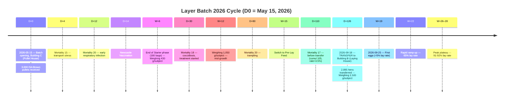

#### 5.6.2 Rearing Phase — Mortalities (`MortalityForm`)

```
Module: REARING → Layer Batch → [Record mortality]
Rule   : identical to the broiler batch (BR-LOT-03, cumul ≤ initial_chick_count)

┌──────────────────────────────────────────────────────────────────────────────────┐
│ Date       │ Count  │ Cause                             │ Cumul │ Live           │
├────────────┼────────┼───────────────────────────────────┼───────┼────────────────┤
│ 2026-05-19 │     15 │ Transport stress / dehydration    │    15 │  2,985         │
│ 2026-05-27 │     20 │ Early respiratory infection       │    35 │  2,965         │
│ 2026-06-14 │     18 │ Coccidiosis — treatment started   │    53 │  2,947         │
│ 2026-07-09 │     15 │ Miscellaneous rearing causes       │    68 │  2,932         │
│ 2026-08-03 │     20 │ Trampling / breakage                │    88 │  2,912         │
│ 2026-09-02 │     17 │ Undetermined cause — before transfer│  105 │  2,895         │
└────────────┴────────┴──────────────────────────────────┴───────┴────────────────┘
  Rearing mortality rate: 105 / 3,000 = 3.50%  ← comparable to the standard
  ISA Brown rearing rate (3–5% cumulative at point of lay).
  Count to be transferred (D+126): 2,895 hens.
```

#### 5.6.3 Sample Weighings (`SampleWeighingForm`) — Growth Curve

```
Module: REARING → Layer Batch → [New sample weighing]
Rule   : weighing_type=birds; average_weight_g = total_weight_g / subject_count;
         quality derived via intrants.utils.determine_quality (QualityCategory)

┌────────────────────────────────────────────────────────────────────────┐
│ date       │ age      │ subject_count │ total_weight_g │ average_weight_g│
├────────────┼──────────┼───────────────┼───────────────┼───────────────┤
│ 2026-05-15 │ D0       │      50       │    2,000.00   │     40.00 g   │
│ 2026-06-26 │ 6 wks.   │      50       │   21,500.00   │    430.00 g   │
│ 2026-08-07 │ 12 wks.  │      50       │   52,500.00   │  1,050.00 g   │
│ 2026-09-18 │ 18 wks.  │      50       │   75,000.00   │  1,500.00 g   │
└────────────┴──────────┴───────────────┴───────────────┴───────────────┘
  Standard ISA Brown target at point of lay: ≈ 1.5–1.6 kg — the last
  weighing (D+126) confirms the batch is ready for transfer.
```

#### 5.6.4 Feed Consumption — Rearing Phase (`ConsumptionForm`)

```
Rule: same starter/grower inputs as the broiler (shared catalog),
      then Pre-Lay Feed (INP-10, stage=starter — visible
      as long as the batch is in the Pullet House).

Starter — W0 to W6 (D0→D42, 180 bags)
  ┌─────────────────────────────────────────────────────────────────┐
  │ date       │ input                │ quantity │ stock after      │
  ├────────────┼──────────────────────┼──────────┼───────────────────┤
  │ 2026-05-20 │ Starter Feed         │  40.000  │ (shared stock)   │
  │ 2026-05-30 │ Starter Feed         │  50.000  │                   │
  │ 2026-06-09 │ Starter Feed         │  45.000  │                   │
  │ 2026-06-19 │ Starter Feed         │  45.000  │ 180 bags cumulative│
  └────────────┴──────────────────────┴──────────┴───────────────────┘

Grower — W6 to W15 (D42→D105, 420 bags)
  ┌─────────────────────────────────────────────────────────────────┐
  │ date       │ input                │ quantity │ stock after      │
  ├────────────┼──────────────────────┼──────────┼───────────────────┤
  │ 2026-07-04 │ Grower Feed          │  80.000  │                   │
  │ 2026-07-19 │ Grower Feed          │  90.000  │                   │
  │ 2026-08-03 │ Grower Feed          │  90.000  │                   │
  │ 2026-08-18 │ Grower Feed          │  80.000  │                   │
  │ 2026-08-27 │ Grower Feed          │  80.000  │ 420 bags cumulative│
  └────────────┴──────────────────────┴──────────┴───────────────────┘

Pre-Lay — W15 to W18 (D105→D126, 90 bags)
  ┌─────────────────────────────────────────────────────────────────┐
  │ date       │ input                │ quantity │ stock after      │
  ├────────────┼──────────────────────┼──────────┼───────────────────┤
  │ 2026-09-04 │ Pre-Lay Feed         │  45.000  │                   │
  │ 2026-09-16 │ Pre-Lay Feed         │  45.000  │ 90 bags cumulative│
  └────────────┴──────────────────────┴──────────┴───────────────────┘
```

#### 5.6.5 Vaccinations & Treatments — Rearing Phase

```
┌──────────────────────────────────────────────────────────────────────────────┐
│ date       │ input                    │ quantity │ reason                    │
├────────────┼──────────────────────────┼──────────┼───────────────────────────┤
│ 2026-05-19 │ Vitamins + Electrolytes  │  3.000 L │ Pullet arrival stress     │
│ 2026-05-25 │ Newcastle Vaccine        │  3,000   │ Preventive program        │
│ 2026-06-02 │ Gumboro Vaccine          │  2,965   │ Preventive program        │
│ 2026-06-14 │ Amoxicillin 50%          │  300 g   │ Coccidiosis treatment     │
│ 2026-06-14 │ Vitamins + Electrolytes  │  4.000 L │ Coccidiosis treatment     │
│ 2026-07-14 │ Newcastle Vaccine        │  2,925   │ Booster before maturity   │
│ 2026-09-07 │ Vitamins + Electrolytes  │  5.000 L │ Transfer preparation      │
└──────────────────────────────────────────────────────────────────────────────┘
```

#### 5.6.6 Transfer to Laying House (`BatchTransferForm`) — D+126

```
Module: REARING → Layer Batch → [Transfer the batch]
Model: BatchTransfer (MODE_FULL — the whole flock moves)
Rule   : BR-BRA-01 (same origin/destination branch); batch must be
         open; transferred_count ≤ live_count. Immutable once created.

  batch                    : Layer Batch 2026
  origin_building          : Building C (Pullet House)
  destination_building     : Building B (Laying House)
  transfer_date            : 2026-09-18
  transfer_age_days        : 126   ← triggered by must_be_transferred (§0.0)
  transferred_count        : 2,895 ← = live_count at time of transfer
  mode                     : full  ← the whole flock moves, no split
  reason                   : "Point of lay reached (18 weeks) — transfer to laying house"

  → Signal transfer_batch_post_save (mode=full):
      batch.building ← Building B
      batch.branch    ← re-derived from Building B.branch (BR-BRA-01)
      initial_chick_count UNCHANGED (3,000) — only split mode
      decrements the baseline; reference_chick_count therefore stays 3,000.
  → batch.phase = laying_house; batch.expected_input_stage = STAGE_GROWER
    as soon as validated → Layer Feed (INP-11, stage=grower) becomes
    visible in ConsumptionForm; Pre-Lay Feed (stage=starter)
    disappears from the list.
```

#### 5.6.7 Ramp-Up to Lay & Egg Collection (`EggCollectionForm`) — Building B

```
Module: REARING → Layer Batch → [Record egg collection]
Rule   : batch must be open; egg_count ≥ 1; quality optional
         (derived from a SampleWeighing weighing_type=eggs on the same day —
         not used here, see Appendix B). Signal egg_collection_post_save
         credits FinishedGoodStock (Egg tray) pro rata to trays
         of 30 eggs.

⚠️ Unlike the previous version of the scenario (hens already at
   pre-lay), laying here genuinely begins ~7 days after transfer
   (19th week of age), with the ramp-up typical of an ISA
   Brown flock: 5% → 90%+ lay rate over 6-7 weeks. Reference
   count: 2,895 hens.

Layer Feed (`ConsumptionForm`, post-transfer, INP-11, stage=grower):
  ┌─────────────────────────────────────────────────────────────────┐
  │ date       │ input                │ quantity │ note              │
  ├────────────┼──────────────────────┼──────────┼───────────────────┤
  │ 2026-09-22 │ Layer Feed           │  80.000  │ start of laying   │
  │ 2026-10-12 │ Layer Feed           │ 100.000  │                   │
  │ 2026-11-01 │ Layer Feed           │ 100.000  │                   │
  │ 2026-11-21 │ Layer Feed           │ 100.000  │ peak plateau      │
  └────────────┴──────────────────────┴──────────┴───────────────────┘

Ramp-up to lay (EggCollection):
  ┌────────────────────────────────────────────────────────────────────────────────────────┐
  │ date       │ age (wks.) │ lay rate   │ egg_count    │ trays (÷30)     │ off-tray         │
  ├────────────┼────────────┼────────────┼──────────────┼─────────────────┼──────────────────┤
  │ 2026-09-25 │     19     │     5%     │       145    │        4         │        25        │
  │ 2026-10-02 │     20     │    22%     │       637    │       21         │         7        │
  │ 2026-10-09 │     21     │    45%     │     1,303    │       43         │        13        │
  │ 2026-10-16 │     22     │    65%     │     1,882    │       62         │        22        │
  │ 2026-10-23 │     23     │    80%     │     2,316    │       77         │         6        │
  │ 2026-10-30 │     24     │    88%     │     2,548    │       84         │        28        │
  │ 2026-11-13 │     26     │    91%     │     2,635    │       87         │        25        │
  │ 2026-11-27 │     28     │    92%     │     2,664    │       88         │        24        │
  └────────────┴────────────┴────────────┴──────────────┴─────────────────┴──────────────────┘
  Total collected over the period: 14,130 eggs (≈ 471 trays)
  → Egg tray stock (30 eggs) credited with each collection.
  → Realistic lay curve: S-shaped ramp-up typical of an ISA
    Brown flock, peak plateau ≈ 91-92% reached around W26-28, then maintained
    for several months (beyond the timeframe of this document).
```

#### 5.6.8 Egg Withdrawals (`EggWithdrawalForm`) — outflows outside formal delivery notes

```
Module: REARING → Layer Batch → [Record egg withdrawal]
Model: EggWithdrawal — debits the same FinishedGoodStock (Egg tray) that
       EggCollection credits, scoped to branch=OUEST. If a customer is
       selected (reason=customer_truck), the form automatically generates
       a CustomerDeliveryNote + line for that quantity — it is THEN
       this delivery note that debits the stock, not EggWithdrawal directly
       (the signal deactivates as soon as generated_delivery_note is set, to
       avoid double debiting).

━━━━━━━━━━━━━━━━━━━━━━━━━━━━━━━━━━━━━━━━━━━━━━━━━━━
EGG-WD-1 — Veterinary sample donation
  branch          : OUEST
  batch           : Layer Batch 2026 (informational only)
  date            : 2026-11-15
  egg_count       : 30   (= 1 tray)
  reason          : donation
  recipient       : "Sanofi Veterinary Clinic — quality control"
  customer        : (empty — no delivery note generated)
  → FinishedGoodStock(Egg tray) ↓ −1 tray (directly, no delivery note)

EGG-WD-2 — Direct truck sale (outside planned delivery note)
  branch          : OUEST
  batch           : Layer Batch 2026
  date            : 2026-11-20
  egg_count       : 60   (= 2 trays)
  reason          : customer_truck
  customer        : Azazga Central Grocery  ← existing customer (§0.2, CUST-4)
  → Automatically generates BLC-2026-0005 (2 trays × 350 DZD = 700 DZD),
    status Delivered; EggWithdrawal.generated_delivery_note = BLC-2026-0005
  → It is BLC-2026-0005 that debits FinishedGoodStock (−2 trays), not this
    EggWithdrawal (generated_delivery_note set → EggWithdrawal signal neutralized)
```

> 📌 **Impact on available stock for §8.4**: out of 471 trays collected,
> 3 have already gone out (1 donation + 2 truck sale, above) → **468 trays**
> remain available for the planned Wholesale Market sale in §8.4.

---

## 6. Phase 4 — Slaughter & Production

### 6.1 Flow

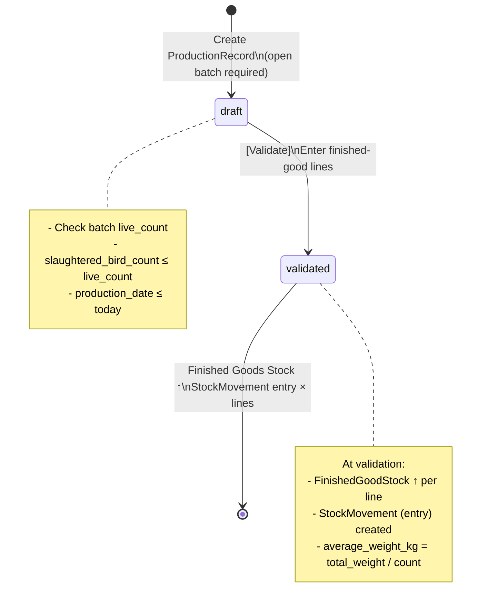

### 6.2 ProductionRecord Form (`ProductionRecordForm`)

```
Module: PRODUCTION → [New record]
Model: ProductionRecord

⚠️ Rule BR-LOT-05 (maturity): validation is blocked if the batch's age
   is less than RearingParameters.sale_maturity_age_days.
   This batch is 40 days old on 2026-06-19 → sale_maturity_age_days must be ≤ 40.
   (See Phase 0 §0.0 — to be configured before opening the batch)

  batch                       : May 2026 Batch — Building A  ← status open required
  production_date              : 2026-06-19
  slaughtered_bird_count        : 1,960   ← ≤ live_count (1,960) ✅
  total_weight_kg               : 4,116.000   ← 1,960 × 2.100 kg avg.
  notes                         : "Complete slaughter — average weight 2.1 kg — Batch closed"

  → average_weight_kg auto-calculated: 4,116.000 / 1,960 = 2.100 kg
  → status = draft
```

### 6.3 Production Lines (`ProductionLineFormSet`)

```
Lines (1 record → N finished-good lines):

⚠️ Units from the seed:
   • Live chicken     → unit = unit  (default price 480 DZD/u)
   • Whole carcass    → unit = kg    (default price 750 DZD/kg)
   The quantity is entered in the finished good's unit.

  ┌────────────────────────────────────────────────────────────────────────────────────┐
  │ finished_good         │ quantity    │ unit_weight │ est_unit_cost │ total_value    │
  ├───────────────────────┼─────────────┼─────────────┼───────────────┼────────────────┤
  │ Live chicken          │    500.000  │   2.100 kg  │  320.0000 DZD │   160,000.00   │
  │ Whole carcass         │  2,146.200  │   1.470 kg  │  220.0000 DZD │   472,164.00   │
  │                       │ (1,460 × 1.470 kg)                                         │
  └───────────────────────┴─────────────┴─────────────┴───────────────┴────────────────┘

  Total estimated value: 632,164.00 DZD

  Action: [Validate] → status = validated
    → FinishedGoodStock(Live chicken)    ↑ +500.000 units
    → FinishedGoodStock(Whole carcass)   ↑ +2,146.200 kg
    → 2 × StockMovement (source=production, type=entry)
```

### 6.4 Closing the Batch (`BatchClosureForm`)

```
Module: REARING → Batch → [Close the batch]
Model: RearingBatch.close()

  closure_date  : 2026-06-19
  notes          : "Batch closed after complete slaughter. Mortality=2%. FCR=1.62. ADG=53g/day."

  → batch.status = closed
  → No further mortality or consumption possible (BR-LOT-03)
```

### 6.5 Final Zootechnical Indicators

| Indicator                   | Calculation                          | Value          |
| --------------------------- | ------------------------------------ | -------------- |
| Initial count               | —                                    | 2,000 birds    |
| Total mortalities           | —                                    | 40 birds       |
| **reference_chick_count**   | initial + Σ outgoing_transfers (0)   | **2,000**      |
| Mortality rate              | 40 / **reference_chick_count** × 100 | **2.00%**      |
| Birds slaughtered           | 2,000 − 40                           | **1,960**      |
| Average weight at slaughter | 4,116 / 1,960                        | **2.100 kg**   |
| Rearing duration            | D0 → D40                             | **40 days**    |
| Total feed consumption      | 200 + 180 + 150                      | **530 bags**   |
| ADG (average daily gain)    | 2,100g / 40d                         | **52.5 g/day** |
| FCR (feed conversion ratio) | 530 × 25 kg / (1,960 × 2.1 kg)       | **≈ 3.24**     |

---

## 7. Phase 5 — Stock Adjustment

> **Context**: a physical inventory on 2026-06-20 reveals 3 fewer carcasses (cold-room deterioration).

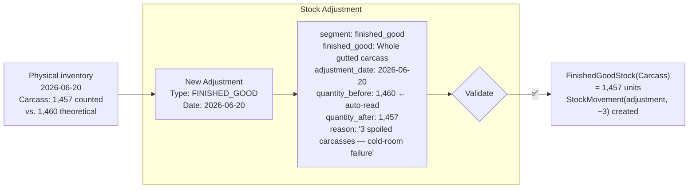

```
Module: STOCK → Adjustments → [New]
Model: StockAdjustment

  segment          : FINISHED_GOOD
  finished_good     : Whole gutted carcass
  adjustment_date   : 2026-06-20        ← ≤ today (clean)
  quantity_before    : 1,460.000         ← read-only, auto-filled by the view
  quantity_after     : 1,457.000
  reason             : "3 carcasses spoiled due to cold-room failure — batch 06/20"

  Rules: quantity_after ≥ 0 / segment = FINISHED_GOOD → finished_good required / input = empty
```

---

## 8. Phase 6 — Customer Sale & Delivery

### 8.1 Sales Overview

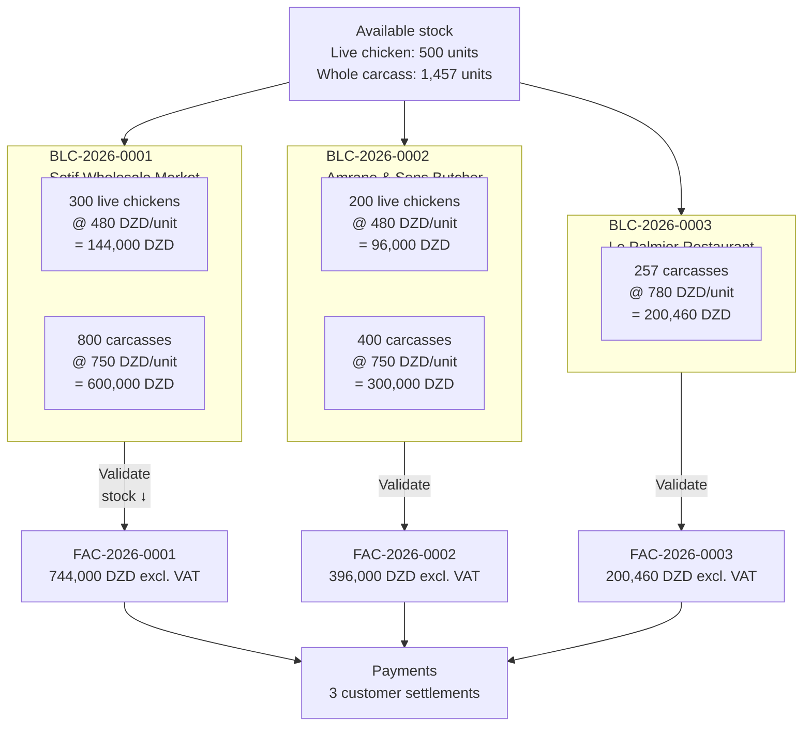

> ℹ️ This diagram covers only the **broiler batch** output (Live chicken
> / Carcass, June 2026). The **Layer batch** also produces
> 471 egg trays, collected much later (W+19 to W+28, see §5.6.7); 3
> trays go out outside a formal delivery note via `EggWithdrawal` (§5.6.8), and the
> remaining balance of 468 trays is sold (BLC-2026-0004), handled separately in **§8.4**.

### 8.2 Customer Delivery Note Forms (`CustomerDeliveryNoteForm`)

```
Module: SALES → Customer Delivery Note → [New]
Rule   : BR-BLC-02 stock checked before validation (quantity ≤ available stock)
         BR-BLC-03 Invoiced delivery note = locked
         status user choices: Draft / Delivered / Disputed (not Invoiced)

━━━━━━━━━━━━━━━━━━━━━━━━━━━━━━━━━━━━━━━━━━━━━━━━━━━
BLC-2026-0001 — Setif Wholesale Market
  reference           : BLC-2026-0001
  customer             : Setif Wholesale Market
  delivery_date         : 2026-06-20
  delivery_address      : "Market Zone, National Road 5, Setif"
  signed_by             : "Boualem Khaled — Receiving clerk"
  status                : Delivered

  Lines:
  ┌──────────────────────────────────────────────────────────────────────────┐
  │ finished_good          │ quantity  │ unit_price    │ total_amount          │
  ├───────────────────────┼───────────┼───────────────┼───────────────────────┤
  │ Live chicken          │  300.000  │    480.0000   │  144,000.00           │
  │ Whole gutted carcass  │  800.000  │    750.0000   │  600,000.00           │
  └───────────────────────┴───────────┴───────────────┴───────────────────────┘
  Total note: 744,000.00 DZD
  Action: [Validate] → status = Delivered
    → FinishedGoodStock(Live chicken)   ↓ −300 (remaining 200)
    → FinishedGoodStock(Whole carcass)  ↓ −800 (remaining 657)

━━━━━━━━━━━━━━━━━━━━━━━━━━━━━━━━━━━━━━━━━━━━━━━━━━━
BLC-2026-0002 — Amrane & Sons Butcher
  reference : BLC-2026-0002
  customer  : Amrane & Sons Butcher
  delivery_date : 2026-06-21
  status    : Delivered

  Lines:
  ┌──────────────────────────────────────────────────────────────────────────┐
  │ finished_good          │ quantity  │ unit_price    │ total_amount          │
  ├───────────────────────┼───────────┼───────────────┼───────────────────────┤
  │ Live chicken          │  200.000  │    480.0000   │   96,000.00           │
  │ Whole gutted carcass  │  400.000  │    750.0000   │  300,000.00           │
  └───────────────────────┴───────────┴───────────────┴───────────────────────┘
  Total note: 396,000.00 DZD
  → Live chicken stock ↓ −200 (remaining 0) / Carcass ↓ −400 (remaining 257)

━━━━━━━━━━━━━━━━━━━━━━━━━━━━━━━━━━━━━━━━━━━━━━━━━━━
BLC-2026-0003 — Le Palmier Restaurant
  reference : BLC-2026-0003
  customer  : Le Palmier Restaurant
  delivery_date : 2026-06-22
  status    : Delivered

  Lines:
  ┌──────────────────────────────────────────────────────────────────────────┐
  │ finished_good          │ quantity  │ unit_price    │ total_amount          │
  ├───────────────────────┼───────────┼───────────────┼───────────────────────┤
  │ Whole gutted carcass  │  257.000  │    780.0000   │  200,460.00           │
  └───────────────────────┴───────────┴───────────────┴───────────────────────┘
  Total note: 200,460.00 DZD
  → Carcass ↓ −257 (remaining 0) ✅ all sold
```

### 8.3 Customer Invoices and Payments

```
Rule   : BR-FAC-01 net_amount = auto-sum of included delivery note lines
         BR-FAC-02 only delivery notes with status Delivered from the same customer
         BR-FAC-03 manual payment — user chooses which invoice(s) to cover
         Status Paid = not selectable (driven by allocations)

FAC-2026-0001 — Setif Wholesale Market
  customer       : Setif Wholesale Market
  delivery_notes : [BLC-2026-0001]
  invoice_date   : 2026-06-20
  due_date       : 2026-07-20   ← +30 days
  net_amount     : 744,000.00 ← auto
  vat_rate       : 0.00%      ← poultry VAT-exempt
  vat_amount     : 0.00
  gross_amount   : 744,000.00

  Payment 1:
    customer       : Setif Wholesale Market
    payment_date   : 2026-06-20
    amount         : 744,000.00
    payment_method : cash
    allocation_mode: manual      ← user chooses which invoice(s) to cover (BR-FAC-03)
    Allocation     : → FAC-2026-0001: 744,000 DZD → status = Paid ✅

FAC-2026-0002 — Amrane & Sons Butcher
  delivery_notes : [BLC-2026-0002]
  net_amount     : 396,000.00
  vat_rate       : 0.00%
  vat_amount     : 0.00
  gross_amount   : 396,000.00 (exempt)

  Payment 2:
    amount          : 200,000.00
    payment_method  : check
    reference       : "CHQ-AMRANE-1044"
    allocation_mode : manual
    Allocation      : → FAC-2026-0002: 200,000 DZD → Partially paid
    balance_due     : 196,000.00 DZD ← outstanding

FAC-2026-0003 — Le Palmier Restaurant
  delivery_notes : [BLC-2026-0003]
  net_amount     : 200,460.00
  vat_rate       : 0.00%
  vat_amount     : 0.00
  gross_amount   : 200,460.00
  → At creation, 50,000.00 DZD is automatically consumed
    from the Customer Deposit of 2026-06-15 (§8.5) → balance due: 150,460.00 DZD

  Payment 3:
    amount          : 150,460.00   ← balance after deposit consumption (§8.5)
    payment_method  : bank transfer
    reference       : "VIR-PALMIER-22062026"
    allocation_mode : manual
    Allocation      : → FAC-2026-0003: 150,460 DZD → Paid ✅
```

### 8.4 Egg Sale (`CustomerDeliveryNoteForm`) — Layer Batch 2026

```
⚠️ Consistency note: the Layer Batch 2026 (§5.6.7) collects 14,130
   eggs (≈ 471 trays) credited to FinishedGoodStock (Egg tray), of which
   3 trays went out before the planned sale via EggWithdrawal (§5.6.8 —
   1 donation + 1 truck sale generating BLC-2026-0005). This section sells off
   the remaining balance (468 trays) once the last collection is recorded
   (2026-11-27).

Module: SALES → Customer Delivery Note → [New]
Prerequisite: last EggCollection of 2026-11-27 (§5.6.7) and the two
              EggWithdrawals of §5.6.8 already recorded — balance 468 trays.

━━━━━━━━━━━━━━━━━━━━━━━━━━━━━━━━━━━━━━━━━━━━━━━━━━━
BLC-2026-0004 — Setif Wholesale Market (Eggs)
  reference : BLC-2026-0004
  customer  : Setif Wholesale Market
  delivery_date : 2026-11-30
  status    : Delivered

  Lines:
  ┌──────────────────────────────────────────────────────────────────────────┐
  │ finished_good          │ quantity  │ unit_price    │ total_amount          │
  ├───────────────────────┼───────────┼───────────────┼───────────────────────┤
  │ Egg tray (30 eggs)     │  468.000  │    350.0000   │  163,800.00           │
  └───────────────────────┴───────────┴───────────────┴───────────────────────┘
  Total note: 163,800.00 DZD
  → FinishedGoodStock(Egg tray) ↓ −468 (remaining 0) ✅ all sold

FAC-2026-0004 — Egg Invoice Wholesale Market
  reference       : FAC-2026-0004
  customer        : Setif Wholesale Market
  delivery_notes  : [BLC-2026-0004]
  invoice_date    : 2026-11-30
  due_date        : 2026-12-30   ← +30 days
  net_amount      : 163,800.00 ← auto
  vat_rate        : 0.00%      ← poultry/eggs VAT-exempt
  vat_amount      : 0.00
  gross_amount    : 163,800.00

  Payment 4:
    customer        : Setif Wholesale Market
    payment_date     : 2026-12-01
    amount           : 163,800.00
    payment_method   : bank transfer
    reference        : "VIR-MG-OEUFS-301126"
    allocation_mode  : manual
    Allocation       : → FAC-2026-0004: 163,800 DZD → Paid ✅
```

> ℹ️ **Scope of the income statement (§10)**: the Layer Batch 2026 remains
> **open** at the end of this document (it only reaches point of lay at
> W+19, well after the closure of the May 2026 batch — see §5.6.1). The egg
> sale above is therefore **not included** in the P&L of §10.2, which is
> deliberately scoped to the May 2026 Batch (Ross 308) only: the
> input costs of the Layer batch (ISA Brown pullets, Pre-Lay Feed,
> Layer Feed) are also not detailed in the supplier delivery notes of
> §3, so mixing this revenue into the broiler P&L would distort the margin without
> the corresponding costs. It is, however, reflected in the
> customer receivables dashboard (§10.4), which is cross-cutting across
> all customers and all invoices, independent of batch.

### 8.5 Customer Deposit (`CustomerDeposit`) — Advance on Order

```
Module: SALES → Customer Payments → [New payment] (no invoice
        selected / excess amount)
Model: CustomerDeposit — created AUTOMATICALLY as soon as a CustomerPayment leaves
       an unallocated balance (payment.unallocated_balance > 0), typically an
       advance paid before any invoice is issued.

━━━━━━━━━━━━━━━━━━━━━━━━━━━━━━━━━━━━━━━━━━━━━━━━━━━
PAY-ADV-1 — Advance from Le Palmier Restaurant (before order)
  customer        : Le Palmier Restaurant
  branch           : EST
  payment_date      : 2026-06-15   ← 7 days before BLC-2026-0003 is created
  amount            : 50,000.00
  payment_method    : cash
  allocation_mode   : manual
  Allocation        : (no invoice exists on this date) → unallocated_balance
                       = 50,000.00 DZD

  → DEPOSIT-CLI-1 automatically created:
      customer          : Le Palmier Restaurant
      branch             : EST (synced from payment.branch)
      payment             : PAY-ADV-1
      amount               : 50,000.00
      remaining_amount     : 50,000.00
      used                 : False

  → On 2026-06-22, as soon as FAC-2026-0003 is created for the same customer/branch,
    clients.utils.consume_customer_deposits_fifo() automatically consumes
    DEPOSIT-CLI-1 (oldest first):
      DepositAllocation: deposit=DEPOSIT-CLI-1, invoice=FAC-2026-0003,
                          amount_allocated = 50,000.00
      DEPOSIT-CLI-1.remaining_amount → 0.00 → used = True
  → See §8.3: the remaining Payment 3 therefore only covers the balance of
    150,460.00 DZD.
```

### 8.6 CustomerSubscription — Recurring Fertilizer Delivery (`CustomerSubscriptionForm` / `PartialDeliveryForm`)

```
Module: SALES → Subscriptions → [New subscription] / [New delivery]
Models: CustomerSubscription (framework agreement) + PartialDelivery (each
        delivered run) + DeliveryTrip (logistics organization, optional)
Rule   : BR-BRA-01 the subscription is scoped to a branch (stock consumed on
         that branch only); a delivery on a subscription that is not
         `active` is rejected; a quota (`total_planned_quantity`) that is not zero
         can never be exceeded cumulatively.

━━━━━━━━━━━━━━━━━━━━━━━━━━━━━━━━━━━━━━━━━━━━━━━━━━━
SUB-1 — Monthly Fertilizer, Setif Wholesale Market
  customer                  : Setif Wholesale Market
  branch                     : EST   ← the treated Fertilizer (§5.5, 720 kg) lives
                                        in the EST branch's stock
  finished_good               : Treated (dried) poultry fertilizer
  start_date                  : 2026-06-25
  end_date                    : (empty — open-ended subscription)
  frequency                    : monthly
  total_planned_quantity       : 720.000 kg   ← capped at the available treated quantity
  unit_price                   : 12.0000 DZD/kg
  status                        : active

TRIP-1 — Fertilizer run of 2026-06-26
  trip_date  : 2026-06-26
  driver     : "Farid Belkacem"
  vehicle    : "Dump truck — 12345-116-16"

DEL-1 — First partial delivery
  subscription      : SUB-1
  trip              : TRIP-1
  date               : 2026-06-26
  delivered_quantity : 300.000 kg
  → FinishedGoodStock(Treated Fertilizer) ↓ −300 kg (remaining 420 kg)
  → cumulative_delivered_quantity = 300.000; remaining_balance = 420.000

DEL-2 — Second partial delivery
  subscription      : SUB-1
  date               : 2026-07-10
  delivered_quantity : 420.000 kg
  → FinishedGoodStock(Treated Fertilizer) ↓ −420 kg (remaining 0) ✅ quota reached
  → cumulative_delivered_quantity = 720.000 = total_planned_quantity → remaining_balance = 0
  ⚠️ Any attempt at a 3rd delivery on SUB-1 would be blocked by the
     quota check (PartialDelivery.clean()) — not exercised here.
```

> ℹ️ Unlike a `CustomerDeliveryNote` (one-off document), no `CustomerInvoice`
> is generated automatically by a `PartialDelivery`: invoicing
> of delivered fertilizer remains, in this cycle, out of scope (manual monthly
> invoicing to be set up separately if needed).

---

## 9. Phase 7 — Operating Expenses

### 9.1 Flow

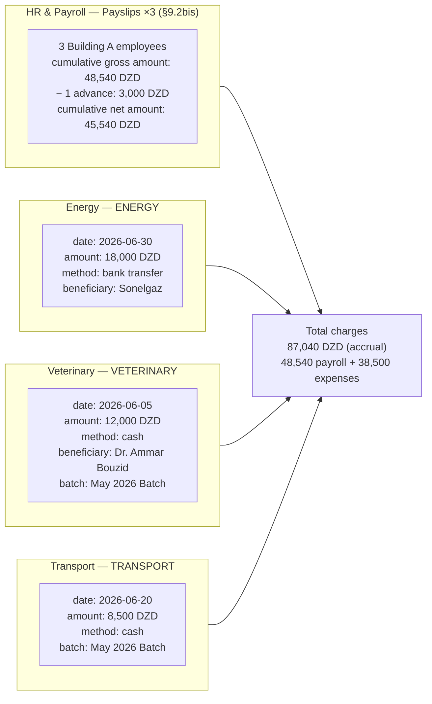

> 🆕 **Change vs v1.3**: the Salaries line item is no longer a single
> lump-sum `Expense` (`DEP-001`). It is now generated by the full
> HR & Payroll cycle (§9.2bis) — `Employee` → `TimeSheet` → `Payslip`,
> with an intermediate `EmployeeAdvance` deducted from the payslip.

### 9.2 Expense Forms (`ExpenseForm`)

```
Module: EXPENSES → [New expense]
Rule   : BR-DEP-01/03 linked_invoice only for SERVICE-type invoices (not goods)
         BR-DEP-04 batch attribution optional (analytical profitability)
         date ≤ today / amount > 0

DEP-002 — Sonelgaz Electricity
  date                : 2026-06-30
  category             : Energy (Electricity / Gas)
  description           : "June 2026 electricity invoice — ventilation + lighting Building A"
  amount                : 18,000.00
  payment_method        : bank transfer
  document_reference     : "SONELGAZ-2026-06-8854"
  branch                 : EST   ← required field (BR-BRA-01)
  batch                  : May 2026 Batch — Building A

DEP-003 — Veterinary fees
  date                : 2026-06-05
  category             : Veterinary Fees
  description           : "Health visit + coccidiosis diagnosis — Dr. Ammar Bouzid"
  amount                : 12,000.00
  payment_method        : cash
  branch                 : EST
  batch                  : May 2026 Batch — Building A
  linked_invoice          : (empty — direct fees, no supplier service invoice)
  notes                   : "Prescription + Amoxicillin 250g treatment protocol"

DEP-004 — Delivery transport
  date                : 2026-06-20
  category             : Transport & Fuel
  description           : "Slaughter transport + customer deliveries — June 20 & 21"
  amount                : 8,500.00
  payment_method        : cash
  branch                 : EST
  batch                  : May 2026 Batch — Building A
```

> 🆕 **DEP-001 (Salaries) no longer exists as an `Expense`**: this line item is
> now entirely produced by the HR & Payroll module below (§9.2bis),
> in line with the removal of `HR (Employee/TimeSheet/Payslip)` from the list
> of unexercised domains (see former Appendix B, v1.3).

### 9.2bis HR & Payroll — `Employee` / `TimeSheet` / `EmployeeLeave` / `EmployeeAdvance` / `Payslip`

```
Module: HR → Employees / Timesheets / Payroll
Rule   : BR-RH-01 6-day work / 1-day rest rotation, a pair covers the rest day
         BR-RH-02 daily_rate = monthly_base_salary / 25 (MONTHLY_REFERENCE_DAYS)
         BR-RH-03 paid leave accrued at 2.5 d/month worked
         BR-RH-04 advance deducted from the month's payslip, never entered as an Expense
         BR-RH-05 payslip = snapshot calculated from TimeSheet (never recalculated after the fact)
         BR-BRA-09 Employee.branch is DERIVED from employee.building.branch (EST here)

━━━━━━━━━━━━━━━━━━━━━━━━━━━━━━━━━━━━━━━━━━━━━━━━━━━
EMP-001 — Rachid Belkacem (team lead)
  employee_id             : OUV-EST-001
  building                 : Building A   ← EST branch automatically derived
  usual_rest_day           : Friday
  pair                     : (EMP-003 — Yacine Ferhat)
  monthly_base_salary      : 18,000.00
  normal_hours_per_day     : 8.00
  overtime_rate_multiplier : 1.50

EMP-002 — Karim Saadi
  employee_id             : OUV-EST-002
  building                 : Building A
  usual_rest_day           : Saturday
  monthly_base_salary      : 15,000.00

EMP-003 — Yacine Ferhat
  employee_id             : OUV-EST-003
  building                 : Building A
  usual_rest_day           : Friday
  pair                     : (EMP-001 — Rachid Belkacem)
  monthly_base_salary      : 15,000.00

TimeSheet (June 2026, summary — 30 days):
  ┌────────────┬────────────────┬──────────────┬──────────────┬─────────────────┐
  │ employee   │ days_present   │ rest_days    │ overtime_hrs │ notes           │
  ├────────────┼────────────────┼──────────────┼──────────────┼─────────────────┤
  │ EMP-001    │       25       │       5      │  4.00 (1 d.) │ night watch     │
  │ EMP-002    │       25       │       5      │  0.00        │ —               │
  │ EMP-003    │       25       │       5      │  0.00        │ —               │
  └────────────┴────────────────┴──────────────┴──────────────┴─────────────────┘

EmployeeAdvance:
  ADVANCE-EMP-1: employee=EMP-001, date=2026-06-15, amount=3,000.00,
                  payment_method=cash, reason="Salary advance — family emergency"
                  → payslip = (empty at this date, will be linked to the June Payslip)

Payslip (month=06, year=2026):
  ┌──────────┬────────────────┬───────────────┬─────────────┬─────────────┬────────────┬─────────────┐
  │ employee │ days_present   │ daily_rate    │ gross_amount│ overtime    │ advances   │ net_amount  │
  ├──────────┼────────────────┼───────────────┼─────────────┼─────────────┼────────────┼─────────────┤
  │ EMP-001  │       25       │    720.00     │  18,000.00  │   540.00 *  │  3,000.00  │  15,540.00  │
  │ EMP-002  │       25       │    600.00     │  15,000.00  │     0.00    │      0.00  │  15,000.00  │
  │ EMP-003  │       25       │    600.00     │  15,000.00  │     0.00    │      0.00  │  15,000.00  │
  └──────────┴────────────────┴───────────────┴─────────────┴─────────────┴────────────┴─────────────┘
  * EMP-001: hourly_rate = 720/8 = 90.00; 4h × 90.00 × 1.50 = 540.00
  → total gross amount (accrued): 18,540.00 + 15,000.00 + 15,000.00 = 48,540.00
  → total advances deducted     : 3,000.00 (EMP-001 only)
  → total net amount (payable on 06/30): 45,540.00
  status: draft → validated → paid (payment_date=2026-06-30, payment_method=bank transfer)
  ADVANCE-EMP-1.payslip ← linked to EMP-001's payslip, deducted from his net_amount
```

> 💰 **Actual payroll cost accrued for the batch (accounting charge)**:
> cumulative gross_amount = **48,540.00 DZD** (18,540 + 15,000 + 15,000). It is this
> amount — not just the `net_amount` paid at month-end — that feeds the
> "Salaries" line of the income statement (§10.2), since the 3,000 DZD
> advance already paid on 06/15 is part of the same labor cost,
> simply advanced during the month rather than settled on 06/30.

---

## 10. Batch Income Statement

### 10.1 Financial Flows Summary

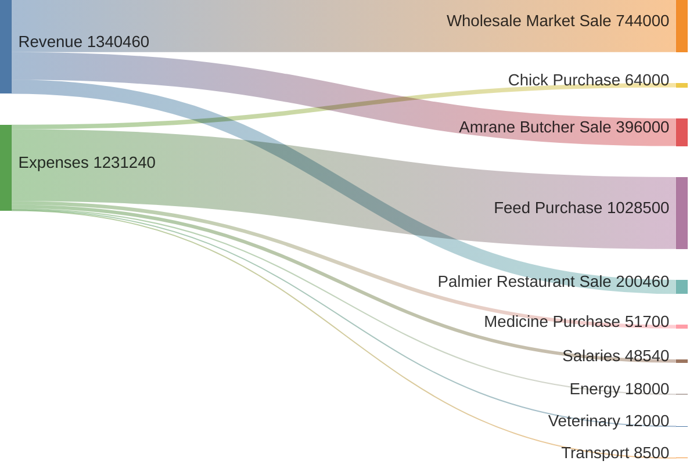

### 10.2 Analytical P&L — May 2026 Batch

| Line item                                        | Amount (DZD)       |
| ------------------------------------------------ | ------------------ |
| **REVENUE**                                      |                    |
| Live chicken sales (500 units × avg. 480 DZD)    | 240,000.00         |
| Whole carcass sales (1,457 units × avg. 757 DZD) | 1,103,949.00       |
| Stock adjustment (−3 spoiled carcasses)          | −2,271.00          |
| **Total revenue**                                | **1,341,678.00**   |
|                                                  |                    |
| **DIRECT COSTS**                                 |                    |
| Chick purchase (2,000 × 32 DZD)                  | −64,000.00         |
| Feed purchase (200×1850 + 180×1950 + 150×2050)   | −1,028,500.00      |
| Medicine & vaccine purchase                      | −51,700.00         |
| **Total direct costs**                           | **−1,144,200.00**  |
|                                                  |                    |
| **OPERATING EXPENSES**                           |                    |
| Worker salaries (Payslips ×3, §9.2bis)           | −48,540.00         |
| Electricity                                      | −18,000.00         |
| Veterinary fees                                  | −12,000.00         |
| Delivery transport                               | −8,500.00          |
| **Total operating expenses**                     | **−87,040.00**     |
|                                                  |                    |
| **NET BATCH RESULT**                             | **110,438.00 DZD** |
| **Net margin**                                   | **~8.2%**          |
| **Margin per bird sold**                         | **56.35 DZD**      |

### 10.3 Finished Goods Stock Movement Table

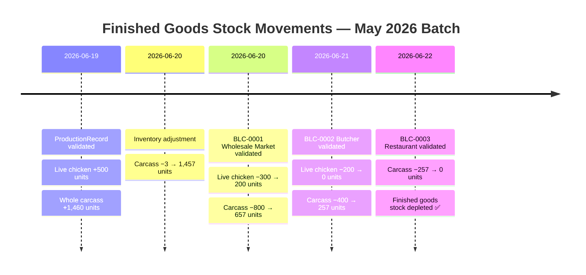

### 10.4 Customer Receivables Dashboard

| Customer                | Invoice       | Gross Amount  | Paid          | Balance     | Status     |
| ----------------------- | ------------- | ------------- | ------------- | ----------- | ---------- |
| Wholesale Market        | FAC-2026-0001 | 744,000       | 744,000       | 0           | ✅ Paid    |
| Amrane Butcher          | FAC-2026-0002 | 396,000       | 200,000       | **196,000** | ⚠️ Partial |
| Palmier Restaurant      | FAC-2026-0003 | 200,460       | 200,460       | 0           | ✅ Paid    |
| Wholesale Market (eggs) | FAC-2026-0004 | 164,850       | 164,850       | 0           | ✅ Paid    |
| **TOTAL**               |               | **1,505,310** | **1,309,310** | **196,000** |            |

---

## 11. Activated Business Rules

### 11.1 Business Rules Table by Phase

| BR               | Module    | Description                                                  | Point of application                                  |
| ---------------- | --------- | ------------------------------------------------------------ | ----------------------------------------------------- |
| **BR-BLF-01**    | Purchases | Stock impacted only when the delivery note is validated      | `post_save` signal on SupplierDeliveryNoteLine        |
| **BR-BLF-02**    | Purchases | Invoiced delivery note is locked — cannot be modified        | `SupplierDeliveryNoteForm.clean()` + `is_locked`      |
| **BR-BLF-03**    | Purchases | Disputed delivery note excluded from invoice selection       | Queryset `SupplierInvoiceForm`                        |
| **BR-BLF-05**    | Purchases | Expired access authorization blocked (Received)              | Form + signal (`authorization_expiration_date`)       |
| **BR-FAF-01**    | Purchases | Invoice amount = auto-sum of delivery note lines             | post-save calculation signal                          |
| **BR-FAF-02**    | Purchases | Only Received delivery notes from the same supplier          | `SupplierInvoiceForm.clean()`                         |
| **BR-FAF-04**    | Purchases | Paid status not selectable                                   | `STATUS_USER_CHOICES` without Paid                    |
| **BR-REG-03**    | Purchases | Automatic FIFO allocation                                    | `post_save` signal on SupplierPayment                 |
| **BR-REG-06**    | Purchases | Payments immutable                                           | No edit form                                          |
| **BR-LOT-01**    | Rearing   | Batch opens only in a Pullet House                           | `RearingBatchForm.clean()` + `building.building_type` |
| **BR-LOT-02**    | Rearing   | Batch requires chick count + delivery note                   | `RearingBatchForm.clean()`                            |
| **BR-LOT-03**    | Rearing   | Mortality/Consumption only on open batch                     | `MortalityForm.clean()` + `ConsumptionForm.clean()`   |
| **BR-LOT-04**    | Rearing   | Batch closure requires ≥ 1 validated production              | Validated in the view before `BatchClosureForm`       |
| **BR-LOT-05**    | Rearing   | Production blocked if batch < maturity_age_days              | `ProductionRecord` validate + view                    |
| **BR-MOR-01**    | Rearing   | Mortality decrements chick input stock                       | `mortality_post_save` signal → InputStock             |
| **BR-INT-03**    | Stock     | Consumption ≤ available stock                                | `ConsumptionForm.clean()`                             |
| **BR-INT-04**    | Inputs    | Input stage filtered according to batch's building_type      | `ConsumptionForm` queryset                            |
| **BR-INT-05**    | Inputs    | Unit of measure immutable if movements exist                 | `InputForm.clean_unite_mesure()`                      |
| **BR-TRF-01**    | Rearing   | Transfer forbidden on closed batch / cross-branch            | `BatchTransfer.clean()` (BR-BRA-01)                   |
| **BR-TRF-02**    | Rearing   | MODE_FULL: batch.building updated, baseline unchanged        | `transfer_batch_post_save` signal                     |
| **BR-TRF-03**    | Rearing   | BatchTransfer immutable (no edit/delete)                     | No edit view                                          |
| **BR-PES-01**    | Rearing   | Quality derived from average_weight_g (QualityCategory)      | `SampleWeighing.quality` (property)                   |
| **BR-DEP-01/03** | Expenses  | linked_invoice = Service type only                           | `ExpenseForm.clean()`                                 |
| **BR-DEP-04**    | Expenses  | Batch attribution optional                                   | Optional `batch` field                                |
| **BR-BLC-01**    | Sales     | Finished goods stock decremented on delivery note validation | `post_save` signal on CustomerDeliveryNoteLine        |
| **BR-BLC-02**    | Sales     | Quantity ≤ available stock                                   | View check before validation                          |
| **BR-BLC-03**    | Sales     | Invoiced delivery note locked                                | `CustomerDeliveryNoteForm.is_locked`                  |
| **BR-FAC-01**    | Sales     | Invoice amount = auto-sum of included delivery notes         | Calculation signal                                    |
| **BR-FAC-02**    | Sales     | Only Delivered delivery notes from the same customer         | `CustomerInvoiceForm` queryset                        |
| **BR-FAC-03**    | Sales     | Manual customer payment allocation                           | `CustomerPaymentAllocation` view                      |

### 11.2 Status Transitions

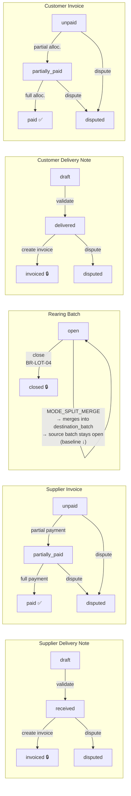

### 11.3 User Roles by Phase

| Phase            | Key action                        | Required role                                                          |
| ---------------- | --------------------------------- | ---------------------------------------------------------------------- |
| 0bis — Branches  | Create branches + assign managers | `admin` only (BR-BRA-06)                                               |
| 1 — Purchases    | Create delivery note + validate   | `operator` or `branch_manager` or `manager` (active branch, BR-BRA-02) |
| 1 — Purchases    | Create invoice + payment          | `accountant` or `manager`                                              |
| 1 — Purchases    | Add attachment (v1.5)             | any role with access to the document                                   |
| 2 — Batch        | Open batch                        | `operator` or `branch_manager` or `manager`                            |
| 3 — Tracking     | Mortalities + consumption         | `operator` or `branch_manager` or `manager`                            |
| 3 — Tracking     | Feed Production                   | `operator` or `branch_manager` or `manager`                            |
| 3 — Tracking     | Egg Withdrawal                    | `operator` or `branch_manager` or `manager`                            |
| 4 — Production   | Enter + validate slaughter        | `operator` or `manager`                                                |
| 4 — Production   | Close batch                       | `manager`                                                              |
| 5 — Adjustment   | Create stock adjustment           | `manager`                                                              |
| 6 — Sale         | Customer delivery note + validate | `manager` or `gerant`                                                  |
| 6 — Sale         | Invoice + payment allocation      | `accountant` or `manager`                                              |
| 6 — Sale         | Subscription + partial delivery   | `manager` or `gerant` (active branch)                                  |
| 7 — Expenses     | Create expenses                   | `manager` or `accountant`                                              |
| 7 — HR & Payroll | Timesheets / Leaves / Advances    | `manager` or `branch_manager`                                          |
| 7 — HR & Payroll | Generate / validate / pay payslip | `accountant` or `manager`                                              |

---

## Appendix A — Summary of Created Entities

> **Starting point**: `seed_db --mode minimal` → master data categories present,
> zero operational data, zero physical instances.
> **Phase 0 / 0bis**: branches, suppliers / customers / buildings / inputs
> entered manually. References actually generated in the format
> `<prefix>-<branch_code>-<YYYY>-<NNNN>` (BR-BRA-05); e.g. `BLF-EST-2026-0001`.

| Phase | Entity                             | Reference / ID                                                              | Final Status            |
| ----- | ---------------------------------- | --------------------------------------------------------------------------- | ----------------------- |
| 0bis  | Branch                             | EST (Building A/Warehouse) / OUEST (Bldgs. B & C)                           | Active ✅               |
| 0bis  | Branch users                       | chef_est, chef_ouest, operator1(EST), operator2(OUEST)                      | —                       |
| 1     | Supplier Delivery Note             | BLF-EST-2026-0001 (Chicks CCA)                                              | Invoiced 🔒             |
| 1     | Supplier Delivery Note             | BLF-EST-2026-0002 (Feed ONAB batch 1)                                       | Invoiced 🔒             |
| 1     | Supplier Delivery Note             | BLF-EST-2026-0003 (Feed ONAB finisher)                                      | Invoiced 🔒             |
| 1     | Supplier Delivery Note             | BLF-EST-2026-0004 (Medicines Sanofi)                                        | Invoiced 🔒             |
| 1     | Supplier Delivery Note             | BLF-EST-2026-0005 (Raw ingredients, §5.3bis)                                | Invoiced 🔒             |
| 1     | Supplier Invoice                   | FRN-EST-2026-0001 (CCA 64,000 DZD)                                          | Paid ✅                 |
| 1     | Supplier Invoice                   | FRN-EST-2026-0002 (ONAB 721,000 DZD)                                        | Paid ✅                 |
| 1     | Supplier Invoice                   | FRN-EST-2026-0003 (ONAB 307,500 DZD)                                        | Unpaid ⏳               |
| 1     | Supplier Invoice                   | FRN-EST-2026-0004 (Sanofi 51,700 DZD)                                       | Paid ✅                 |
| 1     | Supplier Invoice                   | FRN-EST-2026-0005 (ONAB ingredients 42,000)                                 | Paid ✅                 |
| 1     | Supplier Payment                   | REG-EST-2026-0001…0005                                                      | Immutable               |
| 1     | Attachment (v1.5)                  | ATT-1/2/3 (invoice, check, transfer)                                        | —                       |
| 2     | Rearing Batch                      | May 2026 Batch — Building A (EST branch)                                    | Closed 🔒               |
| 3     | Mortalities                        | 5 events, 40 birds                                                          | —                       |
| 3     | Consumptions                       | 11 feed entries + 7 medicine                                                | —                       |
| 3     | Feed Formula                       | In-House Grower Formula (§5.3bis)                                           | Active                  |
| 3     | Feed Production                    | FEED-PROD-1 (+300 kg, formula) / FEED-PROD-2 (+100 kg, direct)              | Credited ✅             |
| 3     | Fertilizer Collection              | 4 collections, 840 kg raw (Building A)                                      | Assigned to treatment   |
| 3     | Fertilizer Treatment               | Treatment 2026-06-24 (720 kg)                                               | Validated ✅            |
| 2bis  | Rearing Batch                      | Layer Batch 2026 (OUEST branch)                                             | Open (Building B)       |
| 3bis  | Mortalities (rearing)              | 6 events, 105 birds (≈3.5%)                                                 | —                       |
| 3bis  | Consumptions (rearing)             | 11 feed + 7 medicine                                                        | —                       |
| 3bis  | Sample Weighings                   | 4 weighings (D0/D42/D84/D126)                                               | —                       |
| 3bis  | Batch Transfer                     | Pullet House C → Laying House B (D+126)                                     | Immutable               |
| 3bis  | Consumptions (laying)              | 4 entries Layer Feed (post-transfer)                                        | —                       |
| 3bis  | Egg Collections                    | 8 collections, 14,130 eggs (≈471 trays)                                     | —                       |
| 3bis  | Egg Withdrawals (v1.4+)            | EGG-WD-1 (donation, 1 tray), EGG-WD-2 (truck sale, 2 trays → BLC-2026-0005) | —                       |
| 4     | Production Record                  | Production 2026-06-19                                                       | Validated ✅            |
| 5     | Stock Adjustment                   | ADJ-2026-0001 (−3 carcasses)                                                | —                       |
| 6     | Customer Delivery Note             | BLC-2026-0001/0002/0003                                                     | Invoiced 🔒             |
| 6     | Customer Invoice                   | FAC-2026-0001/0002/0003                                                     | Paid / Partial / Paid   |
| 6     | Customer Payment                   | PAY-0001/0002/0003                                                          | Immutable               |
| 6     | Customer Deposit                   | DEPOSIT-CLI-1 (Le Palmier Restaurant, 50,000)                               | Used ✅ (§8.5)          |
| 6     | Customer Subscription + Deliveries | SUB-1 (Fertilizer, Wholesale Market) + DEL-1/DEL-2                          | Quota reached ✅ (§8.6) |
| 6bis  | Customer Delivery Note (eggs)      | BLC-2026-0004 (Wholesale Market, §8.4), BLC-2026-0005 (Grocery, §5.6.8)     | Invoiced 🔒             |
| 6bis  | Customer Invoice (eggs)            | FAC-2026-0004 (163,800 DZD)                                                 | Paid ✅                 |
| 6bis  | Customer Payment (eggs)            | PAY-0004                                                                    | Immutable               |
| 7     | Expenses                           | DEP-002/003/004                                                             | —                       |
| 7     | Employee / Timesheet               | EMP-001/002/003 (Building A) — June 2026                                    | —                       |
| 7     | Leave / Employee Advance           | ADVANCE-EMP-1 (3,000 DZD, EMP-001)                                          | Deducted from payslip   |
| 7     | Payslip                            | Payslip ×3 — June 2026 (48,540 → net 45,540)                                | Paid ✅                 |

---

_End of document — PoultryERP Complete Scenario May 2026 Batch — Ross 308 — 2,000 birds_

---

## Appendix B — v1.3 Domains Not Exercised in This Broiler Scenario

The following features exist in the system (v1.3 spec) but are not
activated by this 40-day cycle on a standard Ross 308 batch:

| Domain / Feature                                  | Why absent here                                                                                                                         |
| ------------------------------------------------- | --------------------------------------------------------------------------------------------------------------------------------------- |
| **CustomerSubscription / PartialDelivery**        | One-off sales via Customer Delivery Note; no recurring subscription                                                                     |
| **Access Authorization (Supplier Delivery Note)** | ONAB may issue this type; the cycle uses standard_note to keep it simple                                                                |
| **Partners / PartnerWithdrawal**                  | No withdrawal recorded in this cycle                                                                                                    |
| **HR (Employee / TimeSheet / Payslip)**           | DEP-001 covered salary as a lump-sum expense                                                                                            |
| **MarketPrice / Customer Debt Sheet**             | Not used in this cycle; an analytical tool                                                                                              |
| **CompanyInfo (multi-rate VAT)**                  | VAT-exempt invoices → vat_rate = 0% uniform                                                                                             |
| **BatchTransfer MODE_SPLIT_NEW/MERGE**            | Only MODE_FULL is exercised (§5.6.6); splitting a broiler flock for density reasons remains a possible scenario but is not covered here |
| **SampleWeighing weighing_type=eggs**             | Only bird weighings (growth, §5.6.3) are exercised; egg weighing (EggCollection quality) is not                                         |

> ℹ️ **BatchTransfer** (MODE_FULL) and **SampleWeighing** (weighing_type=birds)
> no longer appear in this table as "not exercised": they are now
> exercised in §5.6, on the Layer Batch 2026 (Pullet House → Laying House at
> point of lay, 18 weeks), a biologically realistic path that a Ross
> 308 broiler batch — slaughtered at 40 days, well before laying age —
> never goes through.
>
> ⚠️ **Documented trap (§5.6.6/§0.4, INT-11)**: `RearingBatch.expected_input_stage`
> never maps a Laying House to `Input.STAGE_LAYING`, only to
> `STAGE_GROWER` (with `STAGE_ALL` always included). A layer feed
> created with `stage=laying` would therefore be invisible in `ConsumptionForm`
> for a batch in a Laying House — the Layer Feed in this scenario is therefore created
> with `stage=grower`, not `stage=laying`, despite the choice's name.
>
> ℹ️ **EggCollection** and **FertilizerCollection / FertilizerTreatment** no
> longer appear in this table: they are now exercised respectively
> in §5.6.7 (Layer batch, after transfer to the Laying House) and §5.5
> (at the Building A level, independent of batch).
